# Wireframe Discovery Process - UML Sequence Diagram

## Overview
This sequence diagram captures the complete discovery process including wireframe swapping from unknown to discovered state, based on actual codebase analysis and debug logs.

## Mermaid Sequence Diagram

```mermaid
sequenceDiagram
    participant Player
    participant StarChartsUI as StarChartsUI
    participant StarChartsManager as StarChartsManager
    participant TargetComputerManager as TargetComputerManager
    participant WireframeScene as THREE.Scene (Wireframe)
    participant TargetHUD as Target HUD

    Note over Player, TargetHUD: Initial Target Selection (Unknown Object)
    
    Player->>StarChartsUI: User clicks on unknown object
    StarChartsUI->>StarChartsUI: selectObject(object)
    StarChartsUI->>StarChartsManager: selectObjectById(object.id)
    StarChartsManager->>TargetComputerManager: setTargetById(objectId)
    
    TargetComputerManager->>TargetComputerManager: createTargetWireframe()
    Note right of TargetComputerManager: Object is undiscovered
    
    TargetComputerManager->>TargetComputerManager: clearTargetWireframe()
    Note right of TargetComputerManager: ⚠️ BUG: this.targetWireframe is null!
    TargetComputerManager->>WireframeScene: scene.children.length (before: 2)
    TargetComputerManager->>WireframeScene: scene.children.length (after: 2)
    Note right of WireframeScene: No wireframe to clear, lights remain
    
    TargetComputerManager->>TargetComputerManager: Create wireframe geometry
    TargetComputerManager->>TargetComputerManager: this.targetWireframe = new LineSegments()
    TargetComputerManager->>WireframeScene: scene.add(this.targetWireframe)
    WireframeScene-->>TargetComputerManager: Total objects: 3 (2 lights + 1 wireframe)
    
    TargetComputerManager->>TargetHUD: updateTargetDisplay()
    TargetHUD-->>Player: Shows "Unknown" with gray border
    
    Note over Player, TargetHUD: Player Movement & Discovery Trigger
    
    Player->>StarChartsManager: Player moves within 10km of object
    StarChartsManager->>StarChartsManager: checkDiscoveryRadius()
    StarChartsManager->>StarChartsManager: batchProcessDiscoveries()
    StarChartsManager->>StarChartsManager: addDiscoveredObject(objectId)
    
    alt Object within discovery range
        StarChartsManager->>StarChartsManager: triggerDiscoveryCallbacks()
        StarChartsManager->>TargetComputerManager: handleDiscoveryEvent(objectId)
        
        Note over TargetComputerManager: Discovery Status Change Detection
        
        TargetComputerManager->>TargetComputerManager: updateTargetDisplay()
        TargetComputerManager->>TargetComputerManager: Check discovery status change
        
        alt Discovery status changed
            Note right of TargetComputerManager: ⚠️ CRITICAL BUG: Wrong scene used!
            TargetComputerManager->>TargetComputerManager: this.scene.remove(this.targetWireframe)
            Note right of TargetComputerManager: Uses main scene instead of wireframeScene!
            TargetComputerManager->>TargetComputerManager: this.targetWireframe = null
            
            TargetComputerManager->>TargetComputerManager: createTargetWireframe() [AGAIN]
            TargetComputerManager->>TargetComputerManager: clearTargetWireframe()
            Note right of TargetComputerManager: this.targetWireframe is null again!
            TargetComputerManager->>WireframeScene: scene.children.length (before: 3)
            TargetComputerManager->>WireframeScene: scene.children.length (after: 3)
            Note right of WireframeScene: Old wireframe still in wireframeScene!
            
            TargetComputerManager->>TargetComputerManager: Create NEW wireframe geometry
            TargetComputerManager->>TargetComputerManager: this.targetWireframe = new LineSegments()
            TargetComputerManager->>WireframeScene: scene.add(this.targetWireframe)
            WireframeScene-->>TargetComputerManager: Total objects: 4 (2 lights + 2 wireframes)
            Note right of WireframeScene: ⚠️ WIREFRAME STACKING OCCURS HERE
        end
        
        TargetComputerManager->>TargetHUD: updateTargetDisplay()
        TargetHUD-->>Player: Shows discovered name with yellow border
    end
    
    Note over Player, TargetHUD: Target Switching Between Objects
    
    Player->>StarChartsUI: User clicks different object
    StarChartsUI->>StarChartsManager: selectObjectById(newObjectId)
    StarChartsManager->>TargetComputerManager: setTargetById(newObjectId)
    
    TargetComputerManager->>TargetComputerManager: createTargetWireframe()
    TargetComputerManager->>TargetComputerManager: clearTargetWireframe()
    Note right of TargetComputerManager: ⚠️ BUG: Still not clearing from wireframeScene
    
    TargetComputerManager->>WireframeScene: scene.add(thirdWireframe)
    Note right of WireframeScene: More wireframes accumulate...
    
    Note over Player, TargetHUD: Root Cause Analysis
    
    rect rgb(255, 200, 200)
        Note over TargetComputerManager, WireframeScene: CRITICAL BUGS IDENTIFIED
        Note over TargetComputerManager: 1. Discovery status change uses wrong scene (this.scene vs this.wireframeScene)
        Note over TargetComputerManager: 2. clearTargetWireframe() called when this.targetWireframe is null
        Note over TargetComputerManager: 3. Old wireframes remain in wireframeScene while reference is lost
        Note over TargetComputerManager: 4. Multiple wireframes accumulate without proper cleanup
    end
```

## Key Issues Identified

### 1. Critical Bug: Wrong Scene Used in Discovery Status Change
- **Location**: `updateTargetDisplay()` lines 2229-2238
- **Problem**: Uses `this.scene.remove()` instead of `this.wireframeScene.remove()`
- **Impact**: Wireframe removed from main scene but remains in wireframe scene
- **Evidence**: `this.targetWireframe` becomes null, but wireframe still visible

### 2. Wireframe Reference Loss During Discovery
- **Problem**: `clearTargetWireframe()` called when `this.targetWireframe` is null
- **Cause**: Previous wireframe reference lost when removed from wrong scene
- **Result**: Old wireframes accumulate in wireframeScene without cleanup

### 3. Double Wireframe Creation Process
- **Initial**: Target selection creates wireframe for unknown object (3 objects total)
- **Discovery**: Status change triggers wireframe recreation (4 objects total)
- **Root Cause**: Old wireframe not properly removed from wireframeScene

### 4. Sub-Target Indicators (Resolved)
- Originally contributed to stacking
- Now completely disabled but core scene bug remains

## Technical Details

### Wireframe Scene Composition
- **Expected**: 2 lights + 1 wireframe = 3 objects
- **Actual**: 2 lights + multiple wireframes = 4+ objects
- **Object Types**: DirectionalLight, AmbientLight, LineSegments (multiple)

### Discovery Flow
1. **Unknown State**: Gray border, "Unknown" label, basic wireframe
2. **Discovery Trigger**: Player proximity (10km range)
3. **Discovered State**: Yellow border, actual name, enhanced wireframe
4. **Wireframe Recreation**: Should replace old wireframe but doesn't

## Fixes Applied

### 1. Critical Scene Bug Fixed ✅
- **Location**: `updateTargetDisplay()` lines 2228-2238
- **Fix**: Changed `this.scene.remove()` to `this.wireframeScene.remove()`
- **Impact**: Wireframes now properly removed from correct scene during discovery status changes

### 2. Orphaned Wireframe Cleanup ✅
- **Location**: `clearTargetWireframe()` method
- **Enhancement**: Added safety mechanism to detect and remove orphaned LineSegments
- **Benefit**: Handles cases where wireframe references are lost but objects remain in scene

### 3. Enhanced Debug Logging ✅
- **Addition**: Detailed object type logging in wireframe operations
- **Benefit**: Better visibility into scene state for future debugging

## Expected Results
- **Before Fix**: 4+ objects in wireframe scene (2 lights + multiple wireframes)
- **After Fix**: Exactly 3 objects in wireframe scene (2 lights + 1 wireframe)
- **Discovery Flow**: Smooth wireframe replacement without accumulation
- **Target Switching**: Clean wireframe cleanup between different targets

## Testing Recommendations
1. Target unknown object → verify 3 objects in wireframe scene
2. Move within 10km to trigger discovery → verify still 3 objects (wireframe replaced, not added)
3. Switch between different targets → verify consistent 3-object count
4. Switch between discovered/undiscovered objects → verify proper wireframe updates
