# Master Technical UX Specification - Sequence Diagrams

This document provides comprehensive Mermaid UML sequence diagrams and supporting diagrams for each keyboard command use case in the Planetz game. Each use case includes detailed interaction flows validated against the actual codebase implementation.

## Document Contents

- **Sequence Diagrams**: Mandatory Mermaid UML sequence diagrams showing detailed interaction flows
- **Supporting Diagrams**: Additional UML diagrams (state, interaction) for complex use cases
- **Error Handling**: Comprehensive validation and error scenarios
- **System Integration**: Accurate representation of component interactions
- **Implementation Status**: Clear indication of implemented vs. unimplemented features

---

## Table of Contents

### [BASIC NAVIGATION](#basic-navigation)
1. [User presses F key and switches to forward view](#user-presses-f-key-and-switches-to-forward-view)
2. [User presses A key and switches to aft view](#user-presses-a-key-and-switches-to-aft-view)
3. [User presses H key and toggles the technical manual](#user-presses-h-key-and-toggles-the-technical-manual)
4. [User presses D key and opens damage control interface](#user-presses-d-key-and-opens-damage-control-interface)

### [IMPULSE PROPULSION](#impulse-propulsion)
5. [User presses 0-9 keys and sets impulse speed](#user-presses-0-9-keys-and-sets-impulse-speed)
6. [User presses \ key and initiates emergency stop](#user-presses--key-and-initiates-emergency-stop)
7. [User presses arrow keys and controls ship attitude](#user-presses-arrow-keys-and-controls-ship-attitude)

### [SHIP SYSTEMS](#ship-systems)
8. [User presses S key and toggles shield control](#user-presses-s-key-and-toggles-shield-control)
9. [User presses L key and toggles long range scanner](#user-presses-l-key-and-toggles-long-range-scanner)
10. [User presses C key and opens star charts navigation](#user-presses-c-key-and-opens-star-charts-navigation)
11. [User presses R key and toggles subspace radio](#user-presses-r-key-and-toggles-subspace-radio)
12. [User presses P key and toggles proximity detector](#user-presses-p-key-and-toggles-proximity-detector)
13. [User presses +/= keys and zooms proximity detector in](#user-presses-keys-and-zooms-proximity-detector-in)
14. [User presses -/_ keys and zooms proximity detector out](#user-presses---keys-and-zooms-proximity-detector-out)
15. [User presses \ key and toggles proximity detector view mode](#user-presses--key-and-toggles-proximity-detector-view-mode)
16. [User presses G key and opens galactic chart](#user-presses-g-key-and-opens-galactic-chart)
17. [User presses T key and toggles target computer](#user-presses-t-key-and-toggles-target-computer)
18. [User presses I key and displays intel information](#user-presses-i-key-and-displays-intel-information)

### [COMBAT SYSTEMS](#combat-systems)
19. [User presses Tab key and cycles to next target](#user-presses-tab-key-and-cycles-to-next-target)
20. [User presses Shift+Tab keys and cycles to previous target](#user-presses-shift-tab-keys-and-cycles-to-previous-target)
21. [User presses Space key and fires active weapon](#user-presses-space-key-and-fires-active-weapon)
22. [User presses , key and selects previous weapon](#user-presses--key-and-selects-previous-weapon)
23. [User presses . key and selects next weapon](#user-presses--key-and-selects-next-weapon)
24. [User presses / key and toggles weapon autofire](#user-presses--key-and-toggles-weapon-autofire)
25. [User presses Z key and selects previous sub-system target](#user-presses-z-key-and-selects-previous-sub-system-target)
26. [User presses X key and selects next sub-system target](#user-presses-x-key-and-selects-next-sub-system-target)

### [ADVANCED OPERATIONS](#advanced-operations)
27. [User presses Q key and creates training targets](#user-presses-q-key-and-creates-training-targets)

### [DEBUG & DEVELOPER](#debug--developer)
28. [User presses Ctrl+O keys and toggles weapon debug](#user-presses-ctrl-o-keys-and-toggles-weapon-debug)
29. [User presses Ctrl+Shift+P keys and toggles wireframe visibility](#user-presses-ctrl-shift-p-keys-and-toggles-wireframe-visibility)
30. [User presses Ctrl+Shift+E keys and downloads error report](#user-presses-ctrl-shift-e-keys-and-downloads-error-report)

### [AI DEBUG CONTROLS](#ai-debug-controls)
31. [User presses Cmd+Shift+A keys and toggles AI debug mode](#user-presses-cmd-shift-a-keys-and-toggles-ai-debug-mode)
32. [User presses Cmd+Shift+E keys and forces all AIs to engage](#user-presses-cmd-shift-e-keys-and-forces-all-ais-to-engage)
33. [User presses Cmd+Shift+I keys and forces all AIs to idle](#user-presses-cmd-shift-i-keys-and-forces-all-ais-to-idle)
34. [User presses Cmd+Shift+S keys and displays AI statistics](#user-presses-cmd-shift-s-keys-and-displays-ai-statistics)
35. [User presses Cmd+Shift+F keys and forces all AIs to flee](#user-presses-cmd-shift-f-keys-and-forces-all-ais-to-flee)
36. [User presses Cmd+Shift+V keys and creates V-formation](#user-presses-cmd-shift-v-keys-and-creates-v-formation)
37. [User presses Cmd+Shift+C keys and creates column formation](#user-presses-cmd-shift-c-keys-and-creates-column-formation)
38. [User presses Cmd+Shift+L keys and creates line abreast formation](#user-presses-cmd-shift-l-keys-and-creates-line-abreast-formation)
39. [User presses Cmd+Shift+B keys and shows flocking statistics](#user-presses-cmd-shift-b-keys-and-shows-flocking-statistics)
40. [User presses Cmd+Shift+T keys and shows combat statistics](#user-presses-cmd-shift-t-keys-and-shows-combat-statistics)
41. [User presses Cmd+Shift+W keys and shows weapon targeting debug](#user-presses-cmd-shift-w-keys-and-shows-weapon-targeting-debug)
42. [User presses Cmd+Shift+X keys and forces AIs to target player](#user-presses-cmd-shift-x-keys-and-forces-ais-to-target-player)
43. [User presses Cmd+Shift+P keys and shows performance statistics](#user-presses-cmd-shift-p-keys-and-shows-performance-statistics)
44. [User presses Cmd+Shift+D keys and toggles debug visualization](#user-presses-cmd-shift-d-keys-and-toggles-debug-visualization)

### [MISSION & COMMUNICATION](#mission--communication)
45. [User presses N key and toggles communication HUD](#user-presses-n-key-and-toggles-communication-hud)
46. [User presses M key and toggles mission status](#user-presses-m-key-and-toggles-mission-status)

---

## BASIC NAVIGATION

### User presses F key and switches to forward view

**Use Case**: Changes the camera view to show the front of the ship

**Sequence Diagram**:

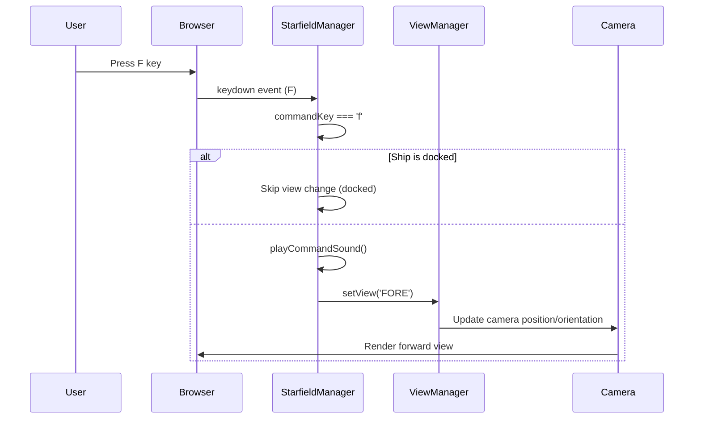

---

### User presses A key and switches to aft view

**Use Case**: Changes the camera view to show the rear of the ship

**Sequence Diagram**:


---

### User presses H key and toggles the technical manual

**Use Case**: Opens or closes the ship systems help screen with detailed control information

**Sequence Diagram**:

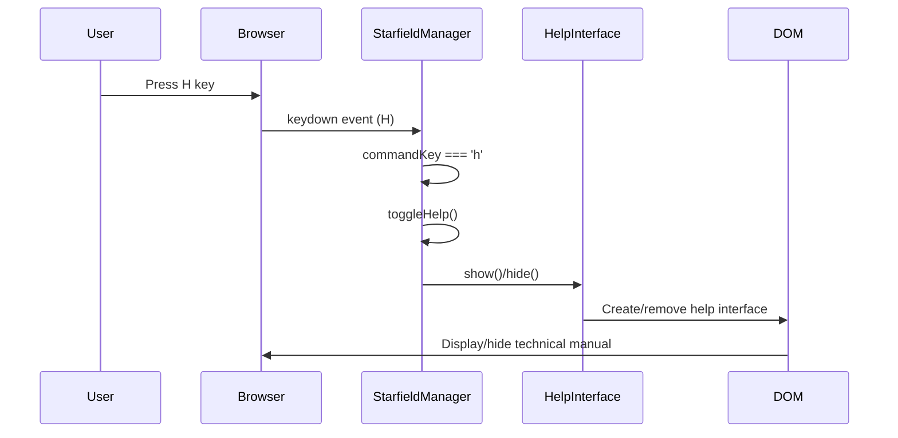

---

### User presses D key and opens damage control interface

**Use Case**: Displays the ship's damage status and repair options

**Sequence Diagram**:

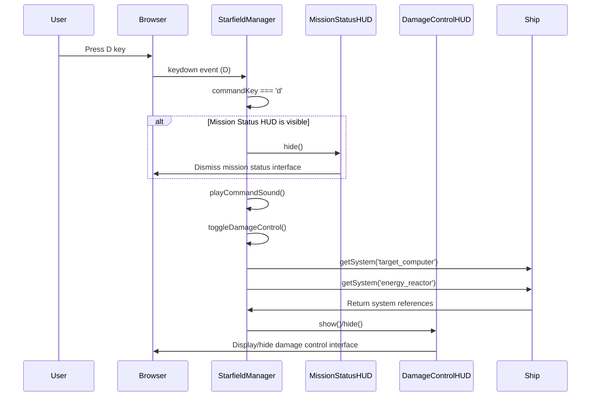

---

## IMPULSE PROPULSION

### User presses 0-9 keys and sets impulse speed

**Use Case**: Sets the ship's impulse engine speed from 0 (full stop) to 9 (maximum speed)

**Sequence Diagram**:

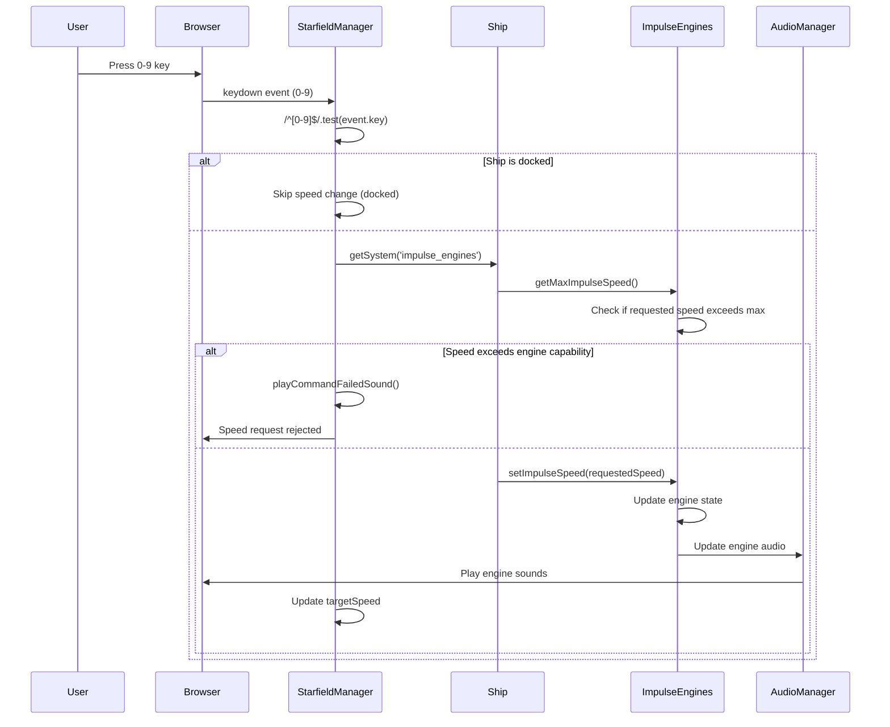

**Supporting State Diagram**:

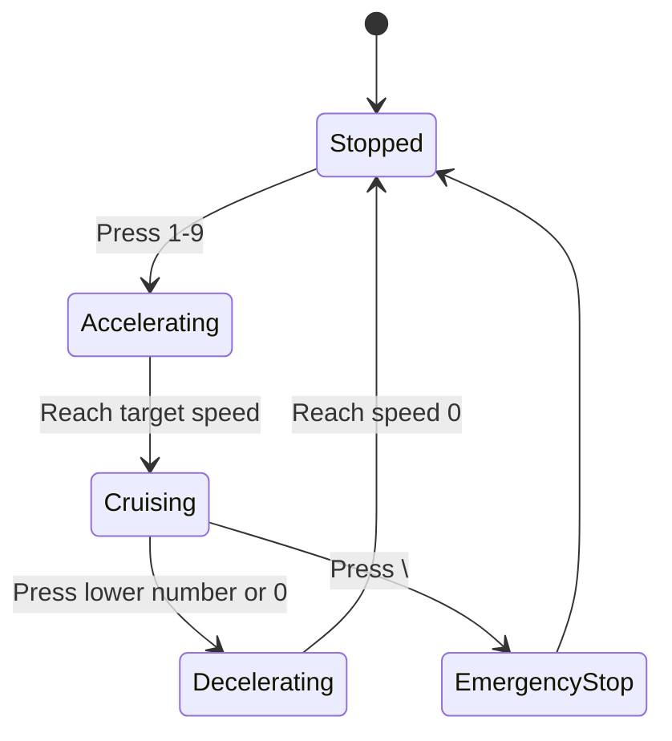

---

### User presses \ key and initiates emergency stop

**Use Case**: Immediately brings the ship to a full stop

**Sequence Diagram**:

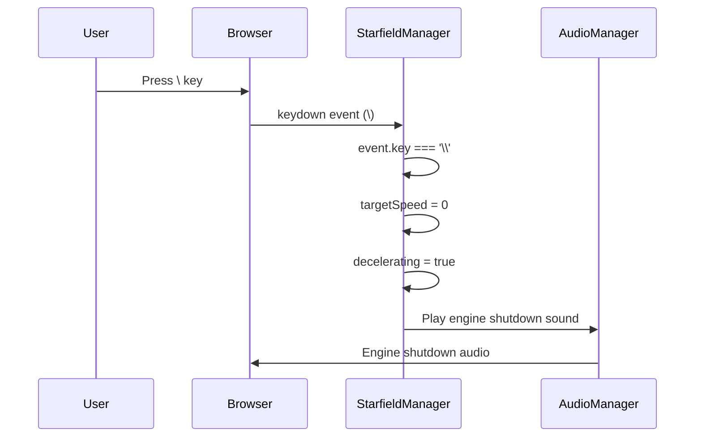

---

### User presses arrow keys and controls ship attitude

**Use Case**: Rotates the ship using left/right/up/down arrow keys for precise maneuvering

**Sequence Diagram**:

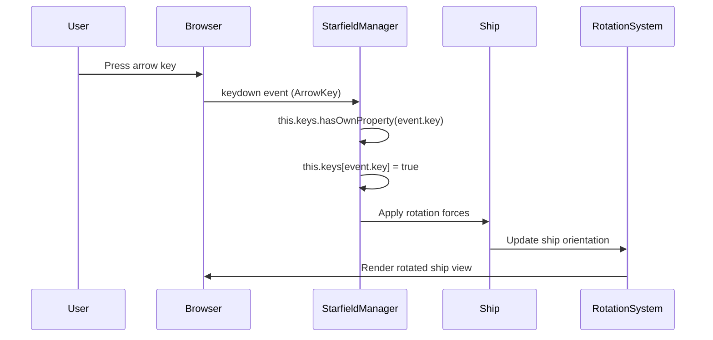

---

## SHIP SYSTEMS

### User presses S key and toggles shield control

**Use Case**: Activates or deactivates the ship's defensive shield system (requires shields system to be installed)

**Sequence Diagram**:

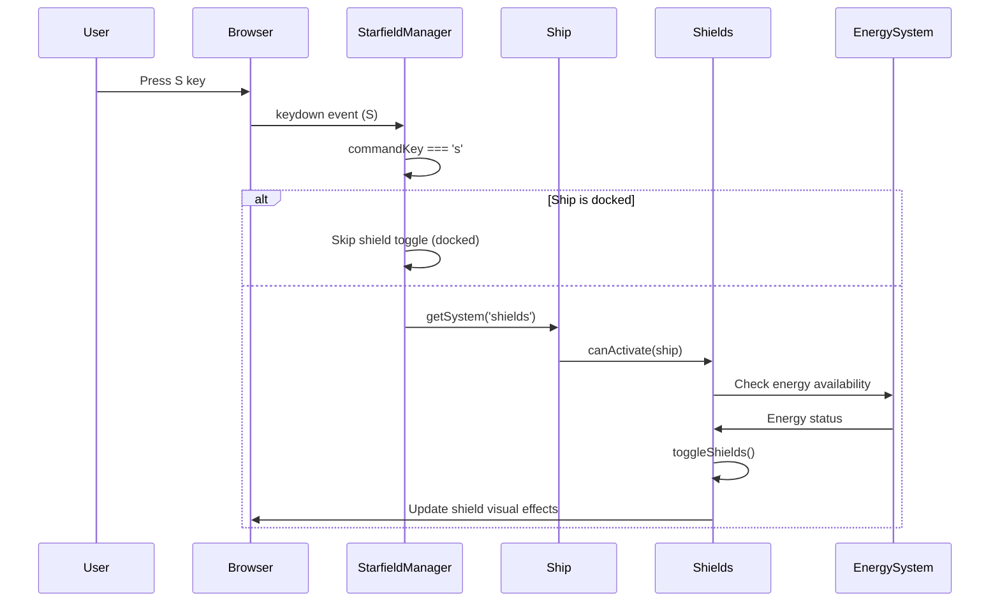

---

### User presses L key and toggles long range scanner

**Use Case**: Opens or closes the long range scanner interface for detecting distant objects (requires long range scanner system)

**Sequence Diagram**:

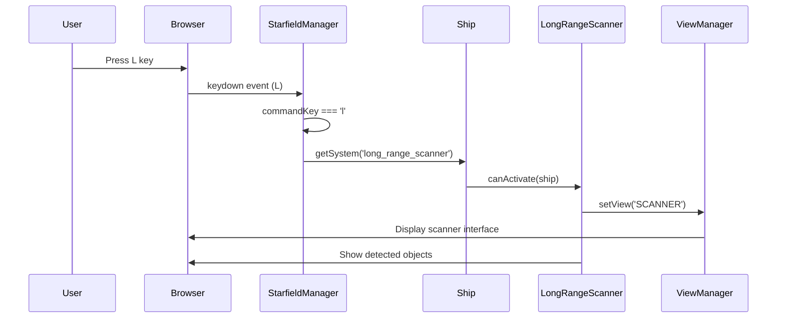

---

### User presses C key and opens star charts navigation

**Use Case**: Displays the star charts system for navigation and discovery (requires star charts system)

**Sequence Diagram**:

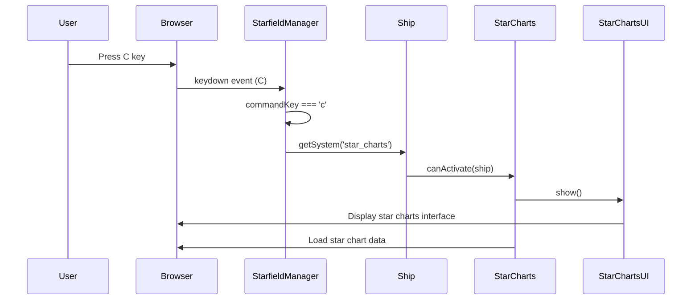

---

### User presses R key and toggles subspace radio

**Use Case**: Turns the subspace radio on or off to receive/ignore communications (requires subspace radio system)

**Sequence Diagram**:

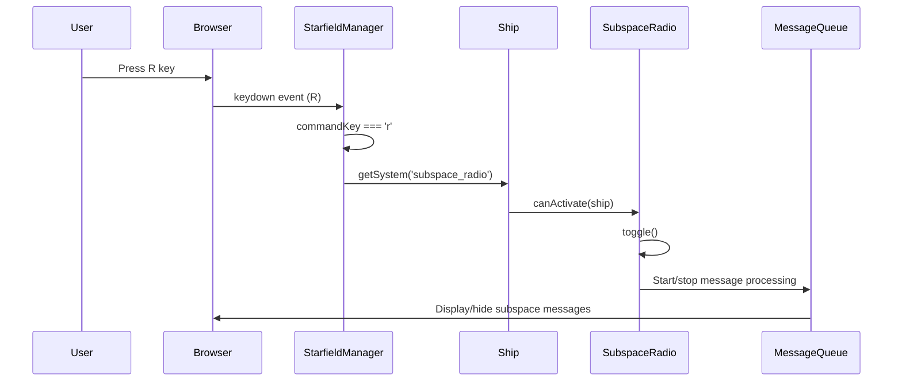

---

### User presses P key and toggles proximity detector

**Use Case**: Activates or deactivates the radar system for nearby object detection (requires proximity detector/radar system)

**Sequence Diagram**:

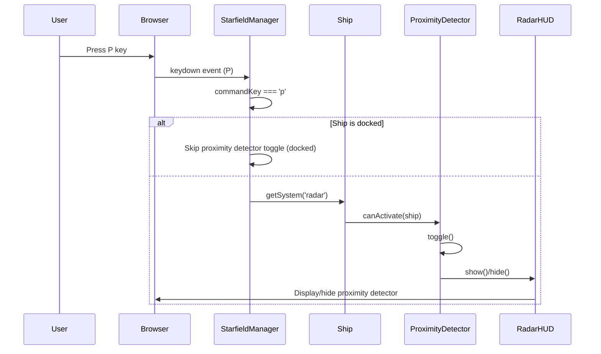

---

### User presses +/= keys and zooms proximity detector in

**Use Case**: Increases zoom level on the proximity detector for closer inspection (when proximity detector is active)

**Sequence Diagram**:

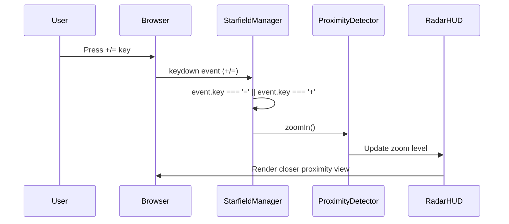

---

### User presses -/_ keys and zooms proximity detector out

**Use Case**: Decreases zoom level on the proximity detector for wider view (when proximity detector is active)

**Sequence Diagram**:

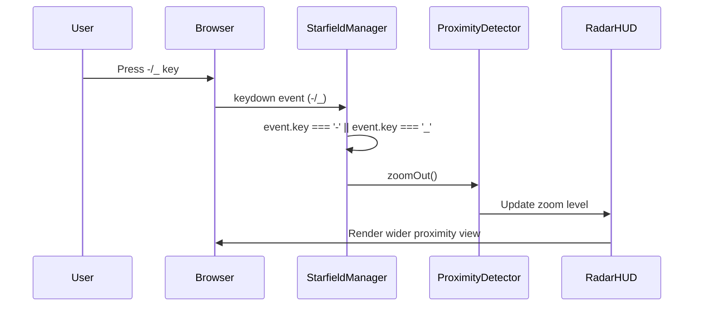

---

### User presses \ key and toggles proximity detector view mode

**Use Case**: Switches between 3D and top-down view modes in the proximity detector (when proximity detector is active)

**Sequence Diagram**:

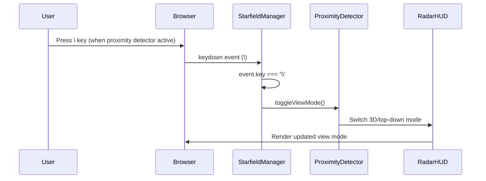

---

### User presses G key and opens galactic chart

**Use Case**: Displays the galactic chart for long-range navigation planning (requires galactic chart system)

**Sequence Diagram**:

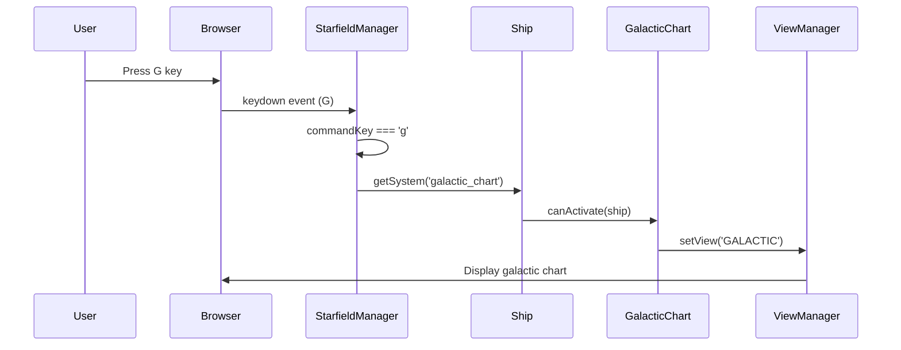

---

### User presses T key and toggles target computer

**Use Case**: Activates or deactivates the target computer system (requires target computer system)

**Sequence Diagram**:

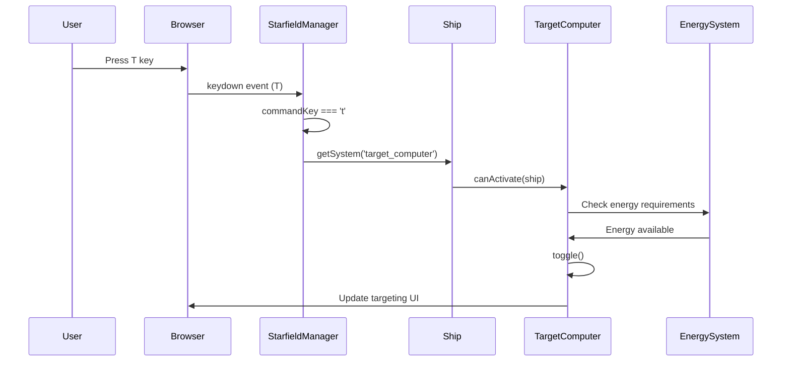

---

### User presses I key and displays intel information

**Use Case**: Shows detailed intelligence data for the currently targeted object (requires target computer and scanner systems)

**Sequence Diagram**:

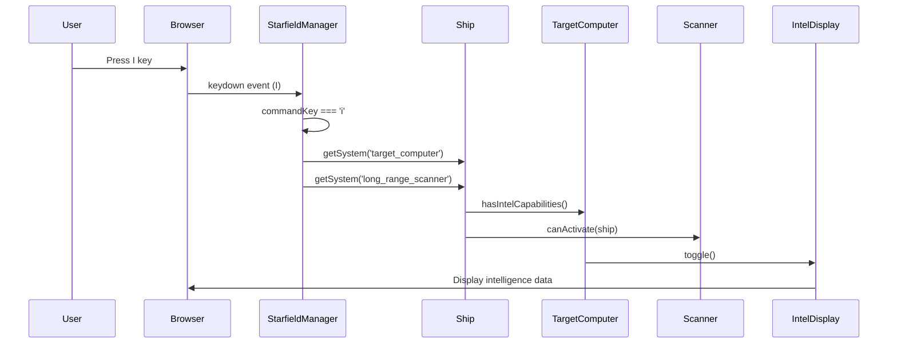

---

## COMBAT SYSTEMS

### User presses Tab key and cycles to next target

**Use Case**: Selects the next available target in the target computer

**Sequence Diagram**:

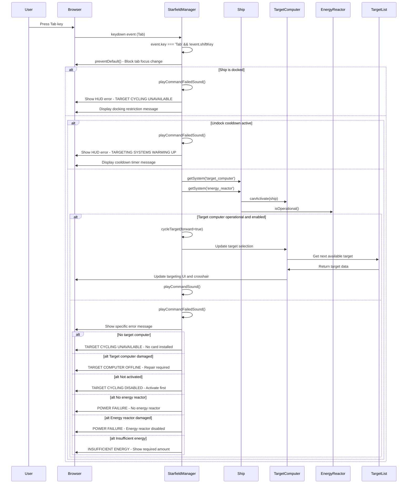

**Supporting State Diagram** (Target Selection States):

```mermaid
stateDiagram-v2
    [*] --> NoTarget
    NoTarget --> Docked: Ship docked
    NoTarget --> Cooldown: Undock cooldown active
    NoTarget --> SystemCheck: Systems available
    SystemCheck --> TargetLocked: Tab pressed, target found
    TargetLocked --> TargetLocked: Tab pressed, cycle to next
    TargetLocked --> NoTarget: Target destroyed/lost
    TargetLocked --> SystemFailure: System requirements not met
    SystemFailure --> NoTarget: Error displayed
    Docked --> NoTarget: Error displayed
    Cooldown --> NoTarget: Error displayed
```

---

### User presses Shift+Tab keys and cycles to previous target

**Use Case**: Selects the previous available target in the target computer

**Sequence Diagram**:

```mermaid
sequenceDiagram
    participant User
    participant Browser
    participant StarfieldManager
    participant Ship
    participant TargetComputer
    participant EnergyReactor
    participant TargetList

    User->>Browser: Press Shift+Tab keys
    Browser->>StarfieldManager: keydown event (Tab, shiftKey=true)
    StarfieldManager->>StarfieldManager: event.key === 'Tab' && event.shiftKey
    StarfieldManager->>Browser: preventDefault() - Block tab focus change

    alt Ship is docked
        StarfieldManager->>StarfieldManager: playCommandFailedSound()
        StarfieldManager->>Browser: Show HUD error - TARGET CYCLING UNAVAILABLE
        StarfieldManager->>Browser: Display docking restriction message
    else
        alt Undock cooldown active
            StarfieldManager->>StarfieldManager: playCommandFailedSound()
            StarfieldManager->>Browser: Show HUD error - TARGETING SYSTEMS WARMING UP
            StarfieldManager->>Browser: Display cooldown timer message
        else
            StarfieldManager->>Ship: getSystem('target_computer')
            StarfieldManager->>Ship: getSystem('energy_reactor')
            Ship->>TargetComputer: canActivate(ship)
            Ship->>EnergyReactor: isOperational()

            alt Target computer operational and enabled
                StarfieldManager->>StarfieldManager: cycleTarget(forward=false)
                StarfieldManager->>TargetComputer: Update target selection
                TargetComputer->>TargetList: Get previous available target
                TargetList->>TargetComputer: Return target data
                TargetComputer->>Browser: Update targeting UI and crosshair
                StarfieldManager->>StarfieldManager: playCommandSound()
            else
                StarfieldManager->>StarfieldManager: playCommandFailedSound()
                StarfieldManager->>Browser: Show specific error message
                alt No target computer
                    StarfieldManager->>Browser: TARGET CYCLING UNAVAILABLE - No card installed
                else alt Target computer damaged
                    StarfieldManager->>Browser: TARGET COMPUTER OFFLINE - Repair required
                else alt Not activated
                    StarfieldManager->>Browser: TARGET CYCLING DISABLED - Activate first
                else alt No energy reactor
                    StarfieldManager->>Browser: POWER FAILURE - No energy reactor
                else alt Energy reactor damaged
                    StarfieldManager->>Browser: POWER FAILURE - Energy reactor disabled
                else alt Insufficient energy
                    StarfieldManager->>Browser: INSUFFICIENT ENERGY - Show required amount
                end
            end
        end
    end
```

---

### User presses Space key and fires active weapon

**Use Case**: Launches the currently selected weapon at the targeted object

**Sequence Diagram**:

```mermaid
sequenceDiagram
    participant User
    participant Browser
    participant StarfieldManager
    participant Ship
    participant WeaponSystem
    participant ActiveWeapon

    User->>Browser: Press Space key
    Browser->>StarfieldManager: keydown event (Space)
    StarfieldManager->>StarfieldManager: event.key === ' '

    alt Ship is docked
        StarfieldManager->>StarfieldManager: playCommandFailedSound()
        StarfieldManager->>Browser: Show HUD error - Cannot fire while docked
    else
        StarfieldManager->>Ship: getSystem('weaponSystem')
        Ship->>WeaponSystem: fireActiveWeapon()

        alt Weapon fired successfully
            WeaponSystem->>ActiveWeapon: Fire weapon
            ActiveWeapon->>Browser: Render weapon effects and projectiles
            WeaponSystem->>Browser: Update weapon status/cooldown
            Note over StarfieldManager: Weapons play their own audio
        else
            StarfieldManager->>StarfieldManager: playCommandFailedSound()
            StarfieldManager->>Browser: Show weapon firing error
        end
    end
```

---

### User presses , key and selects previous weapon

**Use Case**: Cycles to the previous weapon in the ship's arsenal

**Sequence Diagram**:

```mermaid
sequenceDiagram
    participant User
    participant Browser
    participant StarfieldManager
    participant Ship
    participant WeaponSystem
    participant WeaponSlots

    User->>Browser: Press , key
    Browser->>StarfieldManager: keydown event (,)
    StarfieldManager->>StarfieldManager: event.key === ','

    alt Ship is docked
        StarfieldManager->>Browser: Cannot cycle weapons while docked
    else
        StarfieldManager->>Ship: getSystem('weaponSystem')
        Ship->>WeaponSystem: selectPreviousWeapon()
        WeaponSystem->>WeaponSlots: Find previous equipped weapon
        WeaponSlots->>WeaponSystem: Return previous weapon data
        WeaponSystem->>WeaponSystem: Set as active weapon
        WeaponSystem->>Browser: Update weapon display/UI
    end
```

---

### User presses . key and selects next weapon

**Use Case**: Cycles to the next weapon in the ship's arsenal

**Sequence Diagram**:

```mermaid
sequenceDiagram
    participant User
    participant Browser
    participant StarfieldManager
    participant Ship
    participant WeaponSystem
    participant WeaponSlots

    User->>Browser: Press . key
    Browser->>StarfieldManager: keydown event (.)
    StarfieldManager->>StarfieldManager: event.key === '.'

    alt Ship is docked
        StarfieldManager->>Browser: Cannot cycle weapons while docked
    else
        StarfieldManager->>Ship: getSystem('weaponSystem')
        Ship->>WeaponSystem: selectNextWeapon()
        WeaponSystem->>WeaponSlots: Find next equipped weapon
        WeaponSlots->>WeaponSystem: Return next weapon data
        WeaponSystem->>WeaponSystem: Set as active weapon
        WeaponSystem->>Browser: Update weapon display/UI
    end
```

---

### User presses / key and toggles weapon autofire

**Use Case**: Enables or disables automatic weapon firing mode

**Sequence Diagram**:

```mermaid
sequenceDiagram
    participant User
    participant Browser
    participant StarfieldManager
    participant Ship
    participant WeaponSystem

    User->>Browser: Press / key
    Browser->>StarfieldManager: keydown event (/)
    StarfieldManager->>StarfieldManager: event.key === '/'

    alt Ship is docked
        StarfieldManager->>Browser: Cannot toggle autofire while docked
    else
        StarfieldManager->>Ship: getSystem('weaponSystem')
        Ship->>WeaponSystem: toggleAutofire()

        alt Autofire toggled successfully
            WeaponSystem->>WeaponSystem: Update autofire state
            WeaponSystem->>Browser: Update autofire indicator/UI
            StarfieldManager->>StarfieldManager: playCommandSound()
        else
            StarfieldManager->>StarfieldManager: playCommandFailedSound()
        end
    end
```

---

### User presses Z key and selects previous sub-system target

**Use Case**: Cycles targeting to the previous sub-system on the enemy ship (requires Level 3+ Target Computer)

**Sequence Diagram**:

```mermaid
sequenceDiagram
    participant User
    participant Browser
    participant StarfieldManager
    participant Ship
    participant TargetComputer
    participant WeaponSystem

    User->>Browser: Press Z key
    Browser->>StarfieldManager: keydown event (Z)
    StarfieldManager->>StarfieldManager: event.key === 'z'

    alt Ship is docked or target computer disabled
        StarfieldManager->>StarfieldManager: playCommandFailedSound()
    else alt No target computer installed
        StarfieldManager->>StarfieldManager: playCommandFailedSound()
        WeaponSystem->>Browser: Show message - No Target Computer Installed
    else alt Target computer level < 3
        StarfieldManager->>StarfieldManager: playCommandFailedSound()
        WeaponSystem->>Browser: Show message - Sub-targeting requires Level 3+
    else alt No weapon selected
        StarfieldManager->>StarfieldManager: playCommandFailedSound()
        WeaponSystem->>Browser: Show message - No Weapon Selected
    else
        StarfieldManager->>Ship: getSystem('target_computer')
        Ship->>TargetComputer: handleSubTargetingKey('previous')
        TargetComputer->>TargetComputer: Select previous subsystem
        TargetComputer->>Browser: Update targeting crosshair position
        TargetComputer->>Browser: Show subsystem damage indicator
        StarfieldManager->>StarfieldManager: Hide intel panel if visible
    end
```

---

### User presses X key and selects next sub-system target

**Use Case**: Cycles targeting to the next sub-system on the enemy ship (requires Level 3+ Target Computer)

**Sequence Diagram**:

```mermaid
sequenceDiagram
    participant User
    participant Browser
    participant StarfieldManager
    participant Ship
    participant TargetComputer
    participant WeaponSystem

    User->>Browser: Press X key
    Browser->>StarfieldManager: keydown event (X)
    StarfieldManager->>StarfieldManager: event.key === 'x'

    alt Ship is docked or target computer disabled
        StarfieldManager->>StarfieldManager: playCommandFailedSound()
    else alt No target computer installed
        StarfieldManager->>StarfieldManager: playCommandFailedSound()
        WeaponSystem->>Browser: Show message - No Target Computer Installed
    else alt Target computer level < 3
        StarfieldManager->>StarfieldManager: playCommandFailedSound()
        WeaponSystem->>Browser: Show message - Sub-targeting requires Level 3+
    else alt No weapon selected
        StarfieldManager->>StarfieldManager: playCommandFailedSound()
        WeaponSystem->>Browser: Show message - No Weapon Selected
    else
        StarfieldManager->>Ship: getSystem('target_computer')
        Ship->>TargetComputer: handleSubTargetingKey('next')
        TargetComputer->>TargetComputer: Select next subsystem
        TargetComputer->>Browser: Update targeting crosshair position
        TargetComputer->>Browser: Show subsystem damage indicator
        StarfieldManager->>StarfieldManager: Hide intel panel if visible
    end
```

---

## ADVANCED OPERATIONS

### User presses Q key and creates training targets

**Use Case**: Spawns dummy ships for weapons practice and testing

**Sequence Diagram**:

```mermaid
sequenceDiagram
    participant User
    participant Browser
    participant StarfieldManager
    participant TargetingService

    User->>Browser: Press Q key
    Browser->>StarfieldManager: keydown event (Q)
    StarfieldManager->>StarfieldManager: commandKey === 'q'

    alt Ship is docked
        StarfieldManager->>StarfieldManager: playCommandFailedSound()
        StarfieldManager->>Browser: Show HUD error - TARGET SPAWNING UNAVAILABLE
        StarfieldManager->>Browser: Display docking restriction message
    else
        StarfieldManager->>StarfieldManager: playCommandSound()
        StarfieldManager->>Browser: Log spawning message
        StarfieldManager->>StarfieldManager: createTargetDummyShips(3)

        alt Targeting service available
            StarfieldManager->>TargetingService: clearCache()
            TargetingService->>Browser: Clear stale targeting data
        end

        StarfieldManager->>Browser: Add dummy ships to scene
    end
```

**Supporting State Diagram** (Training Target Lifecycle):

```mermaid
stateDiagram-v2
    [*] --> Spawned: Q key pressed
    Spawned --> Active: AI initialized
    Active --> CombatReady: Target acquired
    CombatReady --> Destroyed: Weapons fire
    Destroyed --> [*]: Ship removed
    Active --> Idle: No targets
```

---

## DEBUG & DEVELOPER

### User presses Ctrl+O keys and toggles weapon debug

**Use Case**: Enables or disables debug display showing FPS and system information

**Sequence Diagram**:

```mermaid
sequenceDiagram
    participant User
    participant Browser
    participant StarfieldManager
    participant SpatialManager

    User->>Browser: Press Ctrl+O keys
    Browser->>StarfieldManager: keydown event (O, ctrlKey=true)
    StarfieldManager->>StarfieldManager: event.ctrlKey && event.key.toLowerCase() === 'o'
    StarfieldManager->>Browser: preventDefault()
    StarfieldManager->>Browser: Log debug toggle message
    StarfieldManager->>StarfieldManager: toggleDebugMode()
    StarfieldManager->>Browser: Log debug mode status

    alt SpatialManager available
        StarfieldManager->>SpatialManager: Get stats
        SpatialManager->>StarfieldManager: Return tracked objects data
        StarfieldManager->>Browser: Log spatial manager info
    end

    StarfieldManager->>Browser: Log completion message
```

---

### User presses Ctrl+Shift+P keys and toggles wireframe visibility

**Use Case**: Enhanced wireframe visibility toggle for debugging wireframe issues

**Sequence Diagram**:

```mermaid
sequenceDiagram
    participant User
    participant Browser
    participant StarfieldManager
    participant PhysicsManager

    User->>Browser: Press Ctrl+Shift+P keys
    Browser->>StarfieldManager: keydown event (P, ctrlKey=true, shiftKey=true)
    StarfieldManager->>StarfieldManager: event.ctrlKey && event.shiftKey && event.key.toLowerCase() === 'p'
    StarfieldManager->>Browser: preventDefault()
    StarfieldManager->>Browser: Log wireframe enhancement message

    alt Physics manager available and debug mode active
        StarfieldManager->>PhysicsManager: enhanceWireframeVisibility()
        PhysicsManager->>Browser: Update wireframe rendering
    else
        StarfieldManager->>Browser: Log error - debug mode not active
        StarfieldManager->>Browser: Display instruction to enable debug mode first
    end
```

---

### User presses Ctrl+Shift+E keys and downloads error report

**Use Case**: Downloads a comprehensive error report for debugging (handled by ErrorReporter)

**Sequence Diagram**:

```mermaid
sequenceDiagram
    participant User
    participant Browser
    participant ErrorReporter

    User->>Browser: Press Ctrl+Shift+E keys
    Browser->>ErrorReporter: keydown event (E, ctrlKey=true, shiftKey=true)
    ErrorReporter->>ErrorReporter: event.ctrlKey && event.shiftKey && event.key === 'E'
    ErrorReporter->>Browser: preventDefault()
    ErrorReporter->>ErrorReporter: Generate error report
    ErrorReporter->>Browser: Download error report file
```

---

## AI DEBUG CONTROLS

### User presses Cmd+Shift+A keys and toggles AI debug mode

**Use Case**: Enables or disables AI behavior debugging display

**Sequence Diagram**:

```mermaid
sequenceDiagram
    participant User
    participant Browser
    participant StarfieldManager
    participant EnemyAIManager
    participant DebugVisualizer

    User->>Browser: Press Cmd+Shift+A keys
    Browser->>StarfieldManager: keydown event (A, metaKey=true, shiftKey=true)
    StarfieldManager->>StarfieldManager: event.metaKey && event.shiftKey && event.key === 'a'
    StarfieldManager->>EnemyAIManager: setDebugMode(!debugMode)
    EnemyAIManager->>DebugVisualizer: Enable/disable debug display
    DebugVisualizer->>Browser: Show/hide AI debug information
    EnemyAIManager->>Browser: Update AI status console output
```

---

### User presses Cmd+Shift+E keys and forces all AIs to engage

**Use Case**: Commands all AI ships to enter combat engagement state

**Sequence Diagram**:

```mermaid
sequenceDiagram
    participant User
    participant Browser
    participant StarfieldManager
    participant EnemyAIManager
    participant AIShips

    User->>Browser: Press Cmd+Shift+E keys
    Browser->>StarfieldManager: keydown event (E, metaKey=true, shiftKey=true)
    StarfieldManager->>StarfieldManager: event.metaKey && event.shiftKey && event.key === 'e'
    StarfieldManager->>EnemyAIManager: forceAllAIState('engage')
    EnemyAIManager->>AIShips: Set state to ENGAGE
    AIShips->>AIShips: Update AI behavior
    EnemyAIManager->>Browser: Log state change confirmation
```

---

### User presses Cmd+Shift+I keys and forces all AIs to idle

**Use Case**: Commands all AI ships to enter idle/passive state

**Sequence Diagram**:

```mermaid
sequenceDiagram
    participant User
    participant Browser
    participant StarfieldManager
    participant EnemyAIManager
    participant AIShips

    User->>Browser: Press Cmd+Shift+I keys
    Browser->>StarfieldManager: keydown event (I, metaKey=true, shiftKey=true)
    StarfieldManager->>StarfieldManager: event.metaKey && event.shiftKey && event.key === 'i'
    StarfieldManager->>EnemyAIManager: forceAllAIState('idle')
    EnemyAIManager->>AIShips: Set state to IDLE
    AIShips->>AIShips: Update AI behavior
    EnemyAIManager->>Browser: Log state change confirmation
```

---

### User presses Cmd+Shift+S keys and displays AI statistics

**Use Case**: Shows detailed AI performance and behavior statistics in console

**Sequence Diagram**:

```mermaid
sequenceDiagram
    participant User
    participant Browser
    participant StarfieldManager
    participant EnemyAIManager
    participant StatisticsCollector

    User->>Browser: Press Cmd+Shift+S keys
    Browser->>StarfieldManager: keydown event (S, metaKey=true, shiftKey=true)
    StarfieldManager->>StarfieldManager: event.metaKey && event.shiftKey && event.key === 's'
    StarfieldManager->>EnemyAIManager: getAIStats()
    EnemyAIManager->>StatisticsCollector: Gather AI performance data
    StatisticsCollector->>EnemyAIManager: Return statistics object
    EnemyAIManager->>Browser: Log detailed AI statistics
```

---

### User presses Cmd+Shift+F keys and forces all AIs to flee

**Use Case**: Commands all AI ships to enter flee/escape state

**Sequence Diagram**:

```mermaid
sequenceDiagram
    participant User
    participant Browser
    participant StarfieldManager
    participant EnemyAIManager
    participant AIShips

    User->>Browser: Press Cmd+Shift+F keys
    Browser->>StarfieldManager: keydown event (F, metaKey=true, shiftKey=true)
    StarfieldManager->>StarfieldManager: event.metaKey && event.shiftKey && event.key === 'f'
    StarfieldManager->>EnemyAIManager: forceAllAIState('flee')
    EnemyAIManager->>AIShips: Set state to FLEE
    AIShips->>AIShips: Update AI behavior and movement
    EnemyAIManager->>Browser: Log state change confirmation
```

---

### User presses Cmd+Shift+V keys and creates V-formation

**Use Case**: Arranges all AI ships into a V-shaped flight formation

**Sequence Diagram**:

```mermaid
sequenceDiagram
    participant User
    participant Browser
    participant StarfieldManager
    participant EnemyAIManager
    participant FormationController

    User->>Browser: Press Cmd+Shift+V keys
    Browser->>StarfieldManager: keydown event (V, metaKey=true, shiftKey=true)
    StarfieldManager->>StarfieldManager: event.metaKey && event.shiftKey && event.key === 'v'
    StarfieldManager->>EnemyAIManager: createFormation(targetDummyShips, 'v_formation')
    EnemyAIManager->>FormationController: Calculate V-formation positions
    FormationController->>EnemyAIManager: Formation coordinates
    EnemyAIManager->>Browser: Update ship positions for V-formation
    EnemyAIManager->>Browser: Log formation creation confirmation
```

---

### User presses Cmd+Shift+C keys and creates column formation

**Use Case**: Arranges all AI ships into a column formation

**Sequence Diagram**:

```mermaid
sequenceDiagram
    participant User
    participant Browser
    participant StarfieldManager
    participant EnemyAIManager
    participant FormationController

    User->>Browser: Press Cmd+Shift+C keys
    Browser->>StarfieldManager: keydown event (C, metaKey=true, shiftKey=true)
    StarfieldManager->>StarfieldManager: event.metaKey && event.shiftKey && event.key === 'c'
    StarfieldManager->>EnemyAIManager: createFormation(targetDummyShips, 'column')
    EnemyAIManager->>FormationController: Calculate column formation positions
    FormationController->>EnemyAIManager: Formation coordinates
    EnemyAIManager->>Browser: Update ship positions for column formation
    EnemyAIManager->>Browser: Log formation creation confirmation
```

---

### User presses Cmd+Shift+L keys and creates line abreast formation

**Use Case**: Arranges all AI ships into a line abreast formation

**Sequence Diagram**:

```mermaid
sequenceDiagram
    participant User
    participant Browser
    participant StarfieldManager
    participant EnemyAIManager
    participant FormationController

    User->>Browser: Press Cmd+Shift+L keys
    Browser->>StarfieldManager: keydown event (L, metaKey=true, shiftKey=true)
    StarfieldManager->>StarfieldManager: event.metaKey && event.shiftKey && event.key === 'l'
    StarfieldManager->>EnemyAIManager: createFormation(targetDummyShips, 'line_abreast')
    EnemyAIManager->>FormationController: Calculate line abreast formation positions
    FormationController->>EnemyAIManager: Formation coordinates
    EnemyAIManager->>Browser: Update ship positions for line abreast formation
    EnemyAIManager->>Browser: Log formation creation confirmation
```

---

### User presses Cmd+Shift+B keys and shows flocking statistics

**Use Case**: Displays detailed flocking behavior data for AI ships

**Sequence Diagram**:

```mermaid
sequenceDiagram
    participant User
    participant Browser
    participant StarfieldManager
    participant EnemyAIManager
    participant FlockingSystem

    User->>Browser: Press Cmd+Shift+B keys
    Browser->>StarfieldManager: keydown event (B, metaKey=true, shiftKey=true)
    StarfieldManager->>StarfieldManager: event.metaKey && event.shiftKey && event.key === 'b'
    StarfieldManager->>EnemyAIManager: getFlockingStats()
    EnemyAIManager->>FlockingSystem: Gather flocking behavior data
    FlockingSystem->>EnemyAIManager: Return flocking statistics
    EnemyAIManager->>Browser: Log detailed flocking statistics
```

---

### User presses Cmd+Shift+T keys and shows combat statistics

**Use Case**: Displays real-time combat performance data for all AI ships

**Sequence Diagram**:

```mermaid
sequenceDiagram
    participant User
    participant Browser
    participant StarfieldManager
    participant EnemyAIManager
    participant CombatAnalyzer

    User->>Browser: Press Cmd+Shift+T keys
    Browser->>StarfieldManager: keydown event (T, metaKey=true, shiftKey=true)
    StarfieldManager->>StarfieldManager: event.metaKey && event.shiftKey && event.key === 't'
    StarfieldManager->>EnemyAIManager: getCombatStats()
    EnemyAIManager->>CombatAnalyzer: Analyze combat performance
    CombatAnalyzer->>EnemyAIManager: Return combat statistics
    EnemyAIManager->>Browser: Log detailed combat statistics for each ship
```

---

### User presses Cmd+Shift+W keys and shows weapon targeting debug

**Use Case**: Displays AI weapon targeting calculations and firing solutions

**Sequence Diagram**:

```mermaid
sequenceDiagram
    participant User
    participant Browser
    participant StarfieldManager
    participant EnemyAIManager
    participant WeaponTargetingSystem

    User->>Browser: Press Cmd+Shift+W keys
    Browser->>StarfieldManager: keydown event (W, metaKey=true, shiftKey=true)
    StarfieldManager->>StarfieldManager: event.metaKey && event.shiftKey && event.key === 'w'
    StarfieldManager->>EnemyAIManager: getWeaponTargetingDebug()
    EnemyAIManager->>WeaponTargetingSystem: Gather targeting data
    WeaponTargetingSystem->>EnemyAIManager: Return targeting debug information
    EnemyAIManager->>Browser: Log weapon targeting calculations
```

---

### User presses Cmd+Shift+X keys and forces AIs to target player

**Use Case**: Commands all AI ships to target and engage the player

**Sequence Diagram**:

```mermaid
sequenceDiagram
    participant User
    participant Browser
    participant StarfieldManager
    participant EnemyAIManager
    participant AIShips

    User->>Browser: Press Cmd+Shift+X keys
    Browser->>StarfieldManager: keydown event (X, metaKey=true, shiftKey=true)
    StarfieldManager->>StarfieldManager: event.metaKey && event.shiftKey && event.key === 'x'
    StarfieldManager->>EnemyAIManager: forceTargetPlayer()
    EnemyAIManager->>AIShips: Set target to player ship
    AIShips->>AIShips: Update targeting and engagement behavior
    EnemyAIManager->>Browser: Log player targeting confirmation
```

---

### User presses Cmd+Shift+P keys and shows performance statistics

**Use Case**: Displays AI system performance metrics and timing data

**Sequence Diagram**:

```mermaid
sequenceDiagram
    participant User
    participant Browser
    participant StarfieldManager
    participant EnemyAIManager
    participant PerformanceManager

    User->>Browser: Press Cmd+Shift+P keys
    Browser->>StarfieldManager: keydown event (P, metaKey=true, shiftKey=true)
    StarfieldManager->>StarfieldManager: event.metaKey && event.shiftKey && event.key === 'p'
    StarfieldManager->>EnemyAIManager: getPerformanceStats()
    EnemyAIManager->>PerformanceManager: Gather performance metrics
    PerformanceManager->>EnemyAIManager: Return performance statistics
    EnemyAIManager->>Browser: Log detailed performance statistics
```

---

### User presses Cmd+Shift+D keys and toggles debug visualization

**Use Case**: Enables or disables 3D debug overlays for AI behavior visualization

**Sequence Diagram**:

```mermaid
sequenceDiagram
    participant User
    participant Browser
    participant StarfieldManager
    participant EnemyAIManager
    participant DebugVisualizer

    User->>Browser: Press Cmd+Shift+D keys
    Browser->>StarfieldManager: keydown event (D, metaKey=true, shiftKey=true)
    StarfieldManager->>StarfieldManager: event.metaKey && event.shiftKey && event.key === 'd'
    StarfieldManager->>EnemyAIManager: toggleDebugVisualization()
    EnemyAIManager->>DebugVisualizer: Enable/disable 3D debug overlays
    DebugVisualizer->>Browser: Show/hide debug visualizations
    DebugVisualizer->>Browser: Update debug overlay rendering
```

---

## MISSION & COMMUNICATION

### User presses N key and toggles communication HUD

**Use Case**: Toggles communication HUD visibility or effects based on current state

**Sequence Diagram**:

```mermaid
sequenceDiagram
    participant User
    participant Browser
    participant StarfieldManager
    participant CommunicationHUD

    User->>Browser: Press N key
    Browser->>StarfieldManager: keydown event (N)
    StarfieldManager->>StarfieldManager: commandKey === 'n'

    alt Communication HUD exists
        StarfieldManager->>CommunicationHUD: Check visibility

        alt HUD not visible
            StarfieldManager->>CommunicationHUD: toggle()
            CommunicationHUD->>Browser: Show communication interface
            StarfieldManager->>StarfieldManager: playCommandSound()
            StarfieldManager->>Browser: Log HUD toggled ON
        else HUD visible
            StarfieldManager->>CommunicationHUD: toggleEffects()
            CommunicationHUD->>Browser: Switch between enhanced/minimal effects
            StarfieldManager->>Browser: Log effects mode change
        end
    else
        StarfieldManager->>StarfieldManager: playCommandFailedSound()
        StarfieldManager->>Browser: Show error - Communication system not initialized
    end
```

**Supporting Interaction Diagram** (Communication Flow):

```mermaid
graph TD
    A[User Presses N] --> B{Communication HUD Visible?}
    B -->|No| C[Show HUD]
    B -->|Yes| D[Toggle Effects Mode]
    C --> E[Load Messages]
    D --> F[Switch Video/Wireframe Mode]
    E --> G[Display NPC Communications]
    F --> G
    G --> H[Enable Player Response]
```

---

### User presses M key and toggles mission status

**Use Case**: Displays or hides the mission status and objectives screen (dismisses conflicting HUDs)

**Sequence Diagram**:

```mermaid
sequenceDiagram
    participant User
    participant Browser
    participant StarfieldManager
    participant MissionStatusHUD
    participant MissionManager
    participant ViewManager
    participant DamageControlHUD

    User->>Browser: Press M key
    Browser->>StarfieldManager: keydown event (M)
    StarfieldManager->>StarfieldManager: commandKey === 'm'

    alt Ship is docked
        StarfieldManager->>StarfieldManager: playCommandFailedSound()
        StarfieldManager->>Browser: Show error - Use Mission Board while docked
    else
        alt Mission Status HUD exists
            StarfieldManager->>MissionStatusHUD: Check current visibility

            alt Damage Control HUD visible
                StarfieldManager->>DamageControlHUD: hide()
                DamageControlHUD->>Browser: Dismiss damage control interface
                StarfieldManager->>Browser: Log damage control dismissed
            end

            alt Galactic Chart visible
                StarfieldManager->>ViewManager: galacticChart.hide()
                ViewManager->>Browser: Dismiss galactic chart
                StarfieldManager->>Browser: Log galactic chart dismissed
            end

            alt Long Range Scanner visible
                StarfieldManager->>ViewManager: longRangeScanner.hide()
                ViewManager->>Browser: Dismiss long range scanner
                StarfieldManager->>Browser: Log long range scanner dismissed
            end

            StarfieldManager->>MissionStatusHUD: toggle()
            MissionStatusHUD->>MissionStatusHUD: Update visibility state
            MissionStatusHUD->>MissionManager: Get active missions
            MissionManager->>MissionStatusHUD: Return mission data
            MissionStatusHUD->>Browser: Show/hide mission status
            MissionStatusHUD->>Browser: Display objectives and progress
            StarfieldManager->>StarfieldManager: playCommandSound()
            StarfieldManager->>Browser: Log mission status toggle state
        else
            StarfieldManager->>StarfieldManager: playCommandFailedSound()
            StarfieldManager->>Browser: Show error - Mission system not initialized
        end
    end
```

---

## UNIMPLEMENTED FEATURES

The following features are referenced in the HelpInterface but are not currently implemented in the codebase:

### Ctrl+Shift+B - Emergency Repair
**Status**: Referenced in HelpInterface but no key binding exists in StarfieldManager
**Purpose**: Would instantly repair all damaged ship systems for development/testing
**Implementation Status**: Not implemented

### Ctrl+U - Debug Mode Toggle
**Status**: Not found in the codebase
**Purpose**: Would toggle general debug display mode
**Implementation Status**: Not implemented

### Ctrl+E - Edit Mode
**Status**: Ctrl+Shift+E exists for error reporting, but Ctrl+E for edit mode is not implemented
**Purpose**: Would activate development editing capabilities
**Implementation Status**: Not implemented

### Ctrl+W - Warp Control Mode
**Status**: Not found in the codebase
**Purpose**: Would enable manual warp drive control for testing
**Implementation Status**: Not implemented

---

# APPENDIX A: Core Game Architecture Class Diagram

```mermaid
classDiagram
    class StarfieldManager {
        +viewManager: ViewManager
        +ship: Ship
        +targetComputerManager: TargetComputerManager
        +damageControlHUD: DamageControlHUD
        +missionStatusHUD: MissionStatusHUD
        +communicationHUD: CommunicationHUD
        +enemyAIManager: EnemyAIManager
        +audioManager: AudioManager

        +toggleHelp(): void
        +cycleTarget(forward: boolean): void
        +toggleDamageControl(): void
        +createTargetDummyShips(count: number): void
        +playCommandSound(): void
        +playCommandFailedSound(): void
        +showHUDError(title: string, message: string): void
    }

    class ViewManager {
        +camera: Camera
        +galacticChart: GalacticChart
        +longRangeScanner: LongRangeScanner

        +setView(viewType: string): void
        +getShip(): Ship
    }

    class Ship {
        +weaponSystem: WeaponSystem
        +targetComputer: TargetComputer
        +shields: Shields
        +impulseEngines: ImpulseEngines
        +currentEnergy: number

        +getSystem(systemName: string): System
        +hasSystemCardsSync(systemName: string): boolean
    }

    StarfieldManager --> ViewManager
    StarfieldManager --> Ship
    ViewManager --> Camera
    Ship --> WeaponSystem
    Ship --> TargetComputer
```

---

# APPENDIX B: User Interface Components

```mermaid
classDiagram
    class HelpInterface {
        +starfieldManager: StarfieldManager
        +container: HTMLElement
        +isVisible: boolean

        +show(): void
        +hide(): void
        +createInterface(): void
        +generateBasicControlsSection(): string
        +generateMovementSection(context: ShipContext): string
        +generateSystemsSection(context: ShipContext): string
        +generateCombatSection(context: ShipContext): string
    }

    class DamageControlHUD {
        +ship: Ship
        +container: HTMLElement

        +show(): void
        +hide(): void
        +updateDisplay(): void
    }

    class MissionStatusHUD {
        +missionManager: MissionManager
        +isVisible: boolean

        +toggle(): boolean
        +show(): void
        +hide(): void
        +updateMissions(): void
    }

    class CommunicationHUD {
        +messageSystem: MessageSystem
        +effectsEnabled: boolean

        +toggle(): boolean
        +toggleEffects(): boolean
        +show(): void
        +hide(): void
    }

    HelpInterface --> StarfieldManager
    DamageControlHUD --> Ship
    MissionStatusHUD --> MissionManager
    CommunicationHUD --> MessageSystem
```

---

# APPENDIX C: Combat and Weapon Systems

```mermaid
classDiagram
    class WeaponSystem {
        +weaponSlots: WeaponSlot[]
        +activeWeaponIndex: number
        +autofireEnabled: boolean

        +fireActiveWeapon(): boolean
        +selectNextWeapon(): boolean
        +selectPreviousWeapon(): boolean
        +toggleAutofire(): boolean
        +getActiveWeapon(): Weapon
    }

    class WeaponSlot {
        +equippedWeapon: Weapon
        +isEmpty: boolean

        +loadWeapon(weapon: Weapon): void
        +unloadWeapon(): Weapon
    }

    class Weapon {
        +name: string
        +damage: number
        +range: number
        +cooldown: number
        +weaponType: string

        +fire(target: Object3D): boolean
        +isReady(): boolean
    }

    class TargetComputer {
        +currentTarget: Object3D
        +targetIndex: number
        +subTargetingLevel: number

        +cycleTarget(forward: boolean): void
        +setTarget(target: Object3D): void
        +hasSubTargeting(): boolean
        +handleSubTargetingKey(direction: string): void
    }

    WeaponSystem --> WeaponSlot
    WeaponSlot --> Weapon
    Ship --> WeaponSystem
    Ship --> TargetComputer
```

---

# APPENDIX D: AI and Enemy Management

```mermaid
classDiagram
    class EnemyAIManager {
        +activeAIs: Set~AIEnemy~
        +debugMode: boolean
        +formationController: FormationController

        +setDebugMode(enabled: boolean): void
        +forceAllAIState(state: string): void
        +getAIStats(): object
        +createFormation(ships: AIEnemy[], formationType: string): void
        +getFlockingStats(): object
        +getPerformanceStats(): object
    }

    class AIEnemy {
        +state: string
        +target: Object3D
        +weaponSystem: WeaponSystem

        +setState(newState: string): void
        +setTarget(target: Object3D): void
        +update(deltaTime: number): void
    }

    class FormationController {
        +formations: Map~string, Formation~

        +createVFormation(ships: AIEnemy[]): void
        +createColumnFormation(ships: AIEnemy[]): void
        +createLineAbreastFormation(ships: AIEnemy[]): void
    }

    class DebugVisualizer {
        +debugSettings: object

        +configure(settings: object): void
        +showDebugInfo(): void
        +hideDebugInfo(): void
    }

    EnemyAIManager --> AIEnemy
    EnemyAIManager --> FormationController
    EnemyAIManager --> DebugVisualizer
    AIEnemy --> WeaponSystem
```

---

# APPENDIX E: Navigation and Scanning Systems

```mermaid
classDiagram
    class LongRangeScanner {
        +scanRange: number
        +isOperational: boolean

        +canActivate(ship: Ship): boolean
        +scanSector(): Object3D[]
        +getEnergyConsumptionRate(): number
    }

    class GalacticChart {
        +currentSector: Vector3
        +isVisible: boolean

        +canActivate(ship: Ship): boolean
        +show(): void
        +hide(): void
        +navigateTo(coordinates: Vector3): void
    }

    class ProximityDetector {
        +radar: Radar
        +detectionRange: number
        +zoomLevel: number
        +viewMode: string

        +canActivate(ship: Ship): boolean
        +toggle(): void
        +zoomIn(): boolean
        +zoomOut(): boolean
        +toggleViewMode(): void
    }

    class RadarHUD {
        +proximityDetector: ProximityDetector
        +isVisible: boolean

        +show(): void
        +hide(): void
        +updateDisplay(): void
    }

    Ship --> LongRangeScanner
    Ship --> GalacticChart
    Ship --> ProximityDetector
    ProximityDetector --> RadarHUD
```

---

# APPENDIX F: System Management and Power

```mermaid
classDiagram
    class System {
        +level: number
        +healthPercentage: number
        +isOperational: boolean
        +energyConsumption: number

        +canActivate(ship: Ship): boolean
        +isOperational(): boolean
        +getEnergyConsumptionRate(): number
        +takeDamage(amount: number): void
        +repair(amount: number): void
    }

    class EnergyReactor {
        +currentEnergy: number
        +maxEnergy: number
        +efficiency: number

        +canActivate(ship: Ship): boolean
        +generateEnergy(): void
        +consumeEnergy(amount: number): boolean
        +getEnergyConsumptionRate(): number
    }

    class Shields {
        +strength: number
        +maxStrength: number
        +isActive: boolean

        +canActivate(ship: Ship): boolean
        +toggleShields(): void
        +takeDamage(amount: number): void
        +recharge(amount: number): void
    }

    class ImpulseEngines {
        +currentSpeed: number
        +maxSpeed: number
        +acceleration: number

        +canActivate(ship: Ship): boolean
        +setImpulseSpeed(speed: number): void
        +getImpulseSpeed(): number
        +getMaxImpulseSpeed(): number
    }

    System <|-- EnergyReactor
    System <|-- Shields
    System <|-- ImpulseEngines
    Ship --> EnergyReactor
    Ship --> Shields
    Ship --> ImpulseEngines
```

---

# APPENDIX G: Debug and Development Systems

```mermaid
classDiagram
    class DebugController {
        +isEnabled: boolean
        +performanceMonitor: PerformanceMonitor

        +toggleDebugMode(): void
        +showSystemInfo(): void
        +logPerformanceStats(): void
    }

    class PerformanceMonitor {
        +fps: number
        +memoryUsage: number
        +frameTime: number

        +getStats(): object
        +startMonitoring(): void
        +stopMonitoring(): void
    }

    class WeaponDebugController {
        +hitSpheresVisible: boolean
        +physicsEngine: PhysicsEngine

        +toggleWeaponDebug(): void
        +showHitDetection(): void
        +hideHitDetection(): void
    }

    class EditModeController {
        +isActive: boolean
        +sceneEditor: SceneEditor

        +toggleEditMode(): void
        +enableObjectManipulation(): void
        +disableObjectManipulation(): void
    }

    class ErrorReporter {
        +errorLog: Error[]
        +isEnabled: boolean

        +logError(error: Error): void
        +generateReport(): string
        +downloadReport(): void
    }

    DebugController --> PerformanceMonitor
    WeaponDebugController --> PhysicsEngine
    EditModeController --> SceneEditor
```

---

# APPENDIX H: Mission and Communication Systems

```mermaid
classDiagram
    class MissionManager {
        +activeMissions: Mission[]
        +completedMissions: Mission[]
        +missionStatusHUD: MissionStatusHUD

        +getActiveMissions(): Mission[]
        +updateMissionProgress(missionId: string, progress: number): void
        +completeMission(missionId: string): void
    }

    class Mission {
        +id: string
        +title: string
        +description: string
        +objectives: Objective[]
        +status: string
        +reward: Reward

        +updateProgress(): void
        +isCompleted(): boolean
        +getReward(): Reward
    }

    class MessageSystem {
        +messageQueue: Message[]
        +communicationHUD: CommunicationHUD

        +addMessage(message: Message): void
        +getNextMessage(): Message
        +clearMessages(): void
    }

    class Message {
        +id: string
        +sender: string
        +content: string
        +type: string
        +timestamp: Date

        +display(): void
        +markAsRead(): void
    }

    MissionManager --> Mission
    Mission --> MissionStatusHUD
    MessageSystem --> Message
    Message --> CommunicationHUD
```

---

# APPENDIX I: Spatial and Physics Systems

```mermaid
classDiagram
    class SpatialManager {
        +trackedObjects: Object3D[]
        +spatialIndex: SpatialIndex

        +addObject(object: Object3D): void
        +removeObject(object: Object3D): void
        +getStats(): object
        +queryNearby(position: Vector3, radius: number): Object3D[]
    }

    class PhysicsEngine {
        +world: World
        +gravity: Vector3
        +collisionDetection: boolean

        +addBody(body: PhysicsBody): void
        +removeBody(body: PhysicsBody): void
        +stepSimulation(deltaTime: number): void
        +raycast(origin: Vector3, direction: Vector3): RaycastResult
    }

    class TargetingService {
        +targetCache: Map~string, Target~
        +cacheTimeout: number

        +getTarget(id: string): Target
        +setTarget(id: string, target: Target): void
        +clearCache(): void
        +isExpired(target: Target): boolean
    }

    class WarpDrive {
        +isActive: boolean
        +destination: Vector3
        +warpFactor: number

        +canActivate(ship: Ship): boolean
        +initiateWarp(destination: Vector3): void
        +cancelWarp(): void
        +getWarpStatus(): string
    }

    SpatialManager --> PhysicsEngine
    StarfieldManager --> TargetingService
    Ship --> WarpDrive
```

---

# APPENDIX J: Audio and Feedback Systems

```mermaid
classDiagram
    class AudioManager {
        +soundEffects: Map~string, AudioBuffer~
        +backgroundMusic: AudioBuffer
        +masterVolume: number

        +playSound(soundName: string): void
        +playEngineSound(speed: number): void
        +stopAllSounds(): void
        +setMasterVolume(volume: number): void
    }

    class Camera {
        +position: Vector3
        +rotation: Euler
        +fov: number
        +aspect: number

        +lookAt(target: Vector3): void
        +setPosition(position: Vector3): void
        +setRotation(rotation: Euler): void
    }

    class SceneEditor {
        +selectedObject: Object3D
        +transformMode: string
        +snapToGrid: boolean

        +selectObject(object: Object3D): void
        +moveObject(delta: Vector3): void
        +rotateObject(delta: Euler): void
        +scaleObject(delta: Vector3): void
    }

    StarfieldManager --> AudioManager
    ViewManager --> Camera
    EditModeController --> SceneEditor
```

---

# APPENDIX K: Class Relationships Summary

## Inheritance Hierarchy
```mermaid
graph TD
    A[System - Base Class] --> B[EnergyReactor]
    A --> C[Shields]
    A --> D[ImpulseEngines]
    A --> E[LongRangeScanner]
    A --> F[GalacticChart]
    A --> G[ProximityDetector]
    A --> H[TargetComputer]
    A --> I[WeaponSystem]
```

## Composition Relationships
- `StarfieldManager` contains `ViewManager`, `Ship`, `EnemyAIManager`, etc.
- `Ship` contains multiple `System` instances
- `WeaponSystem` contains `WeaponSlot` array
- `EnemyAIManager` manages `AIEnemy` collection
- `MissionManager` manages `Mission` collection

## Key Interfaces
- All systems implement `canActivate(ship: Ship): boolean`
- HUD components implement `show()`, `hide()`, `toggle()`
- AI components implement `update(deltaTime: number)`
- Weapons implement `fire(target: Object3D): boolean`

## Error Handling
- Most classes include error checking and validation
- Failed operations return appropriate boolean/error indicators
- UI feedback provided through `showHUDError()` and audio cues

---

*Note: All keyboard commands include comprehensive error handling and validation checks. System availability, docking status, and operational requirements are validated before executing commands. AI debug controls are intended for development and testing purposes only.*
