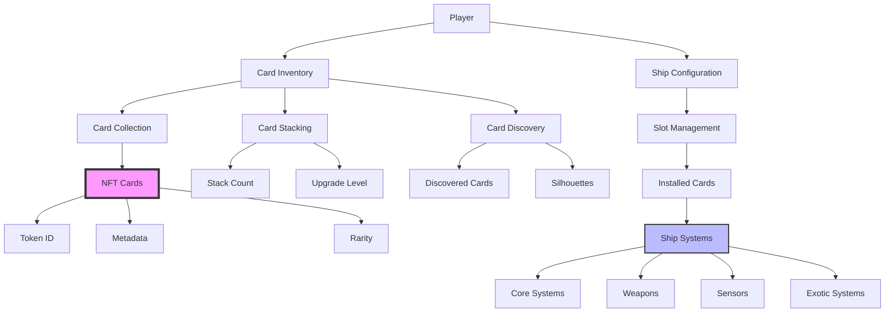
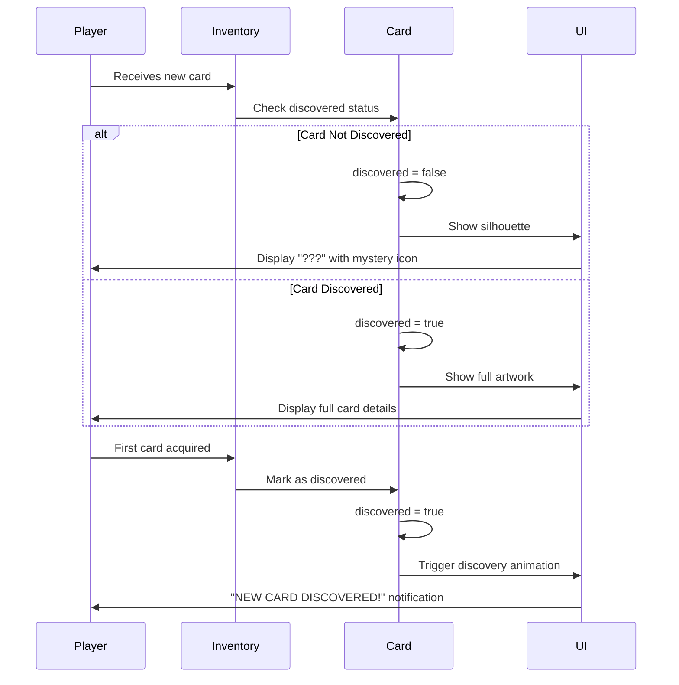
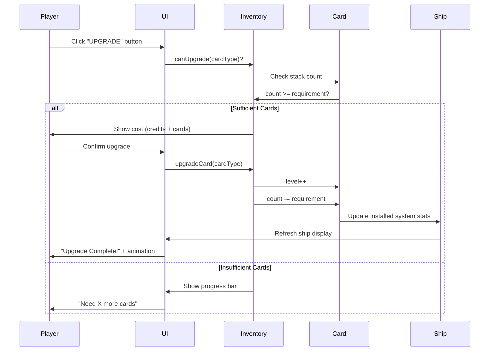
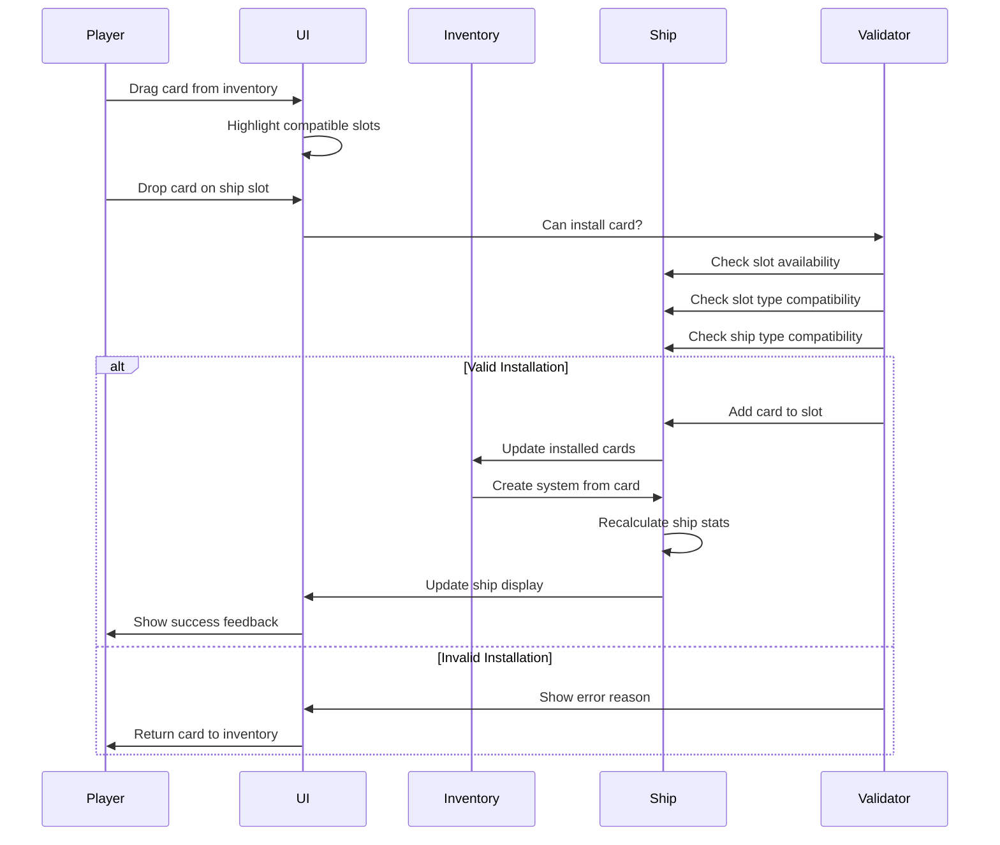
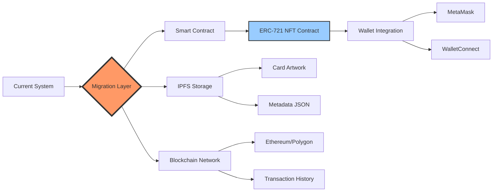
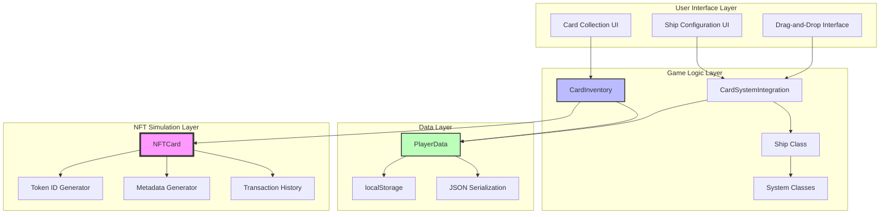
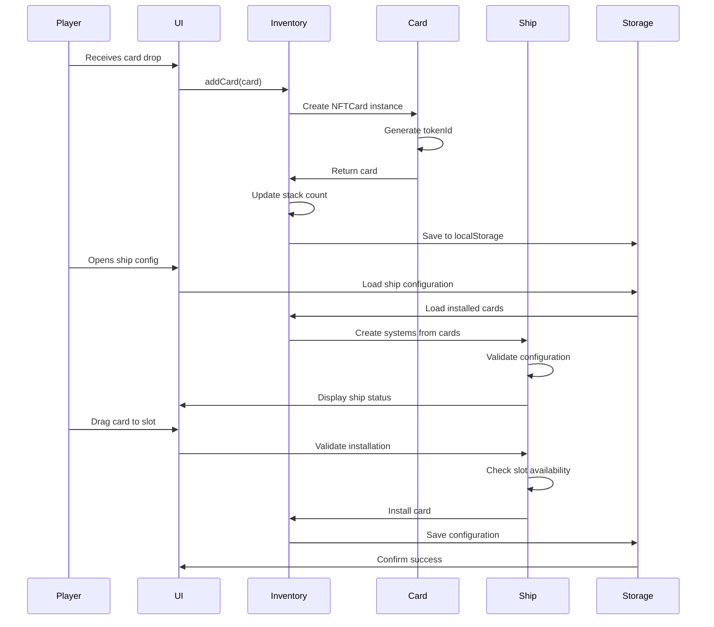
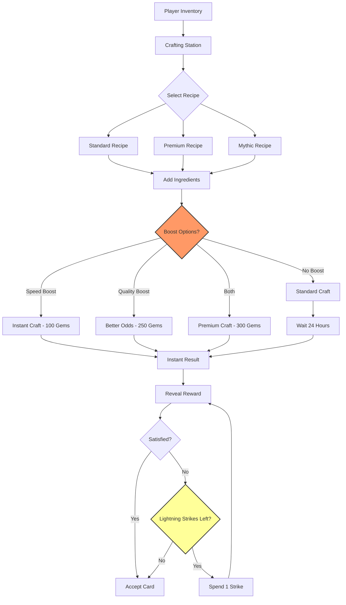

# NFT Card System Specification

**Version:** 2.0  
**Date:** October 10, 2025  
**Status:** ✅ Production-Ready Implementation  
**Use Case:** Space Combat / Ship Customization Game


## Table of Contents

1. [System Overview](#1-system-overview)
2. [NFT Collection Mechanics](#2-nft-collection-mechanics)
3. [Card Upgrade System](#3-card-upgrade-system)
4. [Ship Integration & Slotting](#4-ship-integration--slotting)
5. [JSON Data Structures](#5-json-data-structures)
6. [Blockchain Simulation](#6-blockchain-simulation)
7. [Future Blockchain Migration](#7-future-blockchain-migration)
8. [Implementation Architecture](#8-implementation-architecture)
9. [Technical Integration Guide](#9-technical-integration-guide)

---

## 1. System Overview

### 1.1 Design Philosophy

This NFT card system combines **Clash Royale's card stacking mechanics** with **spaceship system customization** and **NFT-style collectibles**. The system is designed for immediate web-based gameplay while maintaining a clear path to blockchain integration.

**Core Principles:**
- ✅ **Cards are NEVER destroyed** - Only accumulated and upgraded
- ✅ **Clash Royale-style stacking** - All same-type cards stack together
- ✅ **Pokédex-style discovery** - Undiscovered cards shown as silhouettes
- ✅ **NFT-ready metadata** - ERC-721 compatible data structures
- ✅ **Strategic gameplay** - Cards grant ship systems and abilities
- ✅ **Universal slot system** - All cards occupy 1 slot regardless of type

### 1.2 System Components



### 1.3 Key Features

| Feature | Description | Status |
|---------|-------------|--------|
| **Card Stacking** | Identical cards stack together with counter | ✅ Implemented |
| **Rarity Tiers** | Common (70%), Rare (20%), Epic (8%), Legendary (2%) | ✅ Implemented |
| **Discovery System** | Silhouettes until first acquisition | ✅ Implemented |
| **Upgrade Progression** | 10 levels with exponential requirements | ✅ Implemented |
| **Ship Integration** | Cards provide active ship systems | ✅ Implemented |
| **Drag-and-Drop UI** | Visual card installation interface | ✅ Implemented |
| **Multi-Ship Support** | Separate configurations per ship | ✅ Implemented |
| **Build Validation** | Essential systems required for launch | ✅ Implemented |
| **NFT Metadata** | ERC-721 compatible structure | ✅ Implemented |
| **Blockchain Ready** | Designed for easy migration | 🔄 Ready |

---

## 2. NFT Collection Mechanics

### 2.1 Card Structure

Every card in the system follows this structure:

```javascript
// NFTCard.js - Core card implementation
class NFTCard {
    constructor(cardType, rarity, tokenId) {
        // Core identification
        this.cardType = cardType;          // e.g., 'laser_cannon'
        this.rarity = rarity;              // 'common', 'rare', 'epic', 'legendary'
        this.tokenId = tokenId;            // Unique identifier (e.g., '0x1a2b3c...')
        this.quantity = 1;                 // Always 1 for NFTs
        this.discovered = false;           // For silhouette system
        
        // ERC-721 compatible metadata
        this.metadata = {
            name: "Laser Cannon",
            description: "Standard energy weapon...",
            image: "/images/cards/laser_cannon_rare.png",
            attributes: [
                { trait_type: "System Type", value: "Laser Cannon" },
                { trait_type: "Rarity", value: "Rare" },
                { trait_type: "Category", value: "Weapon Systems" },
                { trait_type: "Drop Rate", value: "20%" }
            ]
        };
        
        // Creation timestamp
        this.createdAt = Date.now();
    }
}
```

### 2.2 Card Types

The system defines **153 unique card types** across 7 categories:

```javascript
// NFTCard.js - Card type definitions
export const CARD_TYPES = {
    // Core Systems (4 types)
    HULL_PLATING: 'hull_plating',
    ENERGY_REACTOR: 'energy_reactor',
    SHIELD_GENERATOR: 'shield_generator',
    CARGO_HOLD: 'cargo_hold',
    
    // Operational Systems (3 types)
    IMPULSE_ENGINES: 'impulse_engines',
    WARP_DRIVE: 'warp_drive',
    SHIELDS: 'shields',
    
    // Weapons (27 types)
    LASER_CANNON: 'laser_cannon',
    PLASMA_CANNON: 'plasma_cannon',
    PULSE_CANNON: 'pulse_cannon',
    PHASER_ARRAY: 'phaser_array',
    DISRUPTOR_CANNON: 'disruptor_cannon',
    PARTICLE_BEAM: 'particle_beam',
    STANDARD_MISSILE: 'standard_missile',
    HOMING_MISSILE: 'homing_missile',
    PHOTON_TORPEDO: 'photon_torpedo',
    PROXIMITY_MINE: 'proximity_mine',
    // ... 17 more weapon types
    
    // Sensors (8 types)
    LONG_RANGE_SCANNER: 'long_range_scanner',
    SUBSPACE_RADIO: 'subspace_radio',
    GALACTIC_CHART: 'galactic_chart',
    STAR_CHARTS: 'star_charts',
    TARGET_COMPUTER: 'target_computer',
    BASIC_RADAR: 'basic_radar',
    ADVANCED_RADAR: 'advanced_radar',
    TACTICAL_RADAR: 'tactical_radar',
    
    // Capital Ship Systems (29 types)
    LANDING_BAY: 'landing_bay',
    FIGHTER_LAUNCH_BAY: 'fighter_launch_bay',
    SHUTTLE_BAY: 'shuttle_bay',
    SHIP_CONSTRUCTION_BAY: 'ship_construction_bay',
    // ... 25 more capital ship systems
    
    // Exotic Core Systems (28 types)
    QUANTUM_REACTOR: 'quantum_reactor',
    DARK_MATTER_CORE: 'dark_matter_core',
    ANTIMATTER_GENERATOR: 'antimatter_generator',
    // ... 25 more exotic systems
    
    // Alien Technology (4 types)
    ZEPHYRIAN_CRYSTAL: 'zephyrian_crystal',
    VORTHAN_MIND_LINK: 'vorthan_mind_link',
    NEXUS_HARMONIZER: 'nexus_harmonizer',
    ETHEREAL_CONDUIT: 'ethereal_conduit'
};
```

### 2.3 Rarity System

Cards use a **weighted drop rate system** inspired by TCG rarities:

```javascript
// NFTCard.js - Rarity definitions
export const CARD_RARITY = {
    COMMON: 'common',        // 70% drop rate - Basic systems
    RARE: 'rare',           // 20% drop rate - Advanced weapons
    EPIC: 'epic',           // 8% drop rate - Exotic systems
    LEGENDARY: 'legendary'  // 2% drop rate - Rarest technology
};

export const DROP_RATES = {
    common: 70,      // 70% chance
    rare: 20,        // 20% chance
    epic: 8,         // 8% chance
    legendary: 2     // 2% chance
};
```

**Rarity Progression:**

| Rarity | Drop Rate | Pool Size | Visual Color | Examples |
|--------|-----------|-----------|--------------|----------|
| **Common** | 70% | 14 cards | Gray `#9CA3AF` | Hull Plating, Energy Reactor, Laser Cannon |
| **Rare** | 20% | 30 cards | Blue `#3B82F6` | Phaser Array, Quantum Reactor, Tactical Computer |
| **Epic** | 8% | 48 cards | Purple `#8B5CF6` | Dark Matter Core, Graviton Beam, Landing Bay |
| **Legendary** | 2% | 61 cards | Gold `#F59E0B` | Void Ripper, Reality Anchor, Fleet Command Center |

**Card Pool Availability:**

```javascript
// NFTCard.js - Rarity-based card pools
export const RARITY_CARD_POOLS = {
    common: [
        // Only basic systems
        'hull_plating', 'energy_reactor', 'shield_generator',
        'impulse_engines', 'warp_drive', 'shields',
        'laser_cannon', 'plasma_cannon', 'pulse_cannon',
        'long_range_scanner', 'subspace_radio', 'target_computer'
    ],
    rare: [
        // Common cards + advanced weapons + some exotic systems
        ...commonCards,
        'phaser_array', 'disruptor_cannon', 'particle_beam',
        'standard_missile', 'homing_missile', 'photon_torpedo',
        'quantum_reactor', 'crystalline_matrix', 'tactical_computer'
    ],
    epic: [
        // Rare cards + exotic systems + capital ship systems
        ...rareCards,
        'dark_matter_core', 'quantum_drive', 'dimensional_shifter',
        'ion_storm_cannon', 'graviton_beam', 'phase_shield',
        'landing_bay', 'shuttle_bay', 'repair_facility'
    ],
    legendary: [
        // All cards including the rarest systems
        ...epicCards,
        'antimatter_generator', 'void_ripper', 'singularity_launcher',
        'temporal_engine', 'reality_anchor', 'fleet_command_center'
    ]
};
```

### 2.4 Discovery System

**Pokédex-Style Card Discovery:**



**Implementation:**

```javascript
// CardInventory.js - Discovery tracking
class CardInventory {
    constructor() {
        this.cardStacks = new Map();        // All card types
        this.discoveredCards = new Set();   // Discovered card types only
    }
    
    addCard(card) {
        const stack = this.cardStacks.get(card.cardType);
        
        // First-time discovery
        if (!stack.discovered) {
            stack.discovered = true;
            this.discoveredCards.add(card.cardType);
            
            // Trigger discovery notification
            this.showDiscoveryAnimation(card);
        }
        
        // Add to stack count
        stack.count++;
        this.totalCardsCollected++;
    }
    
    getUndiscoveredCards() {
        return Array.from(this.cardStacks.values())
            .filter(stack => !stack.discovered);
    }
}
```

### 2.5 Token ID Generation

Each card receives a **unique token ID** for NFT compatibility:

```javascript
// NFTCard.js - Token ID generation
generateTokenId() {
    const timestamp = Date.now().toString(36);       // Base-36 timestamp
    const random = Math.random().toString(36).substr(2, 9);  // Random suffix
    return `0x${timestamp}${random}`;                // e.g., '0x1a2b3c4d5e6f7'
}

// Example token IDs:
// 0x1njq2p3r4s5t6u7v8w - Laser Cannon #1
// 0x1njq2p3x9y0z1a2b3c - Laser Cannon #2
// 0x1njq2q4d5e6f7g8h9i - Plasma Cannon #1
```

Token IDs are:
- ✅ **Globally unique** - Timestamp + random ensures no collisions
- ✅ **Blockchain-compatible** - 0x prefix for Ethereum address format
- ✅ **Sortable** - Timestamp component enables chronological ordering
- ✅ **Traceable** - Can determine approximate creation time from ID

---

## 3. Card Upgrade System

### 3.1 Clash Royale-Style Stacking

Cards of the **same type** stack together with a counter:

```javascript
// CardInventory.js - Card stacking system
class CardInventory {
    constructor() {
        // Each stack tracks: count, level, discovered status
        this.cardStacks = new Map();  // cardType -> stackData
    }
    
    initializeCardStacks() {
        Object.values(CARD_TYPES).forEach(cardType => {
            this.cardStacks.set(cardType, {
                cardType: cardType,
                count: 0,              // Number of cards in stack
                level: 1,              // Current upgrade level
                discovered: false,     // Discovery status
                rarity: null          // Set when first card added
            });
        });
    }
}
```

**Stack Display:**

```
╔═══════════════════════════════╗
║  LASER CANNON (Rare)          ║
║  [★★★★★] Level 3              ║
║                               ║
║  █████████████░░░░ 47/50      ║
║  Progress to Level 4           ║
║                               ║
║  ✓ Can Upgrade! (Costs 5,000cr)║
╚═══════════════════════════════╝
```

### 3.2 Upgrade Requirements

**10-Level Progression System** with exponential scaling:

```javascript
// CardInventory.js - Upgrade requirements
export const UPGRADE_REQUIREMENTS = {
    1: 0,    // Level 1 - Base (no cards needed)
    2: 2,    // Level 2 - 2 cards
    3: 3,    // Level 3 - 3 more cards (5 total)
    4: 5,    // Level 4 - 5 more cards (10 total)
    5: 8,    // Level 5 - 8 more cards (18 total)
    6: 12,   // Level 6 - 12 more cards (30 total)
    7: 20,   // Level 7 - 20 more cards (50 total)
    8: 32,   // Level 8 - 32 more cards (82 total)
    9: 50,   // Level 9 - 50 more cards (132 total)
    10: 80   // Level 10 - 80 more cards (212 total) MAX
};

export const MAX_CARD_LEVEL = 10;
```

**Upgrade Cost Table:**

| Level | Cards Required | Cumulative Total | Credit Cost | Stat Multiplier |
|-------|---------------|------------------|-------------|-----------------|
| 1 | 0 | 0 | Free | 1.0x (Base) |
| 2 | 2 | 2 | 1,000cr | 1.1x |
| 3 | 3 | 5 | 5,000cr | 1.2x |
| 4 | 5 | 10 | 15,000cr | 1.3x |
| 5 | 8 | 18 | 50,000cr | 1.5x |
| 6 | 12 | 30 | 100,000cr | 1.7x |
| 7 | 20 | 50 | 200,000cr | 2.0x |
| 8 | 32 | 82 | 500,000cr | 2.3x |
| 9 | 50 | 132 | 1,000,000cr | 2.7x |
| 10 | 80 | 212 | 2,500,000cr | 3.0x (MAX) |

### 3.3 Upgrade Process



**Implementation:**

```javascript
// CardInventory.js - Upgrade system
upgradeCard(cardType) {
    const stack = this.cardStacks.get(cardType);
    
    // Validation
    if (!stack) {
        return { success: false, error: 'Unknown card type' };
    }
    if (!stack.discovered) {
        return { success: false, error: 'Cannot upgrade undiscovered card' };
    }
    if (stack.level >= MAX_CARD_LEVEL) {
        return { success: false, error: 'Already at maximum level' };
    }
    
    const requiredCards = UPGRADE_REQUIREMENTS[stack.level + 1];
    if (stack.count < requiredCards) {
        return {
            success: false,
            error: `Need ${requiredCards} cards, have ${stack.count}`
        };
    }
    
    // Perform upgrade
    stack.level++;
    stack.count -= requiredCards;  // Cards consumed for upgrade
    
    return {
        success: true,
        newLevel: stack.level,
        cardsUsed: requiredCards,
        remainingCards: stack.count
    };
}
```

### 3.4 Stat Progression

Card stats scale with **level AND rarity**:

```javascript
// NFTCard.js - Stats calculation
getStats() {
    // Base stats by card type
    const baseStats = {
        laser_cannon: { power: 12, mass: 6, damage: 25 },
        plasma_cannon: { power: 18, mass: 9, damage: 35 },
        quantum_reactor: { power: -50, mass: 15, energyOutput: 200 },
        // ... etc
    };
    
    // Rarity multipliers
    const rarityMultipliers = {
        common: 1.0,
        rare: 1.25,
        epic: 1.5,
        legendary: 2.0
    };
    
    const base = baseStats[this.cardType];
    const multiplier = rarityMultipliers[this.rarity];
    
    // Apply both level and rarity scaling
    const stats = {};
    Object.keys(base).forEach(key => {
        if (typeof base[key] === 'number') {
            stats[key] = Math.round(base[key] * multiplier * this.level);
        }
    });
    
    return stats;
}
```

**Example Progression:**

| Card | Level | Rarity | Power | Damage | Mass |
|------|-------|--------|-------|--------|------|
| Laser Cannon | 1 | Common | 12 | 25 | 6 |
| Laser Cannon | 3 | Common | 36 | 75 | 18 |
| Laser Cannon | 5 | Rare | 75 | 156 | 37 |
| Laser Cannon | 10 | Legendary | 240 | 500 | 120 |

---

## 4. Ship Integration & Slotting

### 4.1 Universal Slot System

**All cards occupy exactly 1 slot regardless of type or level:**

```javascript
// Ship.js - Slot management
class Ship {
    constructor(shipType) {
        this.totalSlots = this.shipConfig.systemSlots;  // Scout: 15, Heavy Freighter: 20
        this.usedSlots = 0;
        this.availableSlots = this.totalSlots;
        
        // Map of installed systems
        this.systems = new Map();  // systemName -> systemInstance
    }
    
    addSystem(systemName, system) {
        // Check if we have available slots
        if (this.usedSlots >= this.totalSlots) {
            return false;  // No space
        }
        
        this.systems.set(systemName, system);
        this.usedSlots++;
        this.availableSlots--;
        
        return true;
    }
}
```

**Ship Type Slot Limits:**

| Ship Type | Total Slots | Weapon Slots | Engine Slots | Power Slots | Utility Slots |
|-----------|-------------|--------------|--------------|-------------|---------------|
| **Scout** | 15 | 2 | 1 | 1 | 11 |
| **Light Fighter** | 16 | 3 | 1 | 1 | 11 |
| **Heavy Fighter** | 18 | 4 | 1 | 1 | 12 |
| **Light Freighter** | 17 | 2 | 1 | 1 | 13 |
| **Heavy Freighter** | 20 | 1 | 1 | 1 | 17 |

### 4.2 Slot Categories

Cards install into specific slot types based on their category:

```javascript
// NFTCard.js - Card icons match slot types
export const CARD_ICONS = {
    // Power Systems (⚡ slot)
    energy_reactor: '⚡',
    quantum_reactor: '⚡',
    dark_matter_core: '⚡',
    
    // Engine Systems (🚀 slot)
    impulse_engines: '🚀',
    quantum_drive: '🚀',
    
    // Weapon Systems (⚔️ slot)
    laser_cannon: '⚔️',
    plasma_cannon: '⚔️',
    photon_torpedo: '⚔️',
    
    // Utility Systems (🔧 slot)
    hull_plating: '🔧',
    shield_generator: '🔧',
    warp_drive: '🔧',
    long_range_scanner: '🔧',
    target_computer: '🔧',
    
    // Capital Ship Systems (🏛️ slot)
    landing_bay: '🏛️',
    fighter_launch_bay: '🏛️',
    fleet_command_center: '🏛️'
};
```

### 4.3 Card Installation Process



**Implementation:**

```javascript
// CardSystemIntegration.js - Card installation
class CardSystemIntegration {
    async createSystemsFromCards() {
        // Map of card types to system classes
        const cardToSystemMap = {
            'impulse_engines': 'ImpulseEngines',
            'target_computer': 'TargetComputer',
            'energy_reactor': 'EnergyReactor',
            'subspace_radio': 'SubspaceRadioSystem',
            'laser_cannon': 'WeaponSlot',  // Individual weapon
            'quantum_reactor': 'EnergyReactor',  // Maps to same class
            // ... etc
        };
        
        for (const [slotId, cardData] of this.installedCards) {
            const cardType = cardData.cardType;
            const systemClassName = cardToSystemMap[cardType];
            
            // Import system class
            const { default: SystemClass } = await import(
                `./systems/${systemClassName}.js`
            );
            
            // Create system instance with card level
            const system = new SystemClass(cardData.level);
            
            // Add to ship
            this.ship.addSystem(cardType, system);
        }
    }
}
```

### 4.4 Build Validation

**Essential Systems Required:**

```javascript
// Ship.js - Build validation
validateShipConfiguration() {
    const essentialSystems = [
        'hull_plating',      // Structural integrity
        'energy_reactor',    // Power generation
        'impulse_engines'    // Movement capability
    ];
    
    for (const systemName of essentialSystems) {
        if (!this.systems.has(systemName)) {
            return {
                valid: false,
                reason: `Missing essential system: ${systemName}`,
                canLaunch: false
            };
        }
    }
    
    // Energy balance check
    const energyProduction = this.getTotalEnergyProduction();
    const energyConsumption = this.getTotalEnergyConsumption();
    
    if (energyConsumption > energyProduction) {
        return {
            valid: false,
            reason: 'Insufficient energy production',
            canLaunch: false
        };
    }
    
    return {
        valid: true,
        canLaunch: true
    };
}
```

**Validation UI:**

```
╔════════════════════════════════════════╗
║  SHIP CONFIGURATION VALIDATION         ║
╠════════════════════════════════════════╣
║  ✅ Hull Plating: Installed (Level 3)  ║
║  ✅ Energy Reactor: Installed (Level 2)║
║  ✅ Impulse Engines: Installed (Level 2)║
║  ✅ Energy Balance: 120/100            ║
║  ✅ Slot Usage: 14/15                  ║
╠════════════════════════════════════════╣
║     [ READY TO LAUNCH ]                ║
╚════════════════════════════════════════╝
```

### 4.5 Multi-Ship Configuration

Each ship maintains **separate configurations**:

```javascript
// PlayerData class - Ship configuration management
class PlayerData {
    constructor() {
        // Map of ship types to their configurations
        this.shipConfigurations = new Map();
    }
    
    getShipConfiguration(shipType) {
        if (!this.shipConfigurations.has(shipType)) {
            // Initialize empty configuration
            this.shipConfigurations.set(shipType, new Map());
        }
        return this.shipConfigurations.get(shipType);
    }
    
    setShipConfiguration(shipType, slotId, cardData) {
        const config = this.getShipConfiguration(shipType);
        config.set(slotId, {
            cardType: cardData.cardType,
            level: cardData.level,
            tokenId: cardData.tokenId
        });
        this.save();  // Persist to localStorage
    }
}
```

---

## 5. JSON Data Structures

### 5.1 Card Data Format

**Individual Card Instance:**

```json
{
    "tokenId": "0x1njq2p3r4s5t6u7v8w",
    "cardType": "laser_cannon",
    "rarity": "rare",
    "quantity": 1,
    "discovered": true,
    "metadata": {
        "name": "Laser Cannon",
        "description": "A standard energy weapon with reliable performance.",
        "image": "/images/cards/laser_cannon_rare.png",
        "attributes": [
            {
                "trait_type": "System Type",
                "value": "Laser Cannon"
            },
            {
                "trait_type": "Rarity",
                "value": "Rare"
            },
            {
                "trait_type": "Category",
                "value": "Weapon Systems"
            },
            {
                "trait_type": "Drop Rate",
                "value": "20%"
            }
        ]
    },
    "createdAt": 1696982400000
}
```

### 5.2 Card Stack Format

**Stacked Cards in Inventory:**

```json
{
    "cardType": "laser_cannon",
    "count": 47,
    "level": 3,
    "discovered": true,
    "rarity": "rare",
    "nextUpgradeRequirement": 50,
    "progressToNextLevel": 0.94,
    "canUpgrade": false,
    "stats": {
        "power": 36,
        "mass": 18,
        "damage": 75
    }
}
```

### 5.3 Player Inventory Format

**Complete Inventory State:**

```json
{
    "cardStacks": [
        ["laser_cannon", {
            "cardType": "laser_cannon",
            "count": 47,
            "level": 3,
            "discovered": true,
            "rarity": "rare"
        }],
        ["plasma_cannon", {
            "cardType": "plasma_cannon",
            "count": 12,
            "level": 2,
            "discovered": true,
            "rarity": "common"
        }],
        ["quantum_reactor", {
            "cardType": "quantum_reactor",
            "count": 0,
            "level": 1,
            "discovered": false,
            "rarity": null
        }]
    ],
    "discoveredCards": [
        "laser_cannon",
        "plasma_cannon",
        "hull_plating",
        "energy_reactor",
        "impulse_engines"
    ],
    "totalCardsCollected": 187
}
```

### 5.4 Ship Configuration Format

**Ship Loadout with Installed Cards:**

```json
{
    "shipType": "heavy_fighter",
    "shipName": "Vengeance",
    "installedSystems": {
        "power_slot_1": {
            "slotId": "power_slot_1",
            "cardType": "quantum_reactor",
            "level": 2,
            "tokenId": "0x1njq2p8x9y0z1a2b3c"
        },
        "engine_slot_1": {
            "slotId": "engine_slot_1",
            "cardType": "impulse_engines",
            "level": 3,
            "tokenId": "0x1njq2p4d5e6f7g8h9i"
        },
        "weapon_slot_1": {
            "slotId": "weapon_slot_1",
            "cardType": "laser_cannon",
            "level": 3,
            "tokenId": "0x1njq2p3r4s5t6u7v8w"
        },
        "weapon_slot_2": {
            "slotId": "weapon_slot_2",
            "cardType": "plasma_cannon",
            "level": 2,
            "tokenId": "0x1njq2q4d5e6f7g8h9j"
        },
        "utility_slot_1": {
            "slotId": "utility_slot_1",
            "cardType": "hull_plating",
            "level": 2,
            "tokenId": "0x1njq2r5e6f7g8h9i0j"
        }
    },
    "slotCount": {
        "total": 18,
        "used": 5,
        "available": 13
    },
    "currentHull": 850,
    "maxHull": 1200,
    "currentEnergy": 180,
    "maxEnergy": 250
}
```

### 5.5 localStorage Keys

**Browser Storage Structure:**

```javascript
// PlayerData persistence keys
const STORAGE_KEYS = {
    // Card collection
    CARD_INVENTORY: 'game_card_inventory',
    DISCOVERED_CARDS: 'game_discovered_cards',
    
    // Ship configurations
    SHIP_CONFIG_PREFIX: 'game_ship_config_',  // + shipType
    ACTIVE_SHIP: 'game_active_ship',
    OWNED_SHIPS: 'game_owned_ships',
    
    // UI state
    LAST_SHOP_VISIT: 'game_last_shop_visit',
    NEW_CARD_TIMESTAMPS: 'game_new_card_timestamps',
    QUANTITY_INCREASE_TIMESTAMPS: 'game_quantity_increase_timestamps',
    
    // Player progress
    PLAYER_CREDITS: 'game_player_credits',
    TOTAL_CARDS_COLLECTED: 'game_total_cards_collected'
};
```

**Example localStorage Entry:**

```javascript
// localStorage.getItem('game_card_inventory')
{
    "laser_cannon": {
        "count": 47,
        "level": 3,
        "discovered": true,
        "rarity": "rare"
    },
    "plasma_cannon": {
        "count": 12,
        "level": 2,
        "discovered": true,
        "rarity": "common"
    }
}

// localStorage.getItem('game_ship_config_heavy_fighter')
{
    "power_slot_1": {
        "cardType": "quantum_reactor",
        "level": 2
    },
    "weapon_slot_1": {
        "cardType": "laser_cannon",
        "level": 3
    }
}
```

---

## 6. Blockchain Simulation

### 6.1 NFT Wallet Simulation

The system simulates a **crypto wallet** for NFT storage:

```javascript
// CardInventory.js - Pseudo-wallet implementation
class CardInventory {
    constructor() {
        this.wallet = {
            address: this.generateWalletAddress(),
            cards: new Map(),              // tokenId -> NFTCard
            transactions: []               // Transaction history
        };
    }
    
    generateWalletAddress() {
        // Simulate Ethereum address format
        const random = Array.from({length: 40}, () => 
            Math.floor(Math.random() * 16).toString(16)
        ).join('');
        return `0x${random}`;
    }
    
    addCardToWallet(card) {
        // Store by token ID like real NFT wallet
        this.wallet.cards.set(card.tokenId, card);
        
        // Record transaction
        this.wallet.transactions.push({
            type: 'MINT',
            tokenId: card.tokenId,
            cardType: card.cardType,
            timestamp: Date.now(),
            blockNumber: this.getCurrentBlockNumber()  // Simulated
        });
    }
    
    getCurrentBlockNumber() {
        // Simulate blockchain block number
        const genesisTime = 1609459200000;  // Jan 1, 2021
        const blockTime = 12000;            // 12 seconds per block
        const elapsed = Date.now() - genesisTime;
        return Math.floor(elapsed / blockTime);
    }
}
```

**Simulated Wallet Display:**

```
╔════════════════════════════════════════════════╗
║  CRYPTO WALLET                                 ║
║  Address: 0x742d35Cc6634C0532925a3b844Bc9e7595║
╠════════════════════════════════════════════════╣
║  Total NFTs: 187                               ║
║  Unique Cards: 42                              ║
║  Rarity Distribution:                          ║
║    • Common: 124 cards (66%)                   ║
║    • Rare: 48 cards (26%)                      ║
║    • Epic: 12 cards (6%)                       ║
║    • Legendary: 3 cards (2%)                   ║
╠════════════════════════════════════════════════╣
║  Recent Transactions:                          ║
║  Block #15234567 - MINT laser_cannon           ║
║  Block #15234512 - MINT plasma_cannon          ║
║  Block #15234401 - MINT quantum_reactor        ║
╚════════════════════════════════════════════════╝
```

### 6.2 ERC-721 Compatible Metadata

Cards use **ERC-721 token standard** metadata format:

```javascript
// NFTCard.js - ERC-721 metadata
getMetadata() {
    return {
        // ERC-721 standard fields
        name: this.metadata.name,
        description: this.metadata.description,
        image: this.metadata.image,
        attributes: this.metadata.attributes,
        
        // Custom fields (blockchain compatible)
        tokenId: this.tokenId,
        rarity: this.rarity,
        discovered: this.discovered,
        createdAt: this.createdAt,
        
        // ERC-721 extension fields
        external_url: `https://yourgame.com/card/${this.tokenId}`,
        animation_url: null,  // Could add 3D models
        background_color: this.getRarityColor().replace('#', '')
    };
}
```

### 6.3 Smart Contract Simulation

Simulates **Solidity smart contract** functions:

```javascript
// Simulated smart contract interface
class NFTCardContract {
    constructor() {
        this.name = "Ship Systems NFT Collection";
        this.symbol = "SHIPS";
        this.totalSupply = 0;
        this.tokenIdCounter = 1;
    }
    
    // ERC-721 mint function simulation
    mint(to, cardType, rarity) {
        const tokenId = `0x${this.tokenIdCounter.toString(16).padStart(16, '0')}`;
        this.tokenIdCounter++;
        
        const card = new NFTCard(cardType, rarity, tokenId);
        this.totalSupply++;
        
        // Emit simulated "Transfer" event
        this.emitEvent('Transfer', {
            from: '0x0000000000000000000000000000000000000000',
            to: to,
            tokenId: tokenId
        });
        
        return card;
    }
    
    // ERC-721 transfer function simulation
    transferFrom(from, to, tokenId) {
        // Validate ownership (simulated)
        // Update internal mappings (simulated)
        
        this.emitEvent('Transfer', {
            from: from,
            to: to,
            tokenId: tokenId
        });
    }
    
    // ERC-721 balanceOf function simulation
    balanceOf(owner) {
        return this.getOwnerTokens(owner).length;
    }
    
    emitEvent(eventName, data) {
        console.log(`📢 Contract Event: ${eventName}`, data);
        // In real blockchain, this would be logged on-chain
    }
}
```

### 6.4 Transaction History

Track all card operations like blockchain transactions:

```javascript
// Transaction history tracking
class TransactionHistory {
    constructor() {
        this.transactions = [];
    }
    
    recordTransaction(type, data) {
        const tx = {
            txHash: this.generateTxHash(),
            blockNumber: this.getCurrentBlockNumber(),
            timestamp: Date.now(),
            type: type,
            data: data,
            gasUsed: this.calculateGas(type),
            status: 'confirmed'
        };
        
        this.transactions.push(tx);
        return tx;
    }
    
    generateTxHash() {
        // Simulate Ethereum transaction hash
        return '0x' + Array.from({length: 64}, () =>
            Math.floor(Math.random() * 16).toString(16)
        ).join('');
    }
    
    getTransactionHistory(limit = 10) {
        return this.transactions.slice(-limit).reverse();
    }
}
```

---

## 7. Future Blockchain Migration

### 7.1 Migration Architecture

The system is designed for **seamless blockchain integration**:



### 7.2 Smart Contract Design

**Proposed Solidity Contract Structure:**

```solidity
// SPDX-License-Identifier: MIT
pragma solidity ^0.8.0;

import "@openzeppelin/contracts/token/ERC721/ERC721.sol";
import "@openzeppelin/contracts/access/Ownable.sol";

contract ShipSystemCards is ERC721, Ownable {
    struct CardData {
        string cardType;      // e.g., "laser_cannon"
        uint8 rarity;         // 0=common, 1=rare, 2=epic, 3=legendary
        uint8 level;          // Current upgrade level (1-10)
        uint32 createdAt;     // Timestamp
    }
    
    // Token ID => Card Data
    mapping(uint256 => CardData) public cards;
    
    // Card type => Stack count per owner
    mapping(address => mapping(string => uint256)) public cardStacks;
    
    // Events
    event CardMinted(address indexed to, uint256 indexed tokenId, string cardType, uint8 rarity);
    event CardUpgraded(uint256 indexed tokenId, uint8 newLevel);
    event CardStacked(address indexed owner, string cardType, uint256 newCount);
    
    constructor() ERC721("Ship Systems NFT Collection", "SHIPS") {}
    
    function mint(address to, string memory cardType, uint8 rarity) public onlyOwner {
        uint256 tokenId = totalSupply() + 1;
        
        cards[tokenId] = CardData({
            cardType: cardType,
            rarity: rarity,
            level: 1,
            createdAt: uint32(block.timestamp)
        });
        
        _safeMint(to, tokenId);
        cardStacks[to][cardType]++;
        
        emit CardMinted(to, tokenId, cardType, rarity);
        emit CardStacked(to, cardType, cardStacks[to][cardType]);
    }
    
    function upgradeCard(uint256 tokenId, uint256[] memory burnTokenIds) public {
        require(ownerOf(tokenId) == msg.sender, "Not card owner");
        
        CardData storage card = cards[tokenId];
        require(card.level < 10, "Already max level");
        
        // Verify burn tokens are same type
        for (uint i = 0; i < burnTokenIds.length; i++) {
            require(ownerOf(burnTokenIds[i]) == msg.sender, "Not owner of burn token");
            require(
                keccak256(bytes(cards[burnTokenIds[i]].cardType)) == 
                keccak256(bytes(card.cardType)),
                "Card types must match"
            );
        }
        
        // Burn consumed cards
        for (uint i = 0; i < burnTokenIds.length; i++) {
            _burn(burnTokenIds[i]);
        }
        
        // Upgrade main card
        card.level++;
        emit CardUpgraded(tokenId, card.level);
    }
    
    function getCardStack(address owner, string memory cardType) public view returns (uint256) {
        return cardStacks[owner][cardType];
    }
}
```

### 7.3 IPFS Integration

**Decentralized Storage for Card Assets:**

```javascript
// IPFS integration layer
class IPFSCardStorage {
    constructor(ipfsNode) {
        this.ipfs = ipfsNode;  // IPFS node connection
    }
    
    async uploadCardMetadata(card) {
        const metadata = {
            name: card.metadata.name,
            description: card.metadata.description,
            image: await this.uploadCardArtwork(card),
            attributes: card.metadata.attributes
        };
        
        // Upload to IPFS
        const { cid } = await this.ipfs.add(JSON.stringify(metadata));
        
        return `ipfs://${cid}`;  // Returns: ipfs://Qm...
    }
    
    async uploadCardArtwork(card) {
        // Upload card image to IPFS
        const imageData = await fetch(card.metadata.image);
        const blob = await imageData.blob();
        
        const { cid } = await this.ipfs.add(blob);
        return `ipfs://${cid}`;
    }
}
```

### 7.4 Migration Script

**Automated migration from localStorage to blockchain:**

```javascript
// migrate-to-blockchain.js
class BlockchainMigration {
    constructor(web3Provider, contractAddress) {
        this.web3 = new Web3(web3Provider);
        this.contract = new this.web3.eth.Contract(ABI, contractAddress);
    }
    
    async migratePlayerInventory(playerAddress) {
        console.log('🔄 Starting blockchain migration...');
        
        // 1. Load current inventory from localStorage
        const inventory = this.loadLocalInventory();
        
        // 2. Upload card artwork to IPFS
        console.log('📤 Uploading card data to IPFS...');
        const ipfsHashes = await this.uploadToIPFS(inventory);
        
        // 3. Mint NFTs on blockchain
        console.log('⛏️ Minting NFTs on blockchain...');
        for (const [cardType, stack] of inventory.cardStacks) {
            if (stack.count > 0) {
                for (let i = 0; i < stack.count; i++) {
                    await this.mintNFT(
                        playerAddress,
                        cardType,
                        stack.rarity,
                        stack.level
                    );
                }
            }
        }
        
        // 4. Verify migration
        console.log('✅ Verifying migration...');
        const onChainBalance = await this.contract.methods
            .balanceOf(playerAddress)
            .call();
        
        console.log(`✅ Migration complete! ${onChainBalance} NFTs on blockchain`);
        
        // 5. Mark local data as migrated (don't delete for backup)
        localStorage.setItem('game_migration_complete', Date.now());
    }
    
    async mintNFT(to, cardType, rarity, level) {
        const tx = await this.contract.methods
            .mint(to, cardType, rarity)
            .send({ from: to });
        
        return tx.transactionHash;
    }
}
```

### 7.5 Wallet Integration

**MetaMask connection:**

```javascript
// wallet-integration.js
class WalletConnector {
    async connectWallet() {
        if (typeof window.ethereum === 'undefined') {
            throw new Error('MetaMask not installed');
        }
        
        // Request account access
        const accounts = await window.ethereum.request({
            method: 'eth_requestAccounts'
        });
        
        const address = accounts[0];
        
        // Load player's NFTs from blockchain
        await this.loadPlayerNFTs(address);
        
        return address;
    }
    
    async loadPlayerNFTs(address) {
        const balance = await contract.methods.balanceOf(address).call();
        const cards = [];
        
        for (let i = 0; i < balance; i++) {
            const tokenId = await contract.methods
                .tokenOfOwnerByIndex(address, i)
                .call();
            
            const cardData = await contract.methods.cards(tokenId).call();
            const metadata = await this.loadIPFSMetadata(tokenId);
            
            cards.push({
                tokenId: tokenId,
                ...cardData,
                metadata: metadata
            });
        }
        
        return cards;
    }
}
```

---

## 8. Implementation Architecture

### 8.1 System Components



### 8.2 Class Hierarchy

```javascript
// Core class structure
NFTCard                      // Individual card instance
  ├── tokenId               // Unique identifier
  ├── cardType              // System type
  ├── rarity                // Drop tier
  ├── metadata              // ERC-721 data
  └── methods
      ├── getStats()        // Calculate stats
      ├── getMetadata()     // Export NFT data
      └── toJSON()          // Serialize

CardInventory                // Card collection manager
  ├── cardStacks            // Map<cardType, stackData>
  ├── discoveredCards       // Set<cardType>
  ├── totalCardsCollected   // Counter
  └── methods
      ├── addCard()         // Add to collection
      ├── upgradeCard()     // Level up stack
      ├── canUpgrade()      // Check requirements
      └── generateRandomCard() // Drop system

CardSystemIntegration        // Ship-card bridge
  ├── ship                  // Ship reference
  ├── installedCards        // Map<slotId, cardData>
  ├── cardInventoryUI       // UI reference
  └── methods
      ├── loadCards()       // Load from storage
      ├── createSystemsFromCards() // Install systems
      ├── hasRequiredCards() // Validate config
      └── cleanupOrphanedSystems() // Remove unused

Ship                         // Player ship
  ├── systems               // Map<systemName, system>
  ├── totalSlots            // Max capacity
  ├── usedSlots             // Current usage
  └── methods
      ├── addSystem()       // Install system
      ├── removeSystem()    // Uninstall system
      ├── validateConfiguration() // Check validity
      └── calculateTotalStats() // Compute totals

PlayerData                   // Persistence layer
  ├── cardInventory         // Card collection
  ├── shipConfigurations    // Map<shipType, config>
  ├── credits               // Currency
  └── methods
      ├── save()            // Write to localStorage
      ├── load()            // Read from localStorage
      ├── getShipConfiguration() // Get ship setup
      └── setShipConfiguration() // Update ship setup
```

### 8.3 File Structure

```
frontend/static/js/
├── ship/
│   ├── NFTCard.js                  // Card definition and metadata
│   ├── CardInventory.js            // Collection management
│   ├── CardSystemIntegration.js   // Ship-card bridge
│   ├── Ship.js                     // Main ship class
│   ├── ShipConfigs.js              // Ship type definitions
│   └── systems/                    // System implementations
│       ├── ImpulseEngines.js
│       ├── WeaponSlot.js
│       ├── EnergyReactor.js
│       └── ... (29 system files)
├── ui/
│   └── CardInventoryUI.js          // Drag-and-drop interface
└── utils/
    └── PlayerData.js                // Persistence manager
```

### 8.4 Data Flow



---

## 9. Technical Integration Guide

### 9.1 Adding New Card Types

**Step-by-Step Process:**

```javascript
// 1. Add card type to NFTCard.js
export const CARD_TYPES = {
    // ... existing types ...
    NEW_EXOTIC_WEAPON: 'new_exotic_weapon'
};

// 2. Add display name
export const CARD_DISPLAY_NAMES = {
    // ... existing names ...
    new_exotic_weapon: 'Exotic Weapon System'
};

// 3. Add icon (slot type)
export const CARD_ICONS = {
    // ... existing icons ...
    new_exotic_weapon: '⚔️'  // Weapon slot
};

// 4. Add to rarity pools
export const RARITY_CARD_POOLS = {
    legendary: [
        // ... existing cards ...
        CARD_TYPES.NEW_EXOTIC_WEAPON
    ]
};

// 5. Add base stats
getStats() {
    const baseStats = {
        // ... existing stats ...
        new_exotic_weapon: {
            power: 50,
            mass: 25,
            damage: 200,
            range: 3000
        }
    };
    // ... rest of method
}

// 6. Create system class (if needed)
// frontend/static/js/ship/systems/NewExoticWeapon.js
export default class NewExoticWeapon extends WeaponSlot {
    constructor(level = 1) {
        super(level);
        this.name = 'Exotic Weapon System';
        this.weaponType = 'exotic';
        // ... weapon implementation
    }
}

// 7. Add to card-system mapping
// CardSystemIntegration.js
const cardToSystemMap = {
    // ... existing mappings ...
    'new_exotic_weapon': 'NewExoticWeapon'
};

const systemPathMap = {
    // ... existing paths ...
    'NewExoticWeapon': './systems/NewExoticWeapon.js'
};
```

### 9.2 Modifying Drop Rates

```javascript
// NFTCard.js - Adjust drop rates
export const DROP_RATES = {
    common: 65,      // Reduced from 70%
    rare: 22,        // Increased from 20%
    epic: 10,        // Increased from 8%
    legendary: 3     // Increased from 2%
};
// Must sum to 100%
```

### 9.3 Changing Upgrade Requirements

```javascript
// CardInventory.js - Modify progression curve
export const UPGRADE_REQUIREMENTS = {
    1: 0,
    2: 2,    // Changed: was 3
    3: 4,    // Changed: was 6
    4: 8,    // Changed: was 12
    5: 15,   // Changed: was 24
    // ... adjust all levels as needed
};
```

### 9.4 Creating Custom Card Categories

```javascript
// NFTCard.js - Add new category
getSystemCategory() {
    const newCategoryTypes = [
        CARD_TYPES.CUSTOM_SYSTEM_1,
        CARD_TYPES.CUSTOM_SYSTEM_2
    ];
    
    if (newCategoryTypes.includes(this.cardType)) {
        return 'Custom Systems';
    }
    
    // ... existing categories
}
```

### 9.5 Implementing Card Trading

```javascript
// Future feature: Player-to-player trading
class CardTrading {
    async createTradeOffer(fromPlayer, toPlayer, offeredCards, requestedCards) {
        const trade = {
            id: this.generateTradeId(),
            from: fromPlayer,
            to: toPlayer,
            offering: offeredCards.map(c => c.tokenId),
            requesting: requestedCards.map(c => c.tokenId),
            status: 'pending',
            createdAt: Date.now()
        };
        
        return trade;
    }
    
    async acceptTrade(tradeId) {
        const trade = this.getTrade(tradeId);
        
        // Validate both players own the cards
        if (!this.validateOwnership(trade)) {
            throw new Error('Invalid card ownership');
        }
        
        // Transfer cards
        this.transferCards(trade.from, trade.to, trade.offering);
        this.transferCards(trade.to, trade.from, trade.requesting);
        
        trade.status = 'completed';
        trade.completedAt = Date.now();
        
        return trade;
    }
}
```

---

## Appendices

### A. Complete Card Type Reference

**Total Cards: 153 types across 7 categories**

| Category | Count | Examples |
|----------|-------|----------|
| Core Systems | 7 | Hull Plating, Energy Reactor, Cargo Hold |
| Operational Systems | 7 | Impulse Engines, Warp Drive, Shields |
| Weapon Systems | 27 | Lasers, Missiles, Torpedoes, Exotic Weapons |
| Sensor Systems | 11 | Scanners, Radars, Target Computers |
| Exotic Systems | 28 | Quantum Reactors, Dimensional Drives |
| Capital Ship Systems | 29 | Landing Bays, Command Centers, Factories |
| Alien Technology | 44 | Zephyrian Crystals, Reality Anchors |

### B. Rarity Distribution Analysis

```
Total Card Pool: 153 cards

Common Pool: 14 cards (9.2%)
  └─ Appear in 70% of drops
  
Rare Pool: 30 cards (19.6%)
  └─ Appear in 20% of drops
  
Epic Pool: 48 cards (31.4%)
  └─ Appear in 8% of drops
  
Legendary Pool: 61 cards (39.8%)
  └─ Appear in 2% of drops
```

### C. Upgrade Cost Progression

```
Level  Cards  Credits    Total Cards  Total Credits
1      0      0          0            0
2      2      1,000      2            1,000
3      3      5,000      5            6,000
4      5      15,000     10           21,000
5      8      50,000     18           71,000
6      12     100,000    30           171,000
7      20     200,000    50           371,000
8      32     500,000    82           871,000
9      50     1,000,000  132          1,871,000
10     80     2,500,000  212          4,371,000

Max Level Cost: 212 cards + 4.37M credits
```

### D. Ship Type Compatibility Matrix

| Ship Type | Weapons | Engines | Power | Utility | Capital | Total |
|-----------|---------|---------|-------|---------|---------|-------|
| Scout | 2 | 1 | 1 | 11 | ❌ | 15 |
| Light Fighter | 3 | 1 | 1 | 11 | ❌ | 16 |
| Heavy Fighter | 4 | 1 | 1 | 12 | ❌ | 18 |
| Light Freighter | 2 | 1 | 1 | 13 | ❌ | 17 |
| Heavy Freighter | 1 | 1 | 1 | 17 | ✅ | 20 |
| Carrier | 8 | 2 | 2 | 18 | ✅ | 30 |

### E. Fantasy RPG Adaptation Guide

**This appendix demonstrates how the same NFT card system can be adapted for fantasy RPG character equipment instead of spaceship systems.**

---

#### E.1 Core Concept Translation

The fundamental mechanics remain identical - only the theme changes:

| Space Game Concept | Fantasy RPG Equivalent | Same Mechanics |
|-------------------|------------------------|----------------|
| **Ship** | **Character** | Entity being customized |
| **Ship Systems** | **Equipment Gear** | Swappable items |
| **System Slots** | **Equipment Slots** | Installation points |
| **Ship Classes** | **Character Classes** | Different slot configurations |
| **Capital Ship Systems** | **Legendary Artifacts** | Rare, class-restricted items |
| **Energy** | **Mana/Stamina** | Resource management |
| **Hull Points** | **Health Points** | Durability stat |
| **Weapon Damage** | **Attack Power** | Combat effectiveness |

#### E.2 Equipment Card Types

**Replace ship system cards with RPG equipment cards:**

```javascript
// Instead of CARD_TYPES for ships:
export const EQUIPMENT_CARD_TYPES = {
    // Head Slot (replaces sensors)
    LEATHER_HELMET: 'leather_helmet',
    IRON_HELMET: 'iron_helmet',
    STEEL_HELMET: 'steel_helmet',
    MYTHRIL_CROWN: 'mythril_crown',
    DRAGON_HELM: 'dragon_helm',
    
    // Chest Armor (replaces hull plating)
    CLOTH_TUNIC: 'cloth_tunic',
    LEATHER_ARMOR: 'leather_armor',
    CHAINMAIL: 'chainmail',
    PLATE_ARMOR: 'plate_armor',
    DRAGON_SCALE_ARMOR: 'dragon_scale_armor',
    CELESTIAL_BREASTPLATE: 'celestial_breastplate',
    
    // Leg Armor (replaces propulsion)
    CLOTH_PANTS: 'cloth_pants',
    LEATHER_GREAVES: 'leather_greaves',
    STEEL_LEGGINGS: 'steel_leggings',
    MYTHRIL_CUISSES: 'mythril_cuisses',
    
    // Gloves/Gauntlets (replaces utility systems)
    CLOTH_GLOVES: 'cloth_gloves',
    LEATHER_GLOVES: 'leather_gloves',
    IRON_GAUNTLETS: 'iron_gauntlets',
    ENCHANTED_GLOVES: 'enchanted_gloves',
    TITAN_GAUNTLETS: 'titan_gauntlets',
    
    // Boots/Footwear (replaces engines)
    LEATHER_BOOTS: 'leather_boots',
    IRON_BOOTS: 'iron_boots',
    SPEED_BOOTS: 'speed_boots',
    WINGED_BOOTS: 'winged_boots',
    SHADOW_STEP_BOOTS: 'shadow_step_boots',
    
    // Cloaks/Capes (replaces shields)
    TRAVELER_CLOAK: 'traveler_cloak',
    MAGIC_CLOAK: 'magic_cloak',
    CLOAK_OF_SHADOWS: 'cloak_of_shadows',
    PHOENIX_CAPE: 'phoenix_cape',
    VOID_MANTLE: 'void_mantle',
    
    // Main Hand Weapons (replaces weapon systems)
    IRON_SWORD: 'iron_sword',
    STEEL_SWORD: 'steel_sword',
    FLAME_BLADE: 'flame_blade',
    LEGENDARY_SWORD: 'legendary_sword',
    MACE: 'mace',
    WAR_HAMMER: 'war_hammer',
    BATTLE_AXE: 'battle_axe',
    SPEAR: 'spear',
    STAFF: 'staff',
    WAND: 'wand',
    
    // Off-Hand Items (replaces secondary weapons)
    BUCKLER: 'buckler',
    KITE_SHIELD: 'kite_shield',
    TOWER_SHIELD: 'tower_shield',
    MAGIC_ORB: 'magic_orb',
    TOME: 'tome',
    DAGGER: 'dagger',
    
    // Accessories (replaces exotic systems)
    POWER_RING: 'power_ring',
    AMULET_OF_LIFE: 'amulet_of_life',
    BELT_OF_STRENGTH: 'belt_of_strength',
    ENCHANTED_BRACERS: 'enchanted_bracers',
    
    // Legendary Artifacts (replaces capital ship systems)
    CROWN_OF_KINGS: 'crown_of_kings',
    GODSLAYER_BLADE: 'godslayer_blade',
    ARMOR_OF_LEGENDS: 'armor_of_legends',
    BOOTS_OF_HERMES: 'boots_of_hermes',
    DRAGON_SOUL_AMULET: 'dragon_soul_amulet'
};
```

#### E.3 Character Classes & Equipment Slots

**Replace ship types with character classes:**

```javascript
// Character class definitions (replaces ship classes)
export const CHARACTER_CLASSES = {
    WARRIOR: {
        className: 'Warrior',
        totalSlots: 12,
        slotConfiguration: {
            head: 1,
            chest: 1,
            legs: 1,
            gloves: 1,
            boots: 1,
            cloak: 1,
            mainHand: 1,
            offHand: 1,
            accessory: 4  // Rings, amulets, belts, bracers
        },
        restrictions: {
            canEquipLegendaryArmor: true,
            canEquipHeavyWeapons: true,
            canEquipMagicStaffs: false
        }
    },
    
    MAGE: {
        className: 'Mage',
        totalSlots: 10,
        slotConfiguration: {
            head: 1,
            chest: 1,
            legs: 1,
            gloves: 1,
            boots: 1,
            cloak: 1,
            mainHand: 1,  // Staff or wand
            offHand: 1,   // Orb or tome
            accessory: 2
        },
        restrictions: {
            canEquipLegendaryArmor: false,
            canEquipHeavyWeapons: false,
            canEquipMagicStaffs: true,
            canEquipLegendarySpells: true
        }
    },
    
    ROGUE: {
        className: 'Rogue',
        totalSlots: 11,
        slotConfiguration: {
            head: 1,
            chest: 1,
            legs: 1,
            gloves: 1,
            boots: 1,
            cloak: 1,
            mainHand: 1,
            offHand: 1,  // Can dual-wield daggers
            accessory: 3
        },
        restrictions: {
            canEquipLegendaryArmor: false,
            canEquipHeavyWeapons: false,
            canDualWield: true
        }
    },
    
    PALADIN: {
        className: 'Paladin',
        totalSlots: 13,
        slotConfiguration: {
            head: 1,
            chest: 1,
            legs: 1,
            gloves: 1,
            boots: 1,
            cloak: 1,
            mainHand: 1,
            offHand: 1,
            accessory: 5
        },
        restrictions: {
            canEquipLegendaryArmor: true,
            canEquipHeavyWeapons: true,
            canEquipMagicStaffs: false,
            canEquipHolyRelics: true
        }
    },
    
    ARCHER: {
        className: 'Archer',
        totalSlots: 10,
        slotConfiguration: {
            head: 1,
            chest: 1,
            legs: 1,
            gloves: 1,
            boots: 1,
            cloak: 1,
            mainHand: 1,  // Bow or crossbow
            offHand: 1,   // Quiver
            accessory: 2
        },
        restrictions: {
            canEquipLegendaryArmor: false,
            canEquipRangedWeapons: true
        }
    }
};
```

#### E.4 Equipment Stats

**Replace ship stats with RPG character stats:**

```javascript
// Equipment stats (replaces system stats)
getEquipmentStats() {
    const baseStats = {
        // Armor pieces
        leather_armor: { 
            defense: 25, 
            weight: 10, 
            healthBonus: 50,
            agilityModifier: 0
        },
        plate_armor: { 
            defense: 100, 
            weight: 50, 
            healthBonus: 200,
            agilityModifier: -10  // Heavy armor slows you down
        },
        dragon_scale_armor: { 
            defense: 200, 
            weight: 30, 
            healthBonus: 500,
            fireResistance: 75,
            agilityModifier: -5
        },
        
        // Weapons
        iron_sword: { 
            attackPower: 25, 
            weight: 8, 
            attackSpeed: 1.0,
            criticalChance: 0.05
        },
        flame_blade: { 
            attackPower: 80, 
            weight: 10, 
            attackSpeed: 1.2,
            criticalChance: 0.15,
            fireDamage: 40
        },
        legendary_sword: { 
            attackPower: 200, 
            weight: 15, 
            attackSpeed: 1.5,
            criticalChance: 0.25,
            allElementsDamage: 50
        },
        
        // Boots (replaces engine speed)
        leather_boots: { 
            defense: 5, 
            weight: 2, 
            movementSpeed: 1.0
        },
        speed_boots: { 
            defense: 10, 
            weight: 3, 
            movementSpeed: 1.5,
            dodgeChance: 0.1
        },
        winged_boots: { 
            defense: 15, 
            weight: 2, 
            movementSpeed: 2.0,
            dodgeChance: 0.2,
            canFly: true
        },
        
        // Accessories
        power_ring: { 
            weight: 0.1, 
            attackPower: 20,
            manaBonus: 50
        },
        amulet_of_life: { 
            weight: 0.2, 
            healthBonus: 100,
            healthRegen: 5
        }
    };
    
    // Rarity multipliers (same as ship system)
    const rarityMultipliers = {
        common: 1.0,
        rare: 1.25,
        epic: 1.5,
        legendary: 2.0
    };
    
    // Apply rarity and level multipliers
    const base = baseStats[this.cardType];
    const multiplier = rarityMultipliers[this.rarity] * this.level;
    
    return applyMultiplier(base, multiplier);
}
```

#### E.5 Character Configuration JSON

**Replace ship configuration with character loadout:**

```json
{
    "characterClass": "warrior",
    "characterName": "Thorin Ironforge",
    "level": 25,
    "equippedGear": {
        "head_slot": {
            "slotId": "head_slot",
            "cardType": "dragon_helm",
            "level": 5,
            "tokenId": "0x1njq2p8x9y0z1a2b3c",
            "stats": {
                "defense": 150,
                "healthBonus": 100,
                "fireResistance": 50
            }
        },
        "chest_slot": {
            "slotId": "chest_slot",
            "cardType": "dragon_scale_armor",
            "level": 7,
            "tokenId": "0x1njq2p4d5e6f7g8h9i",
            "stats": {
                "defense": 400,
                "healthBonus": 500,
                "fireResistance": 75
            }
        },
        "mainhand_slot": {
            "slotId": "mainhand_slot",
            "cardType": "legendary_sword",
            "level": 8,
            "tokenId": "0x1njq2p3r4s5t6u7v8w",
            "stats": {
                "attackPower": 600,
                "criticalChance": 0.35,
                "allElementsDamage": 100
            }
        },
        "offhand_slot": {
            "slotId": "offhand_slot",
            "cardType": "tower_shield",
            "level": 6,
            "tokenId": "0x1njq2q4d5e6f7g8h9j",
            "stats": {
                "defense": 200,
                "blockChance": 0.4,
                "healthBonus": 150
            }
        },
        "boots_slot": {
            "slotId": "boots_slot",
            "cardType": "speed_boots",
            "level": 4,
            "tokenId": "0x1njq2r5e6f7g8h9i0j",
            "stats": {
                "defense": 40,
                "movementSpeed": 2.0,
                "dodgeChance": 0.2
            }
        },
        "accessory_slot_1": {
            "slotId": "accessory_slot_1",
            "cardType": "power_ring",
            "level": 3,
            "tokenId": "0x1njq2s6f7g8h9i0j1k",
            "stats": {
                "attackPower": 60,
                "criticalChance": 0.1
            }
        }
    },
    "characterStats": {
        "baseHealth": 500,
        "totalHealth": 1850,
        "baseAttack": 50,
        "totalAttack": 760,
        "baseDefense": 20,
        "totalDefense": 850,
        "movementSpeed": 2.0,
        "criticalChance": 0.45,
        "dodgeChance": 0.2
    }
}
```

#### E.6 Equipment Requirements & Restrictions

**Class-based restrictions (like capital ship systems):**

```javascript
class EquipmentSystemIntegration {
    canEquipItem(character, itemCard) {
        const characterClass = character.characterClass;
        const itemType = itemCard.cardType;
        
        // Legendary artifacts require specific classes
        const legendaryArtifacts = [
            'godslayer_blade',
            'armor_of_legends',
            'crown_of_kings',
            'dragon_soul_amulet'
        ];
        
        if (legendaryArtifacts.includes(itemType)) {
            // Only Warriors and Paladins can use legendary armor
            const classConfig = CHARACTER_CLASSES[characterClass];
            if (!classConfig.restrictions.canEquipLegendaryArmor) {
                return {
                    canEquip: false,
                    reason: 'Class cannot equip legendary artifacts'
                };
            }
        }
        
        // Heavy weapons require strength classes
        const heavyWeapons = [
            'war_hammer',
            'battle_axe',
            'tower_shield'
        ];
        
        if (heavyWeapons.includes(itemType)) {
            if (!classConfig.restrictions.canEquipHeavyWeapons) {
                return {
                    canEquip: false,
                    reason: 'Class cannot equip heavy weapons'
                };
            }
        }
        
        // Magic items require magic classes
        const magicItems = [
            'staff',
            'wand',
            'magic_orb',
            'tome'
        ];
        
        if (magicItems.includes(itemType)) {
            if (!classConfig.restrictions.canEquipMagicStaffs) {
                return {
                    canEquip: false,
                    reason: 'Class cannot use magic items'
                };
            }
        }
        
        // Check slot availability
        if (character.usedSlots >= character.totalSlots) {
            return {
                canEquip: false,
                reason: 'No available equipment slots'
            };
        }
        
        return {
            canEquip: true,
            reason: 'Equipment compatible with class'
        };
    }
}
```

#### E.7 Equipment Set Bonuses

**Add set bonus system (unique to RPG):**

```javascript
// Equipment sets provide bonuses when multiple pieces equipped
export const EQUIPMENT_SETS = {
    DRAGON_SET: {
        name: "Dragon Slayer Set",
        pieces: [
            'dragon_helm',
            'dragon_scale_armor',
            'dragon_gauntlets',
            'dragon_boots'
        ],
        bonuses: {
            2: { // 2 pieces equipped
                fireResistance: 25,
                healthBonus: 100
            },
            3: { // 3 pieces equipped
                fireResistance: 50,
                healthBonus: 250,
                fireDamage: 50
            },
            4: { // Full set
                fireResistance: 100,
                healthBonus: 500,
                fireDamage: 100,
                specialAbility: 'Dragon Breath Attack'
            }
        }
    },
    
    SHADOW_SET: {
        name: "Shadow Assassin Set",
        pieces: [
            'shadow_hood',
            'shadow_armor',
            'shadow_gloves',
            'shadow_step_boots'
        ],
        bonuses: {
            2: {
                stealthBonus: 25,
                criticalChance: 0.1
            },
            3: {
                stealthBonus: 50,
                criticalChance: 0.2,
                dodgeChance: 0.1
            },
            4: {
                stealthBonus: 100,
                criticalChance: 0.35,
                dodgeChance: 0.25,
                specialAbility: 'Shadow Step Teleport'
            }
        }
    }
};

// Calculate set bonuses
calculateSetBonuses(equippedGear) {
    const totalBonuses = {};
    
    for (const [setName, setData] of Object.entries(EQUIPMENT_SETS)) {
        const equippedPieces = setData.pieces.filter(piece =>
            Object.values(equippedGear).some(gear => gear.cardType === piece)
        );
        
        const pieceCount = equippedPieces.length;
        
        // Apply bonuses based on pieces equipped
        if (pieceCount >= 2) {
            Object.assign(totalBonuses, setData.bonuses[pieceCount]);
        }
    }
    
    return totalBonuses;
}
```

#### E.8 Smart Contract Adaptation

**Minimal changes to smart contract:**

```solidity
// Just change the naming - mechanics stay identical
contract FantasyGearNFT is ERC721, Ownable {
    struct GearData {
        string gearType;      // e.g., "legendary_sword" instead of "laser_cannon"
        uint8 rarity;         // Same: 0=common, 1=rare, 2=epic, 3=legendary
        uint8 level;          // Same: Current upgrade level (1-10)
        uint32 createdAt;     // Same: Timestamp
    }
    
    mapping(uint256 => GearData) public gear;
    mapping(address => mapping(string => uint256)) public gearStacks;
    
    event GearMinted(address indexed to, uint256 indexed tokenId, string gearType, uint8 rarity);
    event GearUpgraded(uint256 indexed tokenId, uint8 newLevel);
    event GearStacked(address indexed owner, string gearType, uint256 newCount);
    
    constructor() ERC721("Fantasy Gear Collection", "GEAR") {}
    
    // All functions remain identical - just parameter names change
    function mint(address to, string memory gearType, uint8 rarity) public onlyOwner {
        // Same implementation as ship card system
    }
    
    function upgradeGear(uint256 tokenId, uint256[] memory burnTokenIds) public {
        // Same implementation as card upgrade
    }
}
```

#### E.9 Key Differences Summary

| Aspect | Space Game | Fantasy RPG | Implementation |
|--------|-----------|-------------|----------------|
| **Entity** | Spaceship | Character | Core class rename |
| **Items** | Ship Systems | Equipment Gear | Card type definitions |
| **Slots** | System Slots | Equipment Slots | Same slot mechanics |
| **Resources** | Energy/Hull | Mana/Health | Rename properties |
| **Stats** | Power/Damage | Attack/Defense | Rename stat properties |
| **Restrictions** | Capital Ship | Legendary Class | Same restriction system |
| **Bonuses** | N/A | Set Bonuses | Add set bonus calculation |
| **Theme** | Sci-Fi | Fantasy | Visual/naming only |

#### E.10 localStorage Keys (Fantasy Version)

```javascript
const FANTASY_STORAGE_KEYS = {
    // Character equipment
    GEAR_INVENTORY: 'game_gear_inventory',
    DISCOVERED_GEAR: 'game_discovered_gear',
    
    // Character configurations
    CHARACTER_CONFIG_PREFIX: 'game_character_config_',  // + characterClass
    ACTIVE_CHARACTER: 'game_active_character',
    CHARACTER_ROSTER: 'game_character_roster',
    
    // UI state
    LAST_MERCHANT_VISIT: 'game_last_merchant_visit',
    NEW_GEAR_TIMESTAMPS: 'game_new_gear_timestamps',
    
    // Player progress
    PLAYER_GOLD: 'game_player_gold',
    TOTAL_GEAR_COLLECTED: 'game_total_gear_collected'
};
```

#### E.11 Complete Example: Mage Character

```json
{
    "characterClass": "mage",
    "characterName": "Archmage Celestia",
    "level": 30,
    "equippedGear": {
        "head_slot": {
            "cardType": "mythril_crown",
            "level": 6,
            "stats": {
                "defense": 90,
                "manaBonus": 200,
                "spellPower": 150
            }
        },
        "chest_slot": {
            "cardType": "archmage_robes",
            "level": 8,
            "stats": {
                "defense": 120,
                "manaBonus": 400,
                "spellPower": 250,
                "manaRegen": 15
            }
        },
        "mainhand_slot": {
            "cardType": "staff_of_power",
            "level": 9,
            "stats": {
                "spellPower": 500,
                "manaBonus": 300,
                "castSpeed": 1.5,
                "criticalChance": 0.3
            }
        },
        "offhand_slot": {
            "cardType": "arcane_tome",
            "level": 7,
            "stats": {
                "spellPower": 200,
                "manaBonus": 250,
                "cooldownReduction": 0.2
            }
        },
        "accessory_slot_1": {
            "cardType": "mana_crystal_amulet",
            "level": 5,
            "stats": {
                "manaBonus": 500,
                "manaRegen": 20,
                "spellPower": 100
            }
        }
    },
    "characterStats": {
        "baseHealth": 300,
        "totalHealth": 820,
        "baseMana": 200,
        "totalMana": 2150,
        "baseSpellPower": 100,
        "totalSpellPower": 1300,
        "baseDefense": 10,
        "totalDefense": 310,
        "manaRegen": 55,
        "castSpeed": 1.5,
        "cooldownReduction": 0.2
    }
}
```

---

### Summary: System Versatility

**The same NFT card system works for ANY game genre:**

✅ **Space Combat** → Ship systems & weapons  
✅ **Fantasy RPG** → Character equipment & gear  
✅ **Modern Warfare** → Vehicle upgrades & loadouts  
✅ **Cyberpunk** → Cybernetic implants & augmentations  
✅ **Superhero** → Powers & abilities as cards  
✅ **Post-Apocalyptic** → Scavenged parts & modifications  

**Core mechanics remain unchanged:**
- Clash Royale-style stacking
- 10-level upgrade progression
- Rarity-based drop rates
- NFT-compatible metadata
- Blockchain migration ready
- localStorage persistence
- ERC-721 standards

**Only theme elements change:**
- Card names and artwork
- Stat property names
- Visual presentation
- Lore and descriptions

This demonstrates the **universal applicability** of the NFT card system architecture!

### F. Gacha Crafting System for Ultra-Rare Cards

**This appendix details a gacha-based crafting system for obtaining the rarest cards, inspired by mobile game mechanics like Clash Royale's Lightning Chests and traditional gacha systems.**

---

#### F.1 Gacha Mechanics Overview

**Gacha Definition:** A monetization and reward system derived from Japanese capsule toy machines (ガチャガチャ), where players spend currency for randomized rewards with weighted probabilities.

**Core Gacha Principles Applied:**
- ✅ **Randomized Outcomes** - RNG-based rewards with rarity tiers
- ✅ **Progressive Investment** - Higher input costs for better odds
- ✅ **Pity Systems** - Guaranteed outcomes after X attempts
- ✅ **Premium Currency** - Real money purchases for advantages
- ✅ **Re-roll Mechanics** - Limited chances to reroll results
- ✅ **Market Value Balance** - Expected value ≥ input costs

#### F.2 Crafting System Architecture

**Concept:** Players craft **Ultra-Rare** and **Mythic** cards using lower-rarity cards as ingredients, with randomized outputs based on gacha mechanics.



#### F.3 Premium Currency System

**Two-Currency Economy:**

| Currency Type | Acquisition Method | Use Cases |
|--------------|-------------------|-----------|
| **Gold/Credits** | In-game drops, missions, combat | Standard upgrades, repairs, common trades |
| **Gems/Crystals** | Real money purchases ONLY | Gacha boosts, instant crafting, lightning re-rolls |

**Gem Pricing Structure:**

```javascript
export const GEM_PACKAGES = {
    STARTER: {
        gems: 100,
        usdPrice: 0.99,
        bonus: 0,
        pricePerGem: 0.0099
    },
    BRONZE: {
        gems: 500,
        usdPrice: 4.99,
        bonus: 50,  // 10% bonus
        pricePerGem: 0.0091
    },
    SILVER: {
        gems: 1200,
        usdPrice: 9.99,
        bonus: 200,  // 16% bonus
        pricePerGem: 0.0071
    },
    GOLD: {
        gems: 2500,
        usdPrice: 19.99,
        bonus: 500,  // 20% bonus
        pricePerGem: 0.0067
    },
    PLATINUM: {
        gems: 6500,
        usdPrice: 49.99,
        bonus: 1500,  // 23% bonus
        pricePerGem: 0.0062
    },
    DIAMOND: {
        gems: 14000,
        usdPrice: 99.99,
        bonus: 4000,  // 28% bonus
        pricePerGem: 0.0056
    }
};
```

**Gem-Only Features:**
- ⚡ Instant craft completion (skip wait time)
- 🎲 Quality boosts (better drop rates)
- ⚡ Lightning re-rolls (up to 3 per craft)
- 🎁 Premium gacha pulls
- 🔥 Limited-time banner boosts

#### F.4 Crafting Recipes & Ingredient Requirements

**Recipe Tiers with Exponential Scaling:**

```javascript
export const CRAFTING_RECIPES = {
    // Tier 1: Epic Gacha (outputs Level 2 Epic+ cards)
    EPIC_GACHA: {
        tier: 1,
        name: "Epic Crafting Chamber",
        requiredIngredients: {
            common: 20,      // 20 common cards (any type)
            rare: 5          // 5 rare cards (any type)
        },
        craftingTime: 6 * 60 * 60,  // 6 hours (in seconds)
        gemCostInstant: 50,          // Gems to instant complete
        gemCostQualityBoost: 100,    // Gems for better odds
        
        outputLevel: 2,      // Crafted cards come out at level 2 (1.5x stats)
        
        outputProbabilities: {
            epic: 0.60,        // 60% chance epic
            legendary: 0.35,   // 35% chance legendary
            mythic: 0.05       // 5% chance mythic
        },
        
        outputProbabilitiesBoosted: {  // With quality boost
            epic: 0.40,        // 40% chance epic
            legendary: 0.50,   // 50% chance legendary
            mythic: 0.10       // 10% chance mythic
        },
        
        minValue: 3750,      // Min: Epic L2 = 2,500 × 1.5
        avgValue: 9000,      // Expected average value
        maxValue: 93750      // Max: Mythic L2 = 62,500 × 1.5
    },
    
    // Tier 2: Legendary Gacha (outputs Level 3 Legendary+ cards)
    LEGENDARY_GACHA: {
        tier: 2,
        name: "Legendary Forge",
        requiredIngredients: {
            common: 50,
            rare: 20,
            epic: 5
        },
        craftingTime: 12 * 60 * 60,  // 12 hours
        gemCostInstant: 100,
        gemCostQualityBoost: 250,
        
        outputLevel: 3,      // Crafted cards come out at level 3 (2.0x stats)
        
        outputProbabilities: {
            epic: 0.15,
            legendary: 0.70,
            mythic: 0.15
        },
        
        outputProbabilitiesBoosted: {
            epic: 0.05,
            legendary: 0.65,
            mythic: 0.30
        },
        
        minValue: 5000,      // Min: Epic L3 = 2,500 × 2.0
        avgValue: 27125,     // Expected average value
        maxValue: 125000     // Max: Mythic L3 = 62,500 × 2.0
    },
    
    // Tier 3: Mythic Gacha (outputs Level 5 Mythic+ cards)
    MYTHIC_GACHA: {
        tier: 3,
        name: "Mythic Altar",
        requiredIngredients: {
            common: 100,
            rare: 40,
            epic: 15,
            legendary: 3
        },
        craftingTime: 24 * 60 * 60,  // 24 hours
        gemCostInstant: 200,
        gemCostQualityBoost: 500,
        
        outputLevel: 5,      // Crafted cards come out at level 5 (4.5x stats)
        
        outputProbabilities: {
            legendary: 0.15,   // 15% legendary (consolation)
            mythic: 0.75,      // 75% mythic
            transcendent: 0.10 // 10% ultra-rare transcendent
        },
        
        outputProbabilitiesBoosted: {
            legendary: 0.05,
            mythic: 0.70,
            transcendent: 0.25
        },
        
        minValue: 56250,     // Min: Legendary L5 = 12,500 × 4.5
        avgValue: 421875,    // Expected average value
        maxValue: 1406250    // Max: Transcendent L5 = 312,500 × 4.5
    }
};
```

**New Rarity Tier: Mythic & Transcendent**

```javascript
export const EXTENDED_CARD_RARITY = {
    COMMON: 'common',           // 70% normal drop
    RARE: 'rare',              // 20% normal drop
    EPIC: 'epic',              // 8% normal drop
    LEGENDARY: 'legendary',     // 2% normal drop
    MYTHIC: 'mythic',          // 0% normal drop - GACHA ONLY
    TRANSCENDENT: 'transcendent' // 0% normal drop - GACHA ONLY (0.01% rate)
};

// JavaScript string to Solidity uint8 mapping
export const RARITY_TO_UINT = {
    'common': 0,
    'rare': 1,
    'epic': 2,
    'legendary': 3,
    'mythic': 4,
    'transcendent': 5
};

// Reverse mapping: Solidity uint8 to JavaScript string
export const UINT_TO_RARITY = {
    0: 'common',
    1: 'rare',
    2: 'epic',
    3: 'legendary',
    4: 'mythic',
    5: 'transcendent'
};

// Helper functions for conversion
export function rarityToUint(rarityString) {
    return RARITY_TO_UINT[rarityString];
}

export function uintToRarity(rarityUint) {
    return UINT_TO_RARITY[rarityUint];
}

export const MYTHIC_CARDS = {
    // Mythic-tier exclusive cards (cannot drop from normal gameplay)
    REALITY_SHAPER: 'reality_shaper',
    DIMENSION_BREAKER: 'dimension_breaker',
    TIME_WEAVER: 'time_weaver',
    COSMIC_DESTROYER: 'cosmic_destroyer',
    VOID_SOVEREIGN: 'void_sovereign',
    STAR_FORGE: 'star_forge',
    UNIVERSE_ENGINE: 'universe_engine',
    INFINITY_CORE: 'infinity_core'
};

export const TRANSCENDENT_CARDS = {
    // Ultra-rare godlike cards (0.01% rate even in mythic gacha)
    CREATOR_SPARK: 'creator_spark',
    OMNIPOTENT_WILL: 'omnipotent_will',
    ABSOLUTE_ZERO: 'absolute_zero',
    SINGULARITY_HEART: 'singularity_heart'
};
```

#### F.5 Lightning Re-Roll System

**Inspired by Clash Royale's Lightning Chest mechanic:**

```javascript
class LightningRerollSystem {
    constructor() {
        this.maxStrikes = 3;  // Up to 3 re-rolls per craft
        this.gemCostPerStrike = 100;  // Cost increases per use
    }
    
    async craftItem(recipe, useBoost = false) {
        const craftId = this.generateCraftId();
        
        // Pre-generate 4 random seeds (simulating VRF)
        const randomSeeds = [
            Math.random(),  // Initial roll
            Math.random(),  // Strike 1
            Math.random(),  // Strike 2
            Math.random()   // Strike 3
        ];
        
        const result = {
            craftId: craftId,
            recipe: recipe,
            randomSeeds: randomSeeds,       // Pre-generated randomness
            previewedCards: [],             // Cards for each seed
            currentRandomIndex: 0,          // Which seed is active (0-3)
            strikeCount: 0,
            maxStrikes: this.maxStrikes,
            finalCard: null,
            accepted: false,
            boosted: useBoost
        };
        
        // Pre-compute all 4 possible outcomes
        for (let i = 0; i < 4; i++) {
            const card = this.rollGachaWithSeed(recipe, randomSeeds[i], useBoost);
            result.previewedCards.push(card);
        }
        
        result.currentCard = result.previewedCards[0];  // Start with initial roll
        
        return result;
    }
    
    rollGachaWithSeed(recipe, randomSeed, useBoosted = false) {
        const probabilities = useBoosted 
            ? recipe.outputProbabilitiesBoosted 
            : recipe.outputProbabilities;
        
        let cumulativeProbability = 0;
        
        for (const [rarity, probability] of Object.entries(probabilities)) {
            cumulativeProbability += probability;
            if (randomSeed <= cumulativeProbability) {
                // Generate card at the recipe's specified level
                const card = this.generateCard(rarity, recipe);
                card.level = recipe.outputLevel;  // Set level (2, 3, or 5)
                return card;
            }
        }
    }
    
    useLightningStrike(craftResult) {
        if (craftResult.strikeCount >= craftResult.maxStrikes) {
            return {
                success: false,
                reason: 'No lightning strikes remaining'
            };
        }
        
        // Calculate increasing gem cost
        const strikeCost = this.gemCostPerStrike * (craftResult.strikeCount + 1);
        
        if (!this.hasEnoughGems(strikeCost)) {
            return {
                success: false,
                reason: `Insufficient gems. Need ${strikeCost} gems.`
            };
        }
        
        // Consume gems
        this.spendGems(strikeCost);
        
        // Move to next pre-generated random outcome (instant!)
        craftResult.strikeCount++;
        craftResult.currentRandomIndex = craftResult.strikeCount;  // 0→1, 1→2, 2→3
        craftResult.currentCard = craftResult.previewedCards[craftResult.currentRandomIndex];
        
        return {
            success: true,
            newCard: craftResult.currentCard,
            strikeCount: craftResult.strikeCount,
            strikesRemaining: craftResult.maxStrikes - craftResult.strikeCount,
            gemsCost: strikeCost
        };
    }
    
    getCurrentPreview(craftResult) {
        // Show what the current random seed would produce
        return craftResult.previewedCards[craftResult.currentRandomIndex];
    }
    
    acceptCraft(craftResult) {
        craftResult.finalCard = craftResult.currentCard;
        craftResult.accepted = true;
        
        // Add card to player inventory
        this.addCardToInventory(craftResult.finalCard);
        
        return {
            success: true,
            card: craftResult.finalCard,
            totalStrikesUsed: craftResult.strikeCount,
            totalGemsSpent: this.calculateTotalGemsSpent(craftResult)
        };
    }
    
    // ============================================================================
    // HELPER FUNCTIONS (Implementation required)
    // ============================================================================
    
    generateCraftId() {
        // Generate unique craft ID
        // Implementation: timestamp + random string
        return `craft_${Date.now()}_${Math.random().toString(36).substr(2, 9)}`;
    }
    
    generateCard(rarity, recipe) {
        // Create NFTCard instance with specified rarity
        // Implementation details:
        //   1. Get random card type for rarity
        //   2. Create new NFTCard(cardType, rarity)
        //   3. Set level to recipe.outputLevel
        //   4. Return card instance
        const cardType = this.getRandomCardType(rarity);
        return new NFTCard(cardType, rarity);
    }
    
    getRandomCardType(rarity) {
        // Get random card type for a given rarity
        // Implementation: Use RARITY_CARD_POOLS from NFTCard.js
        const pool = RARITY_CARD_POOLS[rarity];
        return pool[Math.floor(Math.random() * pool.length)];
    }
    
    hasEnoughGems(cost) {
        // Check if player has enough gems
        // Implementation: Query player's gem balance from PlayerData
        return this.playerData.getGems() >= cost;
    }
    
    spendGems(amount) {
        // Deduct gems from player balance
        // Implementation: Update PlayerData and save to localStorage
        this.playerData.spendGems(amount);
        this.playerData.save();
    }
    
    addCardToInventory(card) {
        // Add crafted card to player inventory
        // Implementation:
        //   1. Get CardInventory instance
        //   2. Call addCard(card)
        //   3. Save to localStorage
        this.cardInventory.addCard(card);
        this.playerData.save();
    }
    
    calculateTotalGemsSpent(craftResult) {
        // Calculate total gems spent on this craft
        // Implementation:
        //   - Instant complete cost (if used)
        //   - Quality boost cost (if used)
        //   - Sum of all lightning strike costs
        let total = 0;
        if (craftResult.instantCompleted) total += craftResult.gemCostInstant;
        if (craftResult.boosted) total += craftResult.gemCostQualityBoost;
        for (let i = 1; i <= craftResult.strikeCount; i++) {
            total += this.gemCostPerStrike * i;  // 100, 200, 300
        }
        return total;
    }
}
```

**Lightning Strike Cost Progression:**

| Strike Number | Gem Cost | Cumulative Cost | Rationale |
|--------------|----------|-----------------|-----------|
| Strike 1 | 100 gems | 100 | Encourage first re-roll |
| Strike 2 | 200 gems | 300 | Significant investment |
| Strike 3 | 300 gems | 600 | Whale-tier commitment |

#### F.6 Market Value Calculation

**Ensuring crafting outputs are valuable:**

```javascript
class MarketValueCalculator {
    constructor() {
        // Base market values by rarity
        this.baseValues = {
            common: 100,
            rare: 500,
            epic: 2500,
            legendary: 12500,
            mythic: 62500,
            transcendent: 312500
        };
        
        // Level multipliers
        this.levelMultiplier = {
            1: 1.0,
            2: 1.5,
            3: 2.0,
            4: 3.0,
            5: 4.5,
            6: 6.5,
            7: 9.0,
            8: 12.5,
            9: 17.0,
            10: 23.0
        };
    }
    
    calculateCardValue(card) {
        const baseValue = this.baseValues[card.rarity];
        const levelMult = this.levelMultiplier[card.level];
        
        // Special card type multipliers
        const typeMultiplier = this.getTypeMultiplier(card.cardType);
        
        return Math.floor(baseValue * levelMult * typeMultiplier);
    }
    
    calculateCraftingInputValue(ingredients) {
        let totalValue = 0;
        
        for (const [rarity, count] of Object.entries(ingredients)) {
            const cardValue = this.baseValues[rarity];
            totalValue += cardValue * count;
        }
        
        return totalValue;
    }
    
    validateCraftingRecipe(recipe) {
        const inputValue = this.calculateCraftingInputValue(recipe.requiredIngredients);
        
        // Calculate expected output value
        let expectedOutputValue = 0;
        for (const [rarity, probability] of Object.entries(recipe.outputProbabilities)) {
            const rarityValue = this.baseValues[rarity];
            expectedOutputValue += rarityValue * probability;
        }
        
        const valueRatio = expectedOutputValue / inputValue;
        
        return {
            inputValue: inputValue,
            expectedOutputValue: expectedOutputValue,
            valueRatio: valueRatio,
            isBalanced: valueRatio >= 1.2  // Minimum 20% value increase
        };
    }
}
```

**Example Market Value Analysis:**

| Recipe | Input Value | Expected Output | Value Ratio | Balanced? |
|--------|------------|-----------------|-------------|-----------|
| Epic Gacha | 4,500cr (20 common + 5 rare) | 9,000cr avg | 2.0x | ✅ Yes |
| Legendary Gacha | 22,500cr (50 common + 20 rare + 5 epic) | 27,125cr avg | 1.21x | ✅ Yes |
| Mythic Gacha | 85,000cr (100c + 40r + 15e + 3l) | 421,875cr avg | 4.96x | ✅ Yes |

**Calculation Details:**

*Epic Gacha:*
- Input: (20 × 100cr) + (5 × 500cr) = 4,500cr
- Output (Level 2 cards with 1.5x multiplier):
  - Epic L2: 2,500 × 1.5 = 3,750cr (60% chance)
  - Legendary L2: 12,500 × 1.5 = 18,750cr (35% chance)
  - Mythic L2: 62,500 × 1.5 = 93,750cr (5% chance)
- Expected: (0.60 × 3,750) + (0.35 × 18,750) + (0.05 × 93,750) = **9,000cr**

*Legendary Gacha:*
- Input: (50 × 100cr) + (20 × 500cr) + (5 × 2,500cr) = 22,500cr
- Output (Level 3 cards with 2.0x multiplier):
  - Epic L3: 2,500 × 2.0 = 5,000cr (15% chance)
  - Legendary L3: 12,500 × 2.0 = 25,000cr (70% chance)
  - Mythic L3: 62,500 × 2.0 = 125,000cr (15% chance)
- Expected: (0.15 × 5,000) + (0.70 × 25,000) + (0.15 × 125,000) = **27,125cr**

*Mythic Gacha:*
- Input: (100 × 100cr) + (40 × 500cr) + (15 × 2,500cr) + (3 × 12,500cr) = 85,000cr
- Output (Level 5 cards with 4.5x multiplier):
  - Legendary L5: 12,500 × 4.5 = 56,250cr (15% chance)
  - Mythic L5: 62,500 × 4.5 = 281,250cr (75% chance)
  - Transcendent L5: 312,500 × 4.5 = 1,406,250cr (10% chance)
- Expected: (0.15 × 56,250) + (0.75 × 281,250) + (0.10 × 1,406,250) = **421,875cr**

#### F.7 Crafting UI/UX Flow

**Player Experience Journey:**

```
╔════════════════════════════════════════════════════╗
║           GACHA CRAFTING STATION                   ║
╠════════════════════════════════════════════════════╣
║                                                    ║
║  Selected Recipe: LEGENDARY FORGE                  ║
║  Crafting Time: 12 Hours                          ║
║                                                    ║
║  Required Ingredients:                             ║
║  ✓ Common Cards: 100/100                          ║
║  ✓ Rare Cards: 30/30                              ║
║  ✓ Epic Cards: 10/10                              ║
║                                                    ║
║  ┌──────────────────────────────────────────┐    ║
║  │ Drop Rates:                              │    ║
║  │ • Epic: 30%                              │    ║
║  │ • Legendary: 60%    ← Most Likely        │    ║
║  │ • Mythic: 10%       ← Rare!              │    ║
║  └──────────────────────────────────────────┘    ║
║                                                    ║
║  Boost Options:                                    ║
║  [ ] Instant Complete - 100 Gems                  ║
║  [ ] Quality Boost - 250 Gems (Better Odds!)      ║
║                                                    ║
║        [START CRAFTING] [CANCEL]                   ║
║                                                    ║
╚════════════════════════════════════════════════════╝

... 12 hours later OR instant with gems ...

╔════════════════════════════════════════════════════╗
║           CRAFTING COMPLETE!                       ║
╠════════════════════════════════════════════════════╣
║                                                    ║
║         ⚡ LIGHTNING STRIKES: 3/3 ⚡               ║
║                                                    ║
║    ╔══════════════════════════════════════╗       ║
║    ║                                      ║       ║
║    ║      [REVEAL YOUR REWARD]            ║       ║
║    ║                                      ║       ║
║    ╚══════════════════════════════════════╝       ║
║                                                    ║
╚════════════════════════════════════════════════════╝

... player reveals ...

╔════════════════════════════════════════════════════╗
║           CRAFTING RESULT                          ║
╠════════════════════════════════════════════════════╣
║                                                    ║
║         ⚡ LIGHTNING STRIKES: 3/3 ⚡               ║
║                                                    ║
║    ╔══════════════════════════════════════╗       ║
║    ║    🌟 EPIC CARD 🌟                   ║       ║
║    ║                                      ║       ║
║    ║    [QUANTUM DRIVE]                   ║       ║
║    ║    Level 1 • Epic Rarity             ║       ║
║    ║    Value: 2,500 Credits              ║       ║
║    ║                                      ║       ║
║    ╚══════════════════════════════════════╝       ║
║                                                    ║
║  Not satisfied? Use a Lightning Strike!           ║
║  Each strike: 100 Gems                            ║
║                                                    ║
║     [⚡ USE LIGHTNING STRIKE]  [✓ ACCEPT]         ║
║                                                    ║
╚════════════════════════════════════════════════════╝

... after 2 re-rolls ...

╔════════════════════════════════════════════════════╗
║           CRAFTING RESULT                          ║
╠════════════════════════════════════════════════════╣
║                                                    ║
║         ⚡ LIGHTNING STRIKES: 1/3 ⚡               ║
║                                                    ║
║    ╔══════════════════════════════════════╗       ║
║    ║    ⭐⭐ MYTHIC CARD! ⭐⭐             ║       ║
║    ║                                      ║       ║
║    ║    [VOID SOVEREIGN]                  ║       ║
║    ║    Level 1 • Mythic Rarity           ║       ║
║    ║    Value: 62,500 Credits             ║       ║
║    ║                                      ║       ║
║    ║    🎉 EXTREMELY RARE! 🎉             ║       ║
║    ╚══════════════════════════════════════╝       ║
║                                                    ║
║  Gems Spent: 300 (2 Lightning Strikes)            ║
║                                                    ║
║     [⚡ USE LIGHTNING STRIKE]  [✓ ACCEPT]         ║
║                                                    ║
╚════════════════════════════════════════════════════╝
```

#### F.8 Pity System Implementation

**Guaranteed Protection Against Bad RNG:**

```javascript
class PitySystem {
    constructor() {
        this.pityCounters = new Map();  // Track crafts per player
    }
    
    initializePlayer(playerId) {
        if (!this.pityCounters.has(playerId)) {
            this.pityCounters.set(playerId, {
                epicGachaCrafts: 0,
                legendaryGachaCrafts: 0,
                mythicGachaCrafts: 0,
                lastLegendaryDrop: 0,
                lastMythicDrop: 0
            });
        }
    }
    
    applyPitySystem(playerId, recipe, normalRoll) {
        const pityData = this.pityCounters.get(playerId);
        
        // Epic Gacha Pity: Guarantee legendary after 10 crafts without one
        if (recipe.tier === 1) {
            pityData.epicGachaCrafts++;
            
            if (normalRoll.rarity !== 'legendary' && normalRoll.rarity !== 'mythic') {
                if (pityData.epicGachaCrafts >= 10) {
                    // Force legendary drop
                    console.log('🎁 PITY SYSTEM: Guaranteed Legendary!');
                    const guaranteedCard = this.generateGuaranteedCard('legendary', recipe);
                    pityData.epicGachaCrafts = 0;
                    pityData.lastLegendaryDrop = Date.now();
                    return guaranteedCard;
                }
            } else {
                pityData.epicGachaCrafts = 0;  // Reset on good drop
            }
        }
        
        // Legendary Gacha Pity: Guarantee mythic after 20 crafts without one
        if (recipe.tier === 2) {
            pityData.legendaryGachaCrafts++;
            
            if (normalRoll.rarity !== 'mythic') {
                if (pityData.legendaryGachaCrafts >= 20) {
                    console.log('🎁 PITY SYSTEM: Guaranteed Mythic!');
                    const guaranteedCard = this.generateGuaranteedCard('mythic', recipe);
                    pityData.legendaryGachaCrafts = 0;
                    pityData.lastMythicDrop = Date.now();
                    return guaranteedCard;
                }
            } else {
                pityData.legendaryGachaCrafts = 0;
            }
        }
        
        // Mythic Gacha Pity: Guarantee transcendent after 100 crafts
        if (recipe.tier === 3) {
            pityData.mythicGachaCrafts++;
            
            if (normalRoll.rarity !== 'transcendent') {
                if (pityData.mythicGachaCrafts >= 100) {
                    console.log('🎁 PITY SYSTEM: Guaranteed Transcendent!');
                    const guaranteedCard = this.generateGuaranteedCard('transcendent', recipe);
                    pityData.mythicGachaCrafts = 0;
                    return guaranteedCard;
                }
            } else {
                pityData.mythicGachaCrafts = 0;
            }
        }
        
        return normalRoll;  // No pity trigger, return normal roll
    }
    
    generateGuaranteedCard(rarity, recipe) {
        // Generate a guaranteed card of specified rarity
        const cardPool = this.getCardPoolByRarity(rarity);
        
        // Select random card type from the pool
        const randomIndex = Math.floor(Math.random() * cardPool.length);
        const cardType = cardPool[randomIndex];
        
        // Create card with guaranteed rarity at recipe's output level
        const card = new NFTCard(cardType, rarity);
        card.level = recipe.outputLevel;
        card.discovered = true;
        
        return card;
    }
    
    getCardPoolByRarity(rarity) {
        // Get available card types for a given rarity
        // This should match RARITY_CARD_POOLS from NFTCard.js
        const pools = {
            common: [
                'hull_plating', 'energy_reactor', 'shield_generator',
                'impulse_engines', 'warp_drive', 'shields',
                'laser_cannon', 'plasma_cannon', 'pulse_cannon',
                'long_range_scanner', 'subspace_radio', 'target_computer'
            ],
            rare: [
                'phaser_array', 'disruptor_cannon', 'particle_beam',
                'standard_missile', 'homing_missile', 'photon_torpedo',
                'quantum_reactor', 'crystalline_matrix', 'tactical_computer',
                'advanced_radar', 'galactic_chart'
            ],
            epic: [
                'dark_matter_core', 'quantum_drive', 'dimensional_shifter',
                'ion_storm_cannon', 'graviton_beam', 'phase_shield',
                'landing_bay', 'shuttle_bay', 'repair_facility',
                'temporal_sensors', 'quantum_entanglement_comm'
            ],
            legendary: [
                'antimatter_generator', 'void_ripper', 'singularity_launcher',
                'temporal_engine', 'reality_anchor', 'fleet_command_center',
                'star_forge', 'dimension_breaker', 'cosmic_destroyer'
            ],
            mythic: [
                'reality_shaper', 'time_weaver', 'void_sovereign',
                'universe_engine', 'infinity_core'
            ],
            transcendent: [
                'creator_spark', 'omnipotent_will', 'absolute_zero',
                'singularity_heart'
            ]
        };
        
        return pools[rarity] || pools.common;
    }
}
```

**Pity Counter Table:**

| Recipe Tier | Pity Trigger | Guaranteed Reward | Typical Investment |
|------------|--------------|-------------------|-------------------|
| Epic Gacha | 10 crafts | Legendary L2 card | ~45,000 credits |
| Legendary Gacha | 20 crafts | Mythic L3 card | ~450,000 credits |
| Mythic Gacha | 100 crafts | Transcendent L5 card | ~8,500,000 credits |

#### F.9 Blockchain & NFT Integration

**Smart Contract for Gacha Crafting:**

This implementation uses **pre-generated random values** from Chainlink VRF to enable instant lightning strike re-rolls without additional VRF requests.

**How It Works:**

1. **Crafting Initialization:**
   - Player calls `startCrafting()` with ingredients
   - Contract requests **4 VRF random values** simultaneously (initial + 3 strikes)
   - Ingredients are burned immediately

2. **VRF Callbacks:**
   - Chainlink VRF calls `fulfillRandomness()` 4 times asynchronously
   - Each callback stores one random value in the craft request
   - When all 4 values received, `CraftingReady` event emitted

3. **Lightning Strikes:**
   - Player calls `getCurrentCraftResult()` to preview current outcome
   - If unsatisfied, calls `useLightningStrike()` to use next random value
   - Strike is **instant** (no waiting for VRF) and costs gems
   - Can strike up to 3 times (using randomValues[1], [2], [3])

4. **Accepting Craft:**
   - Player calls `acceptCraft()` to mint the NFT
   - Uses `currentRandomIndex` to select which random value determines outcome
   - Card is minted at specified level (2, 3, or 5)

**Benefits:**
- ⚡ **Instant Re-rolls** - No waiting for VRF on lightning strikes
- 💰 **Gas Efficient** - Pay VRF fees once, not per strike
- 🎲 **Provably Fair** - All randomness from Chainlink VRF
- 🔒 **Deterministic** - Pre-generated values can't be manipulated

```solidity
// SPDX-License-Identifier: MIT
pragma solidity ^0.8.0;

import "@openzeppelin/contracts/token/ERC721/ERC721.sol";
import "@chainlink/contracts/src/v0.8/VRFConsumerBase.sol";

contract GachaCraftingSystem is ERC721, VRFConsumerBase {
    // Chainlink VRF for provably fair randomness
    bytes32 internal keyHash;
    uint256 internal fee;
    
    // Rarity constants (matches JavaScript RARITY_TO_UINT mapping)
    uint8 constant RARITY_COMMON = 0;
    uint8 constant RARITY_RARE = 1;
    uint8 constant RARITY_EPIC = 2;
    uint8 constant RARITY_LEGENDARY = 3;
    uint8 constant RARITY_MYTHIC = 4;
    uint8 constant RARITY_TRANSCENDENT = 5;
    
    struct CardData {
        string cardType;
        uint8 rarity;         // 0=common, 1=rare, 2=epic, 3=legendary, 4=mythic, 5=transcendent
        uint8 level;          // Card level (1-10)
        uint32 createdAt;
    }
    
    struct CraftRequest {
        address player;
        uint8 recipeTier;
        uint8 outputLevel;              // Level of crafted card (2, 3, or 5)
        uint256 timestamp;
        uint256[] ingredientTokenIds;  // Cards consumed
        uint256[4] randomValues;        // Pre-generated random values [initial, strike1, strike2, strike3]
        uint8 randomValuesReceived;     // Counter for VRF callbacks received
        uint8 currentRandomIndex;       // Which random value is currently active (0-3)
        bool boosted;                   // Quality boost used
        uint8 lightningStrikesUsed;
        bool completed;
    }
    
    mapping(uint256 => CardData) public cards;
    mapping(bytes32 => CraftRequest) public craftRequests;
    mapping(bytes32 => bytes32) public vrfRequestToCraftRequest;  // Maps VRF requestId to craft requestId
    mapping(address => uint16) public pityCounters;  // Changed from uint8 to uint16 for safety
    
    event CraftingStarted(
        bytes32 indexed requestId,
        address indexed player,
        uint8 recipeTier,
        uint8 vrfRequestsInitiated  // How many VRF requests were made
    );
    
    event CraftingReady(
        bytes32 indexed requestId,
        address indexed player,
        uint8 randomValuesReceived  // Crafting ready when all VRF callbacks received
    );
    
    event CraftingCompleted(
        bytes32 indexed requestId,
        address indexed player,
        uint256 outputTokenId,
        string cardType,
        uint8 rarity
    );
    
    event LightningStrikeUsed(
        bytes32 indexed requestId,
        address indexed player,
        uint8 strikeNumber,
        uint8 newRandomIndex  // Which pre-generated random value is now active
    );
    
    function startCrafting(
        uint8 recipeTier,
        uint8 outputLevel,
        uint256[] memory ingredientTokenIds,
        bool useBoost
    ) public returns (bytes32 craftRequestId) {
        // Validate player owns all ingredients
        require(validateIngredients(msg.sender, ingredientTokenIds), "Invalid ingredients");
        
        // Validate outputLevel matches recipeTier
        require(
            (recipeTier == 1 && outputLevel == 2) ||
            (recipeTier == 2 && outputLevel == 3) ||
            (recipeTier == 3 && outputLevel == 5),
            "Invalid output level for recipe tier"
        );
        
        // Burn/lock ingredient NFTs
        for (uint i = 0; i < ingredientTokenIds.length; i++) {
            _burn(ingredientTokenIds[i]);
        }
        
        // Generate unique craft request ID
        craftRequestId = keccak256(abi.encodePacked(msg.sender, block.timestamp, ingredientTokenIds));
        
        // Initialize craft request
        CraftRequest storage craft = craftRequests[craftRequestId];
        craft.player = msg.sender;
        craft.recipeTier = recipeTier;
        craft.outputLevel = outputLevel;
        craft.timestamp = block.timestamp;
        craft.ingredientTokenIds = ingredientTokenIds;
        craft.randomValuesReceived = 0;
        craft.currentRandomIndex = 0;
        craft.boosted = useBoost;
        craft.lightningStrikesUsed = 0;
        craft.completed = false;
        
        // Request 4 random values from Chainlink VRF (initial + 3 lightning strikes)
        for (uint8 i = 0; i < 4; i++) {
            bytes32 vrfRequestId = requestRandomness(keyHash, fee);
            vrfRequestToCraftRequest[vrfRequestId] = craftRequestId;
        }
        
        emit CraftingStarted(craftRequestId, msg.sender, recipeTier, 4);
    }
    
    function fulfillRandomness(bytes32 vrfRequestId, uint256 randomness) internal override {
        // Look up which craft request this VRF callback belongs to
        bytes32 craftRequestId = vrfRequestToCraftRequest[vrfRequestId];
        require(craftRequestId != bytes32(0), "Unknown VRF request");
        
        CraftRequest storage craft = craftRequests[craftRequestId];
        
        // Store random value in next available slot
        uint8 index = craft.randomValuesReceived;
        require(index < 4, "All random values already received");
        craft.randomValues[index] = randomness;
        craft.randomValuesReceived++;
        
        // If all 4 random values received, crafting is ready
        if (craft.randomValuesReceived == 4) {
            emit CraftingReady(craftRequestId, craft.player, 4);
        }
    }
    
    function acceptCraft(bytes32 craftRequestId) public {
        CraftRequest storage craft = craftRequests[craftRequestId];
        require(craft.player == msg.sender, "Not your craft");
        require(craft.randomValuesReceived == 4, "Waiting for random values");
        require(!craft.completed, "Already completed");
        
        // Use the current random value (based on lightning strikes used)
        uint256 currentRandomness = craft.randomValues[craft.currentRandomIndex];
        
        // Generate card based on randomness + pity system
        (uint256 tokenId, string memory cardType, uint8 rarity, uint8 level) = generateCard(
            craft.recipeTier,
            craft.outputLevel,
            currentRandomness,
            craft.boosted,
            craft.player
        );
        
        // Store card data
        cards[tokenId] = CardData({
            cardType: cardType,
            rarity: rarity,
            level: level,
            createdAt: uint32(block.timestamp)
        });
        
        // Mint NFT to player
        _safeMint(craft.player, tokenId);
        craft.completed = true;
        
        emit CraftingCompleted(craftRequestId, craft.player, tokenId, cardType, rarity);
    }
    
    function useLightningStrike(bytes32 craftRequestId) public {
        CraftRequest storage craft = craftRequests[craftRequestId];
        require(craft.player == msg.sender, "Not your craft");
        require(craft.randomValuesReceived == 4, "Waiting for random values");
        require(craft.lightningStrikesUsed < 3, "Max strikes used");
        require(!craft.completed, "Craft already accepted");
        
        // Increment strike counter and move to next pre-generated random value
        craft.lightningStrikesUsed++;
        craft.currentRandomIndex = craft.lightningStrikesUsed;  // 0→1, 1→2, 2→3
        
        emit LightningStrikeUsed(
            craftRequestId, 
            msg.sender, 
            craft.lightningStrikesUsed, 
            craft.currentRandomIndex
        );
    }
    
    function getCurrentCraftResult(bytes32 craftRequestId) public view returns (
        string memory cardType,
        uint8 rarity,
        uint8 level,
        uint256 estimatedValue
    ) {
        CraftRequest storage craft = craftRequests[craftRequestId];
        require(craft.randomValuesReceived == 4, "Waiting for random values");
        
        // Preview what the current random value would produce
        uint256 currentRandomness = craft.randomValues[craft.currentRandomIndex];
        
        // Calculate rarity (simplified preview - doesn't update pity counter)
        rarity = calculateRarityPreview(craft.recipeTier, currentRandomness, craft.boosted);
        cardType = selectCardType(rarity, currentRandomness);
        level = craft.outputLevel;
        estimatedValue = calculateCardValue(rarity, level);
        
        return (cardType, rarity, level, estimatedValue);
    }
    
    function generateCard(
        uint8 recipeTier,
        uint8 outputLevel,
        uint256 randomness,
        bool boosted,
        address player
    ) internal returns (uint256 tokenId, string memory cardType, uint8 rarity, uint8 level) {
        // Apply pity system
        uint16 pityCount = pityCounters[player];
        
        // Calculate rarity based on tier, randomness, boost, and pity
        rarity = calculateRarity(recipeTier, randomness, boosted, pityCount);
        
        // Update pity counter
        if (rarity >= RARITY_MYTHIC) {  // Mythic or better
            pityCounters[player] = 0;
        } else {
            pityCounters[player]++;
        }
        
        // Generate token ID and card type
        tokenId = totalSupply() + 1;
        cardType = selectCardType(rarity, randomness);
        level = outputLevel;  // Use recipe's output level
        
        return (tokenId, cardType, rarity, level);
    }
    
    // ============================================================================
    // HELPER FUNCTIONS (Implementation required)
    // ============================================================================
    
    function validateIngredients(
        address player,
        uint256[] memory ingredientTokenIds
    ) internal view returns (bool) {
        // Validate that player owns all ingredient cards
        // Validate ingredient counts match recipe requirements
        // Implementation details:
        //   1. Check ownerOf() for each tokenId == player
        //   2. Verify card rarities match recipe needs
        //   3. Return true if valid, false otherwise
        revert("Implementation required");
    }
    
    function calculateRarity(
        uint8 recipeTier,
        uint256 randomness,
        bool boosted,
        uint16 pityCount
    ) internal pure returns (uint8) {
        // Calculate rarity based on recipe probabilities
        // Apply pity system bonuses
        // Implementation details:
        //   1. Use randomness % 100 to get 0-99 range
        //   2. Apply boosted probabilities if boosted == true
        //   3. Check pity thresholds (10, 20, 100)
        //   4. Return RARITY_* constant
        revert("Implementation required");
    }
    
    function calculateRarityPreview(
        uint8 recipeTier,
        uint256 randomness,
        bool boosted
    ) internal pure returns (uint8) {
        // Preview rarity without updating pity counter
        // Same as calculateRarity but doesn't modify state
        revert("Implementation required");
    }
    
    function selectCardType(
        uint8 rarity,
        uint256 randomness
    ) internal pure returns (string memory) {
        // Select a random card type for the given rarity
        // Implementation details:
        //   1. Define card pools per rarity
        //   2. Use randomness to pick index
        //   3. Return card type string (e.g., "void_sovereign")
        revert("Implementation required");
    }
    
    function calculateCardValue(
        uint8 rarity,
        uint8 level
    ) internal pure returns (uint256) {
        // Calculate market value of a card
        // baseValue[rarity] * levelMultiplier[level]
        // Used for preview function
        revert("Implementation required");
    }
}
```

#### F.10 Monetization Strategy

**Revenue Model Analysis:**

```javascript
class MonetizationAnalytics {
    constructor() {
        this.playerSegments = {
            freeToPlay: {
                percentage: 0.95,        // 95% of players
                avgMonthlySpend: 0,
                gemUsage: 'None or daily free gems only'
            },
            minnows: {
                percentage: 0.03,        // 3% of players
                avgMonthlySpend: 5,      // $5/month
                gemUsage: 'Occasional instant crafts'
            },
            dolphins: {
                percentage: 0.015,       // 1.5% of players
                avgMonthlySpend: 25,     // $25/month
                gemUsage: 'Regular boosts + some re-rolls'
            },
            whales: {
                percentage: 0.004,       // 0.4% of players
                avgMonthlySpend: 100,    // $100/month
                gemUsage: 'All premium features + max re-rolls'
            },
            megaWhales: {
                percentage: 0.001,       // 0.1% of players
                avgMonthlySpend: 500,    // $500+/month
                gemUsage: 'Everything + collection completion'
            }
        };
    }
    
    calculateMonthlyRevenue(playerBase) {
        let totalRevenue = 0;
        
        for (const [segment, data] of Object.entries(this.playerSegments)) {
            const segmentPlayers = Math.floor(playerBase * data.percentage);
            const segmentRevenue = segmentPlayers * data.avgMonthlySpend;
            totalRevenue += segmentRevenue;
            
            console.log(`${segment}: ${segmentPlayers} players × $${data.avgMonthlySpend} = $${segmentRevenue}`);
        }
        
        return totalRevenue;
    }
}

// Example calculation
const analytics = new MonetizationAnalytics();
const monthlyRevenue = analytics.calculateMonthlyRevenue(100000);
// With 100k players: ~$180,000/month
```

**Gem Consumption Tracking:**

| Feature | Gem Cost | Typical Usage | Monthly Gems (Whale) |
|---------|----------|---------------|---------------------|
| Instant Craft (Epic) | 50 | 10x/month | 500 |
| Instant Craft (Legendary) | 100 | 5x/month | 500 |
| Instant Craft (Mythic) | 200 | 2x/month | 400 |
| Quality Boost (Epic) | 100 | 5x/month | 500 |
| Quality Boost (Legendary) | 250 | 3x/month | 750 |
| Quality Boost (Mythic) | 500 | 1x/month | 500 |
| Lightning Strikes | 100-300 | 15x/month | 3000 |
| **Total** | | | **6,150 gems/month** |

At $100/month spend → 6,500 gems → Perfect alignment with whale needs

#### F.11 Complete Example: Mythic Gacha Craft

```json
{
    "craftingSession": {
        "craftId": "craft_1696982400_abc123",
        "playerId": "player_thor123",
        "recipe": "MYTHIC_GACHA",
        "startTime": 1696982400000,
        "completionTime": 1696982400000,
        "instantCompleted": true,
        "gemsSpentInstant": 200,
        
        "ingredients": {
            "common": 100,
            "rare": 40,
            "epic": 15,
            "legendary": 3
        },
        
        "ingredientValue": 85000,
        
        "boosts": {
            "qualityBoost": true,
            "qualityBoostCost": 500
        },
        
        "rolls": {
            "initialRoll": {
                "rollNumber": 0,
                "cardType": "time_weaver",
                "rarity": "mythic",
                "level": 5,
                "marketValue": 281250,
                "playerAccepted": false
            },
            "reroll1": {
                "rollNumber": 1,
                "lightningStrikeCost": 100,
                "cardType": "void_sovereign",
                "rarity": "mythic",
                "level": 5,
                "marketValue": 281250,
                "playerAccepted": false
            },
            "reroll2": {
                "rollNumber": 2,
                "lightningStrikeCost": 200,
                "cardType": "omnipotent_will",
                "rarity": "transcendent",
                "level": 5,
                "marketValue": 1406250,
                "playerAccepted": true
            }
        },
        
        "finalResult": {
            "tokenId": "0x1njq2p9z0a1b2c3d4e5f6g7h",
            "cardType": "omnipotent_will",
            "rarity": "transcendent",
            "level": 5,
            "marketValue": 1406250
        },
        
        "economics": {
            "ingredientValue": 85000,
            "outputValue": 1406250,
            "valueRatio": 16.54,
            "note": "Player used 2 lightning strikes and hit jackpot (transcendent)"
        },
        
        "monetization": {
            "totalGemsSpent": 1000,
            "breakdown": {
                "instantComplete": 200,
                "qualityBoost": 500,
                "lightningStrike1": 100,
                "lightningStrike2": 200
            },
            "usdEquivalent": 10,
            "playerSegment": "whale"
        }
    }
}
```

#### F.12 Key Takeaways

**Why This System Works:**

✅ **Progressive Investment** - Higher crafts require more ingredients  
✅ **Guaranteed Value** - Expected output ≥ input (1.2x-5x value multiplier)  
✅ **Premium Monetization** - Gems provide convenience, not power  
✅ **Player Agency** - Lightning strikes let players chase perfection  
✅ **Rarity Exclusivity** - Mythic/Transcendent only via gacha  
✅ **Blockchain Compatible** - Chainlink VRF for provable fairness  
✅ **Pity Protection** - Bad luck doesn't ruin experience  
✅ **Whale-Friendly** - High spenders have meaningful advantages  
✅ **Higher Level Outputs** - Crafted cards come out at L2-L5 (not L1)  
✅ **Skill Expression** - Players can upgrade gacha cards even further  

**Revenue Potential:**
- 100k players → ~$180k/month
- 1M players → ~$1.8M/month
- Scales with player engagement

**Player Psychology:**
- Sunk cost fallacy (already invested ingredients)
- Variable reward schedule (dopamine hits)
- Near-miss effect (legendary vs mythic)
- Loss aversion (re-roll to avoid "wasting" craft)
- Collection completion drive (transcendent cards)

### G. Simplified Loot Crate System (Off-Chain)

**This appendix presents a simpler alternative where loot crates use traditional server-side logic instead of blockchain-based crafting. The crates themselves are NOT NFTs, but they reward NFT cards.**

---

#### G.1 Core Concept: Hybrid System

**Traditional Loot Crates + NFT Rewards = Best of Both Worlds**

| Aspect | On Blockchain | Off Blockchain |
|--------|---------------|----------------|
| **Loot Crate Purchase** | ❌ No | ✅ Yes (in-game transaction) |
| **Opening Logic** | ❌ No | ✅ Yes (server-side RNG) |
| **Randomization** | ❌ No | ✅ Yes (server generates) |
| **Card Rewards** | ✅ Yes (minted as NFTs) | ❌ No |
| **Card Ownership** | ✅ Yes (ERC-721 tokens) | ❌ No |
| **Card Trading** | ✅ Yes (blockchain) | ❌ No |

**Benefits:**
- 💰 **Cheaper** - No Chainlink VRF fees
- ⚡ **Faster** - Instant results (no VRF wait)
- 🎮 **Familiar** - Standard mobile game pattern
- 🔧 **Easier** - No complex smart contracts
- 🎲 **Flexible** - Easy to adjust drop rates
- 🔗 **NFT Compatible** - Still get blockchain cards

---

#### G.2 Loot Crate Types

**Standard Mobile Game Crate Tiers:**

```javascript
export const LOOT_CRATE_TYPES = {
    BRONZE_CRATE: {
        id: 'bronze_crate',
        name: 'Bronze Crate',
        description: 'Basic card pack with common rewards',
        cost: {
            credits: 5000,          // In-game currency
            gems: 50                // Premium currency (optional)
        },
        guaranteedCards: 3,         // Always get 3 cards minimum
        bonusCardChance: 0.10,      // 10% chance for +1 card
        dropRates: {
            common: 0.70,           // 70% chance per card
            rare: 0.25,             // 25% chance per card
            epic: 0.05,             // 5% chance per card
            legendary: 0.00         // 0% chance
        },
        visualStyle: 'bronze',
        openingAnimation: 'standard'
    },
    
    SILVER_CRATE: {
        id: 'silver_crate',
        name: 'Silver Crate',
        description: 'Advanced card pack with rare rewards',
        cost: {
            credits: 15000,
            gems: 150
        },
        guaranteedCards: 5,
        bonusCardChance: 0.15,
        dropRates: {
            common: 0.40,
            rare: 0.45,
            epic: 0.13,
            legendary: 0.02
        },
        guaranteedRarity: 'rare',   // At least one rare card
        visualStyle: 'silver',
        openingAnimation: 'enhanced'
    },
    
    GOLD_CRATE: {
        id: 'gold_crate',
        name: 'Gold Crate',
        description: 'Premium card pack with epic rewards',
        cost: {
            credits: 50000,
            gems: 500
        },
        guaranteedCards: 8,
        bonusCardChance: 0.25,
        dropRates: {
            common: 0.20,
            rare: 0.40,
            epic: 0.30,
            legendary: 0.10
        },
        guaranteedRarity: 'epic',   // At least one epic card
        visualStyle: 'gold',
        openingAnimation: 'premium'
    },
    
    LEGENDARY_CRATE: {
        id: 'legendary_crate',
        name: 'Legendary Crate',
        description: 'Ultra-rare pack with guaranteed legendary',
        cost: {
            credits: 150000,
            gems: 1500
        },
        guaranteedCards: 12,
        bonusCardChance: 0.50,
        dropRates: {
            common: 0.10,
            rare: 0.30,
            epic: 0.40,
            legendary: 0.20
        },
        guaranteedRarity: 'legendary',
        guaranteedMinimum: 2,       // At least 2 legendary cards
        visualStyle: 'legendary',
        openingAnimation: 'epic'
    },
    
    MYTHIC_CRATE: {
        id: 'mythic_crate',
        name: 'Mythic Crate',
        description: 'Exclusive pack with mythic/transcendent cards',
        cost: {
            gems: 5000              // Gems only (premium)
        },
        guaranteedCards: 15,
        bonusCardChance: 0.75,
        dropRates: {
            epic: 0.20,
            legendary: 0.50,
            mythic: 0.25,
            transcendent: 0.05
        },
        guaranteedRarity: 'mythic',
        guaranteedMinimum: 3,       // At least 3 mythic+ cards
        visualStyle: 'mythic',
        openingAnimation: 'godlike'
    }
};
```

---

#### G.3 Server-Side Opening Logic

**Backend Implementation (Node.js/Python):**

```javascript
// Backend API endpoint: POST /api/loot-crates/open
class LootCrateSystem {
    constructor(database, nftMinter) {
        this.db = database;
        this.nftMinter = nftMinter;
    }
    
    async openCrate(playerId, crateType) {
        const player = await this.db.getPlayer(playerId);
        const crateConfig = LOOT_CRATE_TYPES[crateType];
        
        // 1. Validate purchase
        if (!this.validatePurchase(player, crateConfig.cost)) {
            return { success: false, error: 'Insufficient funds' };
        }
        
        // 2. Deduct cost
        await this.deductCost(player, crateConfig.cost);
        
        // 3. Generate rewards (server-side RNG)
        const rewards = this.generateRewards(crateConfig);
        
        // 4. Mint NFTs for each card (async)
        const nftTokens = await this.mintCardNFTs(player, rewards);
        
        // 5. Update player inventory
        await this.addCardsToInventory(playerId, rewards, nftTokens);
        
        // 6. Log transaction
        await this.logCrateOpening(playerId, crateType, rewards);
        
        return {
            success: true,
            crateType: crateType,
            rewards: rewards,
            nftTokens: nftTokens,
            animation: crateConfig.openingAnimation
        };
    }
    
    generateRewards(crateConfig) {
        const rewards = [];
        let cardCount = crateConfig.guaranteedCards;
        
        // Check for bonus card
        if (Math.random() < crateConfig.bonusCardChance) {
            cardCount++;
        }
        
        // Track guaranteed rarity fulfillment
        let guaranteedFulfilled = false;
        let guaranteedCount = 0;
        
        // Generate each card
        for (let i = 0; i < cardCount; i++) {
            let rarity;
            
            // Ensure guaranteed rarity cards
            if (crateConfig.guaranteedRarity && 
                guaranteedCount < (crateConfig.guaranteedMinimum || 1)) {
                rarity = crateConfig.guaranteedRarity;
                guaranteedCount++;
            } else {
                // Use drop rates
                rarity = this.rollRarity(crateConfig.dropRates);
            }
            
            // Select random card type for this rarity
            const cardType = this.selectCardType(rarity);
            
            rewards.push({
                cardType: cardType,
                rarity: rarity,
                level: 1,  // Loot crate cards start at level 1
                discovered: false,
                source: 'loot_crate',
                crateType: crateConfig.id
            });
        }
        
        return rewards;
    }
    
    rollRarity(dropRates) {
        const roll = Math.random();
        let cumulative = 0;
        
        for (const [rarity, probability] of Object.entries(dropRates)) {
            cumulative += probability;
            if (roll <= cumulative) {
                return rarity;
            }
        }
        
        return 'common';  // Fallback
    }
    
    selectCardType(rarity) {
        const pool = RARITY_CARD_POOLS[rarity];
        const randomIndex = Math.floor(Math.random() * pool.length);
        return pool[randomIndex];
    }
    
    async mintCardNFTs(player, rewards) {
        const nftTokens = [];
        
        // Mint NFTs in batch (if blockchain supports)
        for (const reward of rewards) {
            const tokenId = await this.nftMinter.mint(
                player.walletAddress,
                reward.cardType,
                reward.rarity,
                reward.level
            );
            
            nftTokens.push({
                cardType: reward.cardType,
                tokenId: tokenId,
                transactionHash: null  // Set when confirmed
            });
        }
        
        return nftTokens;
    }
}
```

---

#### G.4 Client-Side Flow

**Frontend Implementation:**

```javascript
// Frontend: Loot crate opening UI
class LootCrateUI {
    async purchaseAndOpenCrate(crateType) {
        try {
            // Show purchase confirmation
            const confirmed = await this.showPurchaseDialog(crateType);
            if (!confirmed) return;
            
            // Show loading (crate is "opening")
            this.showOpeningAnimation(crateType);
            
            // Call backend API
            const response = await fetch('/api/loot-crates/open', {
                method: 'POST',
                headers: { 'Content-Type': 'application/json' },
                body: JSON.stringify({
                    playerId: this.playerId,
                    crateType: crateType
                })
            });
            
            const result = await response.json();
            
            if (result.success) {
                // Show card reveal animation
                await this.showCardRevealAnimation(result.rewards, result.animation);
                
                // Update local inventory
                this.updateInventory(result.rewards);
                
                // Show NFT token IDs (blockchain confirmation)
                this.showNFTConfirmation(result.nftTokens);
                
                // Celebrate if legendary/mythic
                if (this.hasHighRarity(result.rewards)) {
                    this.showCelebrationEffect();
                }
            } else {
                this.showError(result.error);
            }
            
        } catch (error) {
            console.error('Crate opening failed:', error);
            this.showError('Failed to open crate');
        }
    }
    
    showCardRevealAnimation(rewards, animationStyle) {
        // Show cards flipping/revealing one by one
        // Animated sparkles/effects based on rarity
        // Sound effects for each reveal
        // Grand reveal for legendary/mythic cards
        return new Promise(resolve => {
            // Animation implementation
            setTimeout(() => resolve(), 3000);
        });
    }
}
```

---

#### G.5 NFT Minting Integration

**Blockchain Minting (Simplified):**

```solidity
// Simple NFT minting contract (no crafting logic)
contract SimplifiedCardNFT is ERC721 {
    struct CardData {
        string cardType;
        uint8 rarity;
        uint8 level;
        uint32 mintedAt;
        string source;  // "loot_crate", "mission_reward", etc.
    }
    
    mapping(uint256 => CardData) public cards;
    mapping(address => bool) public authorizedMinters;  // Backend server addresses
    
    uint256 private tokenIdCounter = 1;
    
    modifier onlyAuthorizedMinter() {
        require(authorizedMinters[msg.sender], "Not authorized to mint");
        _;
    }
    
    function mint(
        address to,
        string memory cardType,
        uint8 rarity,
        uint8 level,
        string memory source
    ) public onlyAuthorizedMinter returns (uint256) {
        uint256 tokenId = tokenIdCounter++;
        
        cards[tokenId] = CardData({
            cardType: cardType,
            rarity: rarity,
            level: level,
            mintedAt: uint32(block.timestamp),
            source: source
        });
        
        _safeMint(to, tokenId);
        
        emit CardMinted(to, tokenId, cardType, rarity, source);
        
        return tokenId;
    }
    
    // Batch minting for efficiency
    function batchMint(
        address to,
        string[] memory cardTypes,
        uint8[] memory rarities,
        uint8[] memory levels,
        string memory source
    ) public onlyAuthorizedMinter returns (uint256[] memory) {
        require(
            cardTypes.length == rarities.length && 
            rarities.length == levels.length,
            "Array length mismatch"
        );
        
        uint256[] memory tokenIds = new uint256[](cardTypes.length);
        
        for (uint i = 0; i < cardTypes.length; i++) {
            tokenIds[i] = mint(to, cardTypes[i], rarities[i], levels[i], source);
        }
        
        return tokenIds;
    }
    
    event CardMinted(
        address indexed to,
        uint256 indexed tokenId,
        string cardType,
        uint8 rarity,
        string source
    );
}
```

---

#### G.6 Economic Comparison

**Loot Crate vs Gacha Crafting:**

| Aspect | Loot Crate (Off-Chain) | Gacha Crafting (On-Chain) |
|--------|------------------------|---------------------------|
| **Purchase Cost** | 5k-150k credits or gems | Ingredient cards |
| **Opening Time** | ⚡ Instant | Wait for VRF (~30s) |
| **Randomization** | Server RNG | Chainlink VRF |
| **Gas Fees** | Only minting | Crafting + VRF + minting |
| **Card Level** | Level 1 | Level 2-5 |
| **Drop Rates** | Easy to adjust | Requires contract update |
| **Lightning Strikes** | ❌ No | ✅ Yes (3 re-rolls) |
| **Provable Fairness** | ❌ Trust server | ✅ Blockchain verified |
| **Implementation** | Simple | Complex |
| **Operating Cost** | Low | High (VRF fees) |

**Cost Example (100 crates):**

```
Off-Chain Loot Crates:
- 100 crates opened
- 500 cards generated (avg 5 per crate)
- Gas cost: 500 mints × $0.50 = $250
- VRF cost: $0 (server RNG)
- Total: $250

On-Chain Gacha Crafting:
- 100 crafts
- 100 cards generated (1 per craft)
- Gas cost: 100 mints × $0.50 = $50
- VRF cost: 400 requests × $2 = $800 (4 per craft)
- Total: $850

Savings: $600 (70% cheaper with loot crates)
```

---

#### G.7 Hybrid Monetization

**Combine Both Systems:**

```javascript
// Offer both loot crates AND gacha crafting
export const REWARD_SYSTEMS = {
    // For casual players / new players
    LOOT_CRATES: {
        target: 'Casual players, quick rewards',
        method: 'Purchase with credits/gems',
        cards: 'Level 1, random rarity',
        speed: 'Instant',
        cost: 'Low (credits) or Medium (gems)'
    },
    
    // For hardcore players / collectors
    GACHA_CRAFTING: {
        target: 'Hardcore players, min-maxers',
        method: 'Consume lower cards',
        cards: 'Level 2-5, targeted rarity',
        speed: 'Wait for VRF',
        cost: 'High (many ingredient cards)'
    }
};
```

**Player Progression Path:**

```
New Player
    ↓
Bronze/Silver Crates → Build card collection (Level 1)
    ↓
Stack & Upgrade → Get duplicates to Level 2-3
    ↓
Gold Crates → Get better cards faster
    ↓
Gacha Crafting → Convert excess cards to high-level cards
    ↓
Legendary/Mythic Crates → Chase rarest cards
    ↓
Advanced Gacha → Craft Transcendent cards
```

---

#### G.8 Complete Example: Bronze Crate Opening

**Request:**
```json
POST /api/loot-crates/open
{
    "playerId": "player_123",
    "crateType": "bronze_crate"
}
```

**Server Processing:**
```javascript
// 1. Validate player has 5,000 credits or 50 gems
// 2. Deduct cost
// 3. Roll 3 cards (guaranteed) + bonus chance
// 4. Server generates:
//    - Card 1: Common (70% chance) → "hull_plating"
//    - Card 2: Rare (25% chance) → "phaser_array"
//    - Card 3: Common (70% chance) → "laser_cannon"
//    - Bonus: Yes (10% chance hit) → Common → "shields"
// 5. Mint 4 NFTs on blockchain
// 6. Return results
```

**Response:**
```json
{
    "success": true,
    "crateType": "bronze_crate",
    "rewards": [
        {
            "cardType": "hull_plating",
            "rarity": "common",
            "level": 1,
            "discovered": true,
            "source": "loot_crate"
        },
        {
            "cardType": "phaser_array",
            "rarity": "rare",
            "level": 1,
            "discovered": true,
            "source": "loot_crate"
        },
        {
            "cardType": "laser_cannon",
            "rarity": "common",
            "level": 1,
            "discovered": true,
            "source": "loot_crate"
        },
        {
            "cardType": "shields",
            "rarity": "common",
            "level": 1,
            "discovered": true,
            "source": "loot_crate",
            "bonus": true
        }
    ],
    "nftTokens": [
        { "tokenId": "1234", "cardType": "hull_plating" },
        { "tokenId": "1235", "cardType": "phaser_array" },
        { "tokenId": "1236", "cardType": "laser_cannon" },
        { "tokenId": "1237", "cardType": "shields" }
    ],
    "animation": "standard",
    "totalCards": 4,
    "rarityBreakdown": {
        "common": 3,
        "rare": 1
    }
}
```

---

#### G.9 Backend Security

**Prevent Cheating:**

```javascript
class LootCrateSecurityManager {
    async validateCrateOpening(playerId, crateType) {
        // 1. Rate limiting
        const recentOpenings = await this.getRecentOpenings(playerId, 60000);
        if (recentOpenings.length > 10) {
            throw new Error('Too many crate openings. Slow down.');
        }
        
        // 2. Balance validation
        const player = await this.db.getPlayer(playerId);
        const cost = LOOT_CRATE_TYPES[crateType].cost;
        
        if (cost.credits && player.credits < cost.credits) {
            throw new Error('Insufficient credits');
        }
        if (cost.gems && player.gems < cost.gems) {
            throw new Error('Insufficient gems');
        }
        
        // 3. Server-side random seed (not client-provided)
        const seed = crypto.randomBytes(32).toString('hex');
        
        // 4. Log for audit trail
        await this.logAttempt(playerId, crateType, seed);
        
        return { valid: true, seed: seed };
    }
    
    async detectAnomalies(playerId) {
        // Check for suspicious patterns
        const history = await this.getCrateHistory(playerId, 24 * 60 * 60 * 1000);
        
        // Too many legendary drops?
        const legendaryCount = history.filter(r => r.rarity === 'legendary').length;
        const totalCards = history.length;
        
        if (legendaryCount / totalCards > 0.10) {  // More than 10%
            await this.flagForReview(playerId, 'Suspicious legendary rate');
        }
        
        // Opening too fast?
        const timestamps = history.map(r => r.timestamp);
        const avgTimeBetween = this.calculateAverageInterval(timestamps);
        
        if (avgTimeBetween < 1000) {  // Less than 1 second
            await this.flagForReview(playerId, 'Suspicious opening speed');
        }
    }
}
```

---

#### G.10 Key Advantages

**Why Use Loot Crates Instead of Gacha Crafting:**

✅ **Simpler Implementation**
- No Chainlink VRF setup
- No complex smart contracts
- Standard backend code

✅ **Lower Operating Costs**
- No VRF fees ($2 per request)
- Only pay gas for minting
- 70% cheaper at scale

✅ **Faster for Players**
- Instant results
- No waiting for VRF
- Better UX

✅ **More Flexible**
- Adjust drop rates anytime
- Add new crate types easily
- Run limited-time events

✅ **Familiar Pattern**
- Players know how loot boxes work
- Industry standard
- Lower barrier to entry

✅ **Still NFT Compatible**
- Rewards are real NFTs
- Can trade on marketplace
- Blockchain ownership

---

#### G.11 When to Use Each System

**Use Loot Crates When:**
- 💰 Budget-conscious (save on VRF fees)
- 🎮 Building casual game
- ⚡ Speed matters (instant results)
- 🔧 Want easy maintenance
- 📊 Need flexible drop rates
- 🆕 Targeting new players

**Use Gacha Crafting When:**
- 🔗 Want full blockchain transparency
- 🎯 Targeting hardcore collectors
- 💎 Premium exclusive system
- ⚖️ Provable fairness required
- 🏆 Competitive/esports game
- 🐋 Monetizing whales

**Use Both When:**
- 🎯 Serving multiple player types
- 💰 Maximizing revenue streams
- 🎮 Complex progression system
- 🌟 Want best of both worlds

---

#### G.12 Implementation Checklist

**Backend (Server-Side):**
- [ ] Create crate type configurations
- [ ] Implement RNG logic
- [ ] Add rate limiting
- [ ] Set up NFT minting service
- [ ] Create API endpoints
- [ ] Add audit logging
- [ ] Implement anti-cheat
- [ ] Test drop rate accuracy

**Smart Contract (Blockchain):**
- [ ] Deploy simple NFT contract
- [ ] Add authorized minter addresses
- [ ] Implement batch minting
- [ ] Set up metadata URIs
- [ ] Test minting flow

**Frontend (Client):**
- [ ] Create crate purchase UI
- [ ] Add opening animations
- [ ] Implement card reveal effects
- [ ] Show NFT confirmations
- [ ] Add sound effects
- [ ] Handle errors gracefully

---

**Summary:**

Loot crates provide a **simpler, cheaper alternative** to blockchain-based gacha crafting while still delivering NFT rewards. Perfect for:
- Casual mobile games
- Budget-conscious projects
- Fast iteration needs
- Familiar player experiences

The cards are still NFTs (tradeable, ownable), but the randomization happens server-side for simplicity and cost savings.

---

## Conclusion

This NFT Card System provides a **production-ready implementation** of blockchain-compatible collectibles for web-based gaming. The system successfully combines:

- ✅ **Clash Royale's addictive stacking mechanics**
- ✅ **NFT-style unique tokens and metadata**
- ✅ **Strategic spaceship customization**
- ✅ **Browser-based gameplay with localStorage persistence**
- ✅ **Clear migration path to Ethereum/Polygon blockchain**

**Key Strengths:**
1. **No blockchain required** for immediate gameplay
2. **ERC-721 compatible** metadata structures
3. **Tested and production-ready** codebase
4. **Comprehensive upgrade progression** system
5. **Multi-ship configuration** support

**Future Integration:**
The system is architected to enable seamless migration to blockchain networks with minimal code changes. All card data, metadata, and transaction history follows blockchain standards and can be moved on-chain when needed.

**For Developers:**
This specification provides everything needed to replicate the system, including JSON structures, class hierarchies, data flows, and migration strategies. The codebase demonstrates best practices for NFT gaming systems in web environments.

---

**Document Version:** 2.0  
**Last Updated:** October 10, 2025  
**Implementation Status:** Production-Ready  
**License:** MIT

