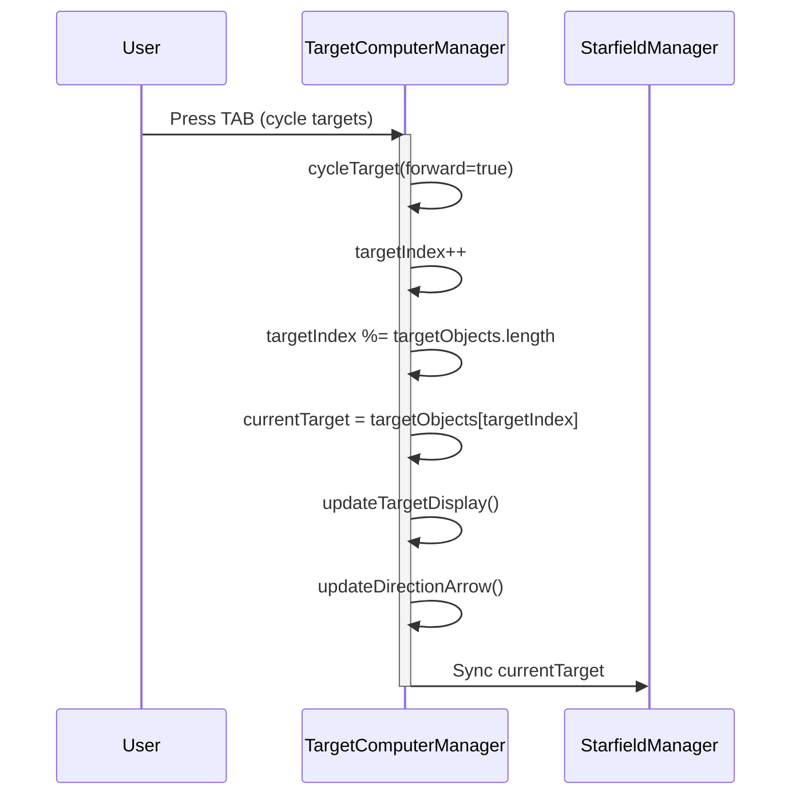
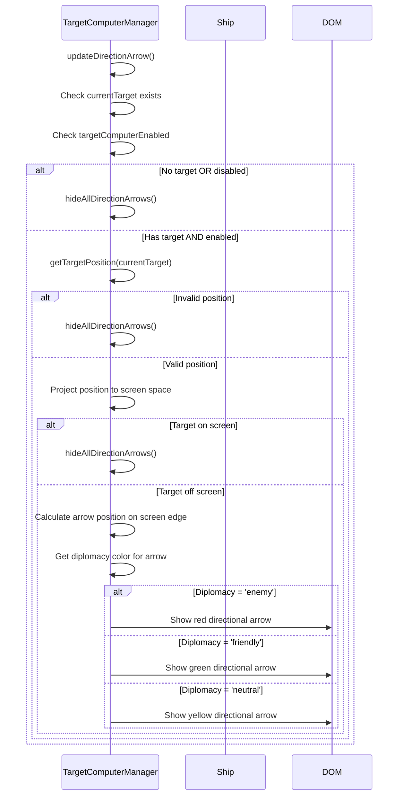

# Target Dummy Creation & Integration Sequence Diagram

## 🎯 **Phase 1: Target Dummy Creation Flow**

```mermaid
sequenceDiagram
    participant User
    participant StarfieldManager
    participant TargetComputerManager
    participant ShipFactory
    participant THREE.Scene

    User->>StarfieldManager: Press Q (spawn target dummies)
    activate StarfieldManager

    StarfieldManager->>StarfieldManager: createTargetDummyShips(3)

    loop For each dummy ship (3 times)
        StarfieldManager->>ShipFactory: createDummyShipMesh()
        ShipFactory-->>StarfieldManager: Return dummyShip, shipMesh

        StarfieldManager->>StarfieldManager: Configure dummy ship properties
        note right: diplomacy: 'enemy'<br/>isTargetDummy: true<br/>faction: 'enemy'

        StarfieldManager->>THREE.Scene: scene.add(shipMesh)
        StarfieldManager->>StarfieldManager: dummyShipMeshes.push(shipMesh)
        StarfieldManager->>StarfieldManager: targetDummyShips.push(dummyShip)
    end

    StarfieldManager->>StarfieldManager: updateTargetList()
    StarfieldManager->>TargetComputerManager: updateTargetList()
    deactivate StarfieldManager
```

## 🎯 **Phase 2: Target List Update Flow**

```mermaid
sequenceDiagram
    participant TargetComputerManager
    participant StarfieldManager
    participant DummyShip
    participant THREE.Mesh

    TargetComputerManager->>TargetComputerManager: updateTargetList()

    alt Physics System Available
        TargetComputerManager->>TargetComputerManager: updateTargetListWithPhysics()
        note right: Uses physics entities for targeting
    else Physics System Unavailable
        TargetComputerManager->>TargetComputerManager: updateTargetListTraditional()
        note right: Uses traditional targeting
    end

    TargetComputerManager->>TargetComputerManager: addNonPhysicsTargets(allTargets, maxRange)

    loop For each dummy ship mesh
        TargetComputerManager->>THREE.Mesh: mesh.userData.ship
        THREE.Mesh-->>TargetComputerManager: dummyShip

        TargetComputerManager->>TargetComputerManager: Check distance <= maxRange
        TargetComputerManager->>TargetComputerManager: Check ship.currentHull > 0.001

        TargetComputerManager->>TargetComputerManager: Create targetData object
        note right: {<br/>name: ship.shipName,<br/>type: 'enemy_ship',<br/>diplomacy: ship.diplomacy,<br/>faction: ship.faction,<br/>isShip: true,<br/>ship: dummyShip<br/>}

        TargetComputerManager->>TargetComputerManager: allTargets.push(targetData)
    end

    TargetComputerManager->>TargetComputerManager: targetObjects = allTargets
    TargetComputerManager->>TargetComputerManager: sortTargetsByDistance()
    TargetComputerManager->>TargetComputerManager: updateTargetDisplay()
```

## 🎯 **Phase 3: Target Selection Flow**



## 🎯 **Phase 4: UI Update Flow (Target Display)**

```mermaid
sequenceDiagram
    participant TargetComputerManager
    participant Ship
    participant DOM

    TargetComputerManager->>TargetComputerManager: updateTargetDisplay()

    TargetComputerManager->>TargetComputerManager: Check currentTarget exists

    alt No current target
        TargetComputerManager->>DOM: Show "No Target Selected"
        TargetComputerManager->>TargetComputerManager: hideTargetReticle()
    else Has current target
        TargetComputerManager->>TargetComputerManager: getCurrentTargetData()

        TargetComputerManager->>TargetComputerManager: Calculate target distance

        TargetComputerManager->>TargetComputerManager: Get diplomacy info
        note right: From currentTargetData.ship.diplomacy<br/>OR currentTargetData.diplomacy

        alt Diplomacy = 'enemy'
            TargetComputerManager->>DOM: Update targetInfoDisplay with red styling
            TargetComputerManager->>TargetComputerManager: createTargetWireframe() with red color
        else Diplomacy = 'friendly'
            TargetComputerManager->>DOM: Update targetInfoDisplay with green styling
        else Diplomacy = 'neutral'
            TargetComputerManager->>DOM: Update targetInfoDisplay with yellow styling
        end

        TargetComputerManager->>TargetComputerManager: Check isEnemyShip and has sub-targeting
        note right: isEnemyShip = diplomacy === 'enemy'<br/>subTargeting = ship?.subTargeting?.enabled

        alt isEnemyShip AND subTargeting enabled
            TargetComputerManager->>DOM: Show sub-system targeting UI
        else
            TargetComputerManager->>DOM: Hide sub-system targeting UI
        end
    end
```

## 🎯 **Phase 5: Directional Arrow Update Flow**


